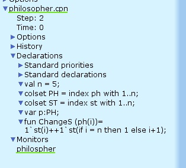

---
## Front matter
lang: ru-RU
title: Лабораторная работа 10. Задача об обедающих мудрецах
author:
  - Абакумова О. М.
institute:
  - Российский университет дружбы народов, Москва, Россия


## i18n babel
babel-lang: russian
babel-otherlangs: english

## Formatting pdf
toc: false
toc-title: Содержание
slide_level: 2
aspectratio: 169
section-titles: true
theme: metropolis
header-includes:
 - \metroset{progressbar=frametitle,sectionpage=progressbar,numbering=fraction}
 - '\makeatletter'
 - '\makeatother'
mainfont: Open Sans Light

---

# Информация

## Докладчик

:::::::::::::: {.columns align=center}
::: {.column width="70%"}

  * Абакумова Олеся Максимовна
  * Студентка
  * Российский университет дружбы народов
  * 1132220832@pfur.ru
  * <https://github.com/omabakumova>

:::
::: {.column width="30%"}


:::
::::::::::::::

# Цель работы

Реализовать модель задачи об обедающих мудрецах с помощью CPN Tools и накормить мудрецов.

# Задание

1. Построить модель задачи об обедающих мудрецах в CPN Tools.

2. Выполнить упражнение


# Теоретическое введение

Задача об обедающих мудрецах --- классическая задача о блокировках и синхронизации процессов.

## Теоретическое введение

Пять мудрецов сидят за круглым столом и могут пребывать в двух состояниях --- думать и есть. Между соседями лежит одна палочка для еды. Для приёма пищи
необходимы две палочки. Палочки --- пересекающийся ресурс. Необходимо синхронизировать процесс еды так, чтобы мудрецы не умерли с голода.

{#fig:001 width=25%}


# Выполнение лабораторной работы

## Реализация модели задачи об обедающих мудрецах

{#fig:002 width=50%}

## Реализация модели задачи об обедающих мудрецах

{#fig:003 width=50%}

## Реализация модели задачи об обедающих мудрецах

{#fig:004 width=50%}

## Реализация модели задачи об обедающих мудрецах

{#fig:005 width=50%}

## Упражнение

{#fig:006 width=70%}

## Упражнение

```

 Statistics
------------------------------------------------------------------------

  State Space
     Nodes:  11
     Arcs:   30
     Secs:   0
     Status: Full

  Scc Graph
     Nodes:  1
     Arcs:   0
     Secs:   0


```

## Упражнение

```
 Boundedness Properties
------------------------------------------------------------------------

  Best Integer Bounds
                             Upper      Lower
     philospher'philosopher_eats 1
                             2          0
     philospher'philosopher_thinks 1
                             5          3
     philospher'stiks_on_the_table 1
                             5          1

  Best Upper Multi-set Bounds
     philospher'philosopher_eats 1
                         1`ph(1)++
1`ph(2)++
1`ph(3)++
1`ph(4)++
1`ph(5)
     philospher'philosopher_thinks 1
                         1`ph(1)++
```
                      
## Упражнение
```
1`ph(2)++
1`ph(3)++
1`ph(4)++
1`ph(5)
     philospher'stiks_on_the_table 1
                         1`st(1)++
1`st(2)++
1`st(3)++
1`st(4)++
1`st(5)

  Best Lower Multi-set Bounds
     philospher'philosopher_eats 1
                         empty
     philospher'philosopher_thinks 1
                         empty
     philospher'stiks_on_the_table 1
                         empty

```

# Выводы

Во время выполнения данной лабораторной работы я реализовала модель задачи об обедающих мудрецах.
