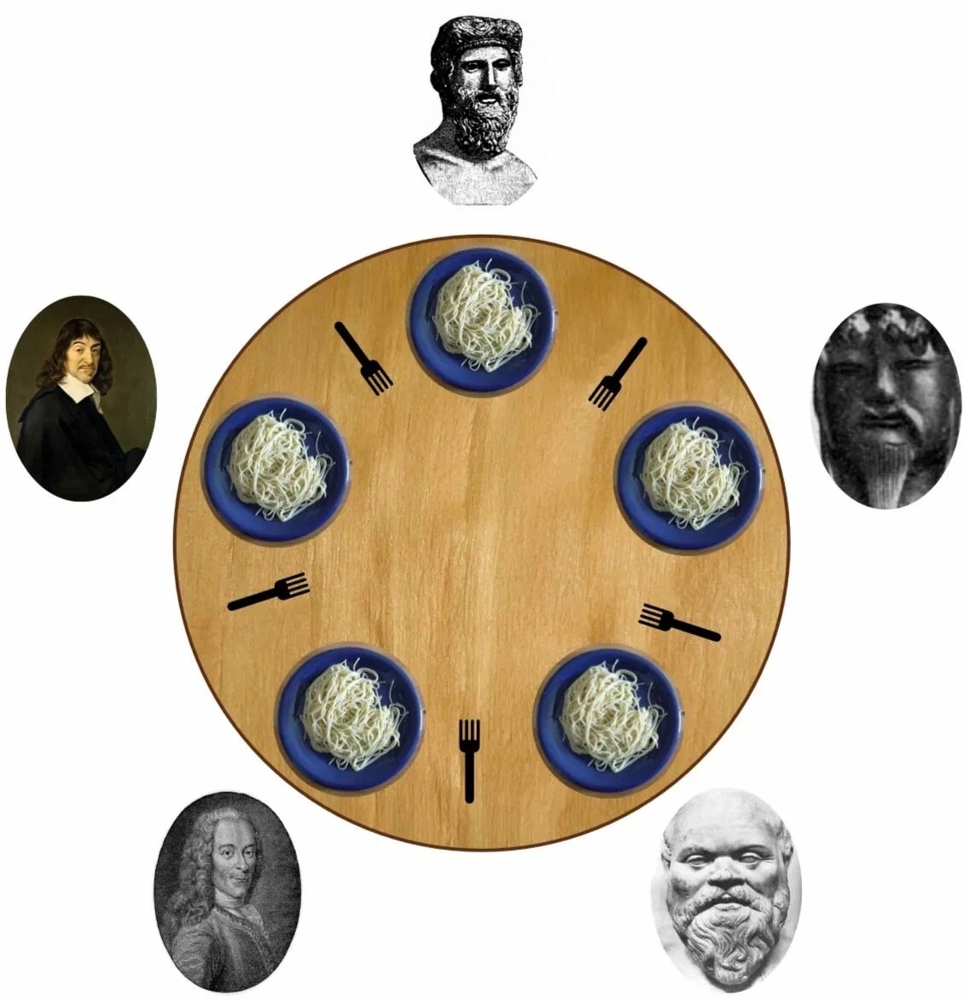
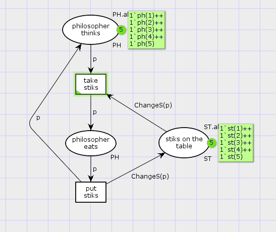
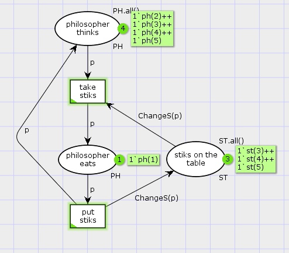
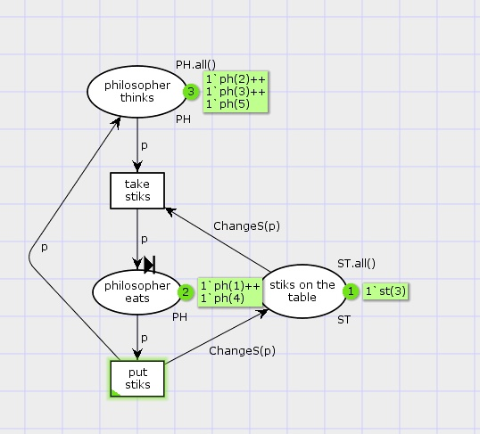
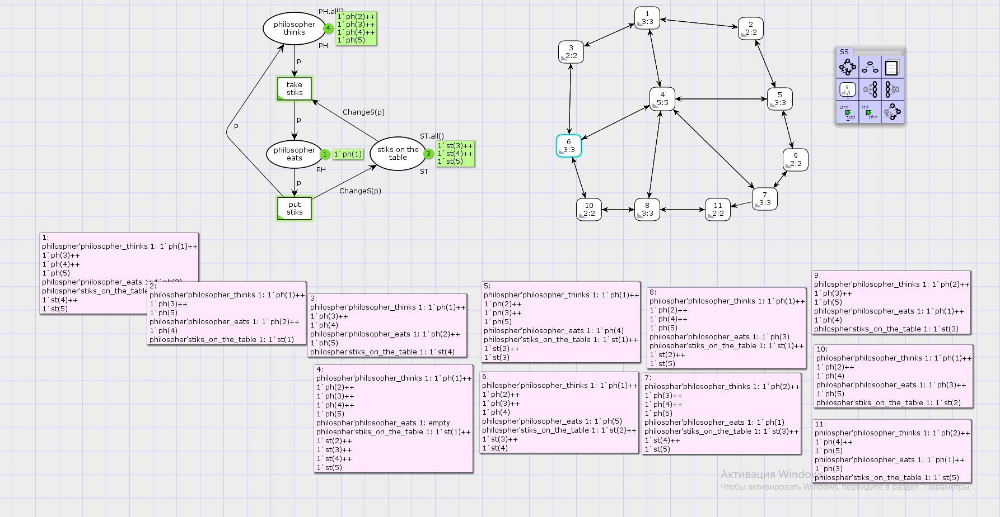

---
## Front matter
title: "Лабораторная работа 10. Задача об обедающих мудрецах"
author: "Абакумова Олеся Максимовна, НФИбд-02-22"

## Generic otions
lang: ru-RU
toc-title: "Содержание"

## Bibliography
bibliography: bib/cite.bib
csl: pandoc/csl/gost-r-7-0-5-2008-numeric.csl

## Pdf output format
toc: true # Table of contents
toc-depth: 2
lof: true # List of figures
lot: true # List of tables
fontsize: 12pt
linestretch: 1.5
papersize: a4
documentclass: scrreprt
## I18n polyglossia
polyglossia-lang:
  name: russian
  options:
	- spelling=modern
	- babelshorthands=true
polyglossia-otherlangs:
  name: english
## I18n babel
babel-lang: russian
babel-otherlangs: english
## Fonts
mainfont: IBM Plex Serif
romanfont: IBM Plex Serif
sansfont: IBM Plex Sans
monofont: IBM Plex Mono
mathfont: STIX Two Math
mainfontoptions: Ligatures=Common,Ligatures=TeX,Scale=0.94
romanfontoptions: Ligatures=Common,Ligatures=TeX,Scale=0.94
sansfontoptions: Ligatures=Common,Ligatures=TeX,Scale=MatchLowercase,Scale=0.94
monofontoptions: Scale=MatchLowercase,Scale=0.94,FakeStretch=0.9
mathfontoptions:
## Biblatex
biblatex: true
biblio-style: "gost-numeric"
biblatexoptions:
  - parentracker=true
  - backend=biber
  - hyperref=auto
  - language=auto
  - autolang=other*
  - citestyle=gost-numeric
## Pandoc-crossref LaTeX customization
figureTitle: "Рис."
tableTitle: "Таблица"
listingTitle: "Листинг"
lofTitle: "Список иллюстраций"
lotTitle: "Список таблиц"
lolTitle: "Листинги"
## Misc options
indent: true
header-includes:
  - \usepackage{indentfirst}
  - \usepackage{float} # keep figures where there are in the text
  - \floatplacement{figure}{H} # keep figures where there are in the text
---


# Цель работы

Реализовать модель задачи об обедающих мудрецах с помощью CPN Tools и накормить мудрецов.

# Задание

1. Построить модель задачи об обедающих мудрецах в CPN Tools.

2. Выполнить упражнение

# Теоретическое введение

Задача об обедающих мудрецах --- классическая задача о блокировках и синхронизации процессов.
Пять мудрецов сидят за круглым столом и могут пребывать в двух состояниях --- думать и есть. Между соседями лежит одна палочка для еды. Для приёма пищи
необходимы две палочки. Палочки --- пересекающийся ресурс. Необходимо синхронизировать процесс еды так, чтобы мудрецы не умерли с голода (рис. [-@fig:001]).

{#fig:001 width=70%}

# Выполнение лабораторной работы
## Реализация модели задачи об обедающих мудрецах

Рисуем граф сети. Для этого с помощью контекстного меню создаём новую сеть,
добавляем позиции, переходы и дуги.
Начальные данные:
- позиции: мудрец размышляет (philosopher thinks), мудрец ест (philosopher eats),
палочки находятся на столе (sticks on the table)

- переходы: взять палочки (take sticks), положить палочки (put sticks)

В меню задаём новые декларации модели: типы фишек, начальные значения
позиций, выражения для дуг:

- n --- число мудрецов и палочек (n = 5);

- p --- фишки, обозначающие мудрецов, имеют перечисляемый тип PH от 1 до n;

- s --- фишки, обозначающие палочки, имеют перечисляемый тип ST от 1 до n;

- функция ChangeS(p) ставит в соответствие мудрецам палочки (возвращает номера палочек, используемых мудрецами); по условию задачи мудрецы сидят по
кругу и мудрец p(i) может взять i и i + 1 палочки (рис. [-@fig:002]):

{#fig:002 width=70%}

Задав правильно декларации в соответствии с которым построен граф сети,имеем (рис. [-@fig:003]):

{#fig:003 width=70%}

Теперь запустим нашу модель и наблюдаем за обедом мудрецов! (рис. [-@fig:004]):

{#fig:004 width=70%}

Также отметим,что при последующих запусках одновременно палочками могут воспользоваться только два из пяти мудрецов (рис. [-@fig:005]):

{#fig:005 width=70%}

## Упражнение

Теперь вычислим пространство состояний (рис. [-@fig:006]):

{#fig:006 width=70%}

Теперь сформуируем отчет о пространстве состояний:

```
CPN Tools state space report for:
/cygdrive/C/Users/user/Downloads/philo.cpn
Report generated: Sat Apr 12 18:45:31 2025


 Statistics
------------------------------------------------------------------------

  State Space
     Nodes:  11
     Arcs:   30
     Secs:   0
     Status: Full

  Scc Graph
     Nodes:  1
     Arcs:   0
     Secs:   0


 Boundedness Properties
------------------------------------------------------------------------

  Best Integer Bounds
                             Upper      Lower
     philospher'philosopher_eats 1
                             2          0
     philospher'philosopher_thinks 1
                             5          3
     philospher'stiks_on_the_table 1
                             5          1

  Best Upper Multi-set Bounds
     philospher'philosopher_eats 1
                         1`ph(1)++
1`ph(2)++
1`ph(3)++
1`ph(4)++
1`ph(5)
     philospher'philosopher_thinks 1
                         1`ph(1)++
1`ph(2)++
1`ph(3)++
1`ph(4)++
1`ph(5)
     philospher'stiks_on_the_table 1
                         1`st(1)++
1`st(2)++
1`st(3)++
1`st(4)++
1`st(5)

  Best Lower Multi-set Bounds
     philospher'philosopher_eats 1
                         empty
     philospher'philosopher_thinks 1
                         empty
     philospher'stiks_on_the_table 1
                         empty


 Home Properties
------------------------------------------------------------------------

  Home Markings
     All


 Liveness Properties
------------------------------------------------------------------------

  Dead Markings
     None

  Dead Transition Instances
     None

  Live Transition Instances
     All


 Fairness Properties
------------------------------------------------------------------------

  Impartial Transition Instances
     philospher'put_stiks 1
     philospher'take_stiks 1

  Fair Transition Instances
     None

  Just Transition Instances
     None

  Transition Instances with No Fairness
     None

```
Модель "обедающих философов" успешно проанализирована, пространство состояний небольшое и полное, deadlocks отсутствуют, все переходы живые, переходы **put_stiks** и **take_stiks** беспристрастны, но нет гарантий строгой справедливости в распределении ресурсов, что может привести к неравномерному голоданию философов; из любого состояния возможен возврат в исходное.

# Выводы

Во время выполнения данной лабораторной работы я реализовала модель задачи об обедающих мудрецах.
