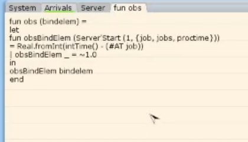
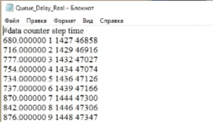
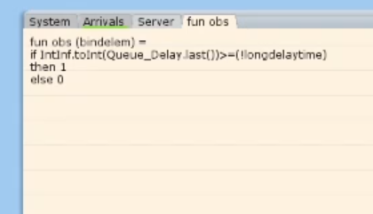
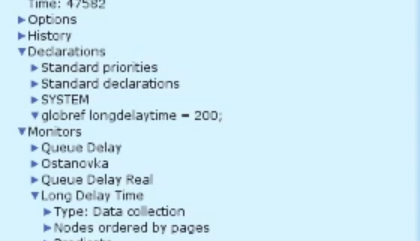
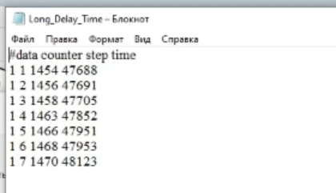
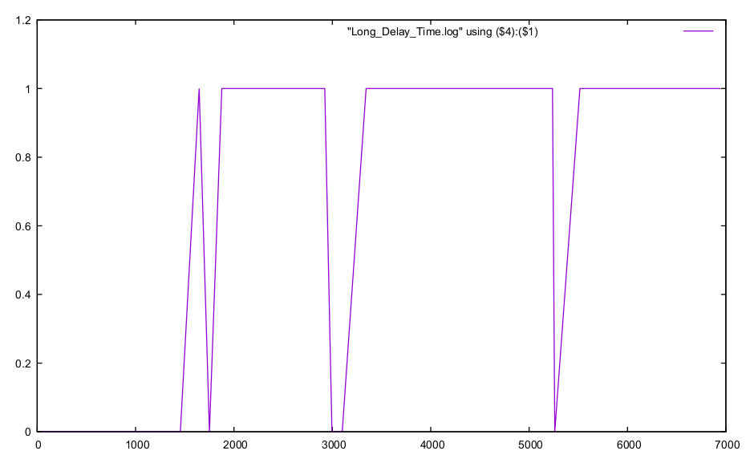

---
## Front matter
lang: ru-RU
title: Лабораторная работа 11. Модель системы массового обслуживания M |M |1
author:
  - Абакумова О. М.
institute:
  - Российский университет дружбы народов, Москва, Россия


## i18n babel
babel-lang: russian
babel-otherlangs: english

## Formatting pdf
toc: false
toc-title: Содержание
slide_level: 2
aspectratio: 169
section-titles: true
theme: metropolis
header-includes:
 - \metroset{progressbar=frametitle,sectionpage=progressbar,numbering=fraction}
 - '\makeatletter'
 - '\makeatother'
mainfont: Open Sans Light

---

# Информация

## Докладчик

:::::::::::::: {.columns align=center}
::: {.column width="70%"}

  * Абакумова Олеся Максимовна
  * Студентка
  * Российский университет дружбы народов
  * 1132220832@pfur.ru
  * <https://github.com/omabakumova>

:::
::: {.column width="30%"}


:::
::::::::::::::

# Задание

1. Построить модель задачи cистемы массового ослуживания $M|M|1$

2. Построить график

# Теоретическое введение

 В систему поступает поток заявок двух типов, распределённый по пуассоновскому
закону. Заявки поступают в очередь сервера на обработку. Дисциплина очереди -
FIFO. Если сервер находится в режиме ожидания (нет заявок на сервере), то заявка
поступает на обработку сервером.


# Выполнение лабораторной работы
## Построение модели с помощью CPNTools

{#fig:001 width=70%}

## Построение модели с помощью CPNTools

{#fig:002 width=70%}

## Построение модели с помощью CPNTools

{#fig:003 width=70%}

## Построение модели с помощью CPNTools

{#fig:004 width=25%}

## Построение модели с помощью CPNTools

{#fig:005 width=70%}

## Построение модели с помощью CPNTools


{#fig:006 width=70%}

## Построение модели с помощью CPNTools

{#fig:007 width=70%}

## Мониторинг параметров моделируемой системы

{#fig:008 width=45%}

## Мониторинг параметров моделируемой системы

{#fig:009 width=45%}

## Мониторинг параметров моделируемой системы

{#fig:010 width=70%}

## Мониторинг параметров моделируемой системы

{#fig:011 width=30%}

## Мониторинг параметров моделируемой системы

```
#!/usr/bin/gnuplot -persist

set encoding utf8
set term pngcairo font "Helvetica,9"

# задаём выходной файл графика
set out 'window_1.png'
plot "Queue_Delay.log" using ($4):($1) with lines
```

## Мониторинг параметров моделируемой системы

{#fig:012 width=70%}

## Мониторинг параметров моделируемой системы

{#fig:013 width=70%}

## Мониторинг параметров моделируемой системы

{#fig:014 width=70%}

## Мониторинг параметров моделируемой системы

{#fig:015 width=70%}

## Мониторинг параметров моделируемой системы

{#fig:016 width=70%}

## Мониторинг параметров моделируемой системы

{#fig:017 width=70%}

## Мониторинг параметров моделируемой системы


```
#!/usr/bin/gnuplot -persist

set encoding utf8
set term pngcairo font "Helvetica,9"

# задаём выходной файл графика
set out 'window_1.png'
set style line 2
plot [0:] [0:1.2] "Long_Delay_Time.log" using ($4):($1) with lines
```

## Мониторинг параметров моделируемой системы

{#fig:018 width=70%}


# Выводы

В процессе выполнения данной лабораторной работы я реализовала модель
системы массового обслуживания $M|M|1$ в CPN Tools.
