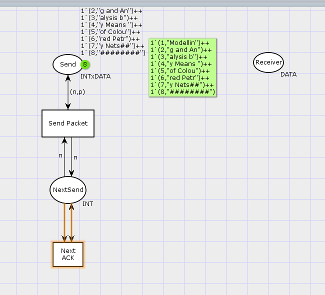
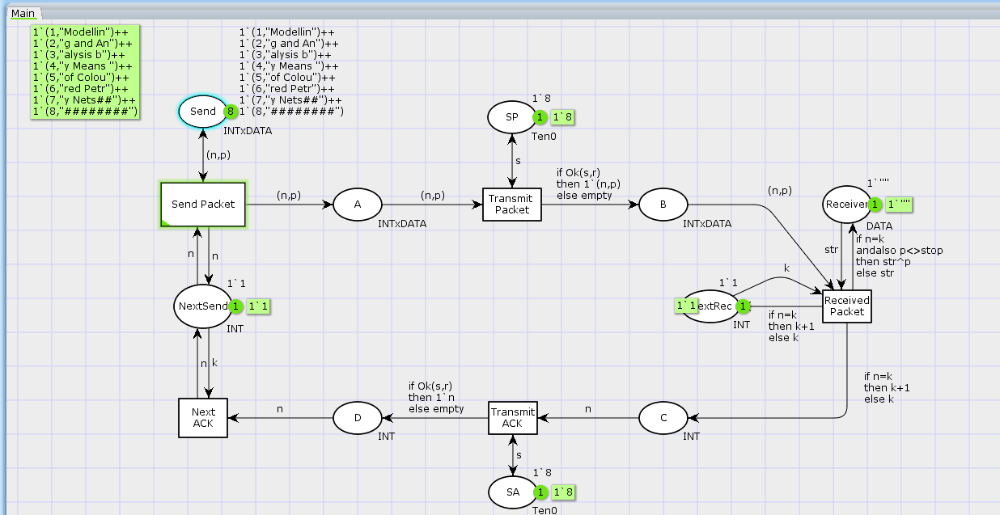
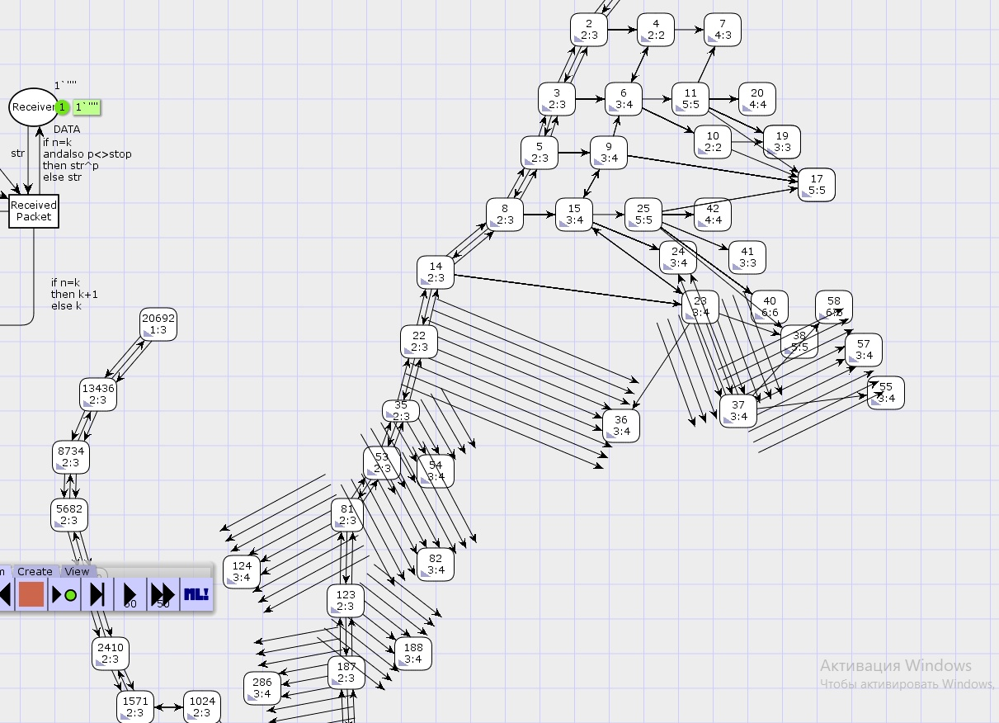

---
## Front matter
lang: ru-RU
title: Лабораторная работа 12. Пример моделирования простого протокола передачи данных
author:
  - Абакумова О. М.
institute:
  - Российский университет дружбы народов, Москва, Россия


## i18n babel
babel-lang: russian
babel-otherlangs: english

## Formatting pdf
toc: false
toc-title: Содержание
slide_level: 2
aspectratio: 169
section-titles: true
theme: metropolis
header-includes:
 - \metroset{progressbar=frametitle,sectionpage=progressbar,numbering=fraction}
 - '\makeatletter'
 - '\makeatother'
mainfont: Open Sans Light

---

# Информация

## Докладчик

:::::::::::::: {.columns align=center}
::: {.column width="70%"}

  * Абакумова Олеся Максимовна
  * Студентка
  * Российский университет дружбы народов
  * 1132220832@pfur.ru
  * <https://github.com/omabakumova>

:::
::: {.column width="30%"}


:::
::::::::::::::

# Цель работы

Реализовать модель простого протокола передачи данных

# Задание

1. Построить модель простого протокола передачи данных

2. Выполнить упражнение

# Теоретическое введение

Рассмотрим ненадёжную сеть передачи данных, состоящую из источника, получателя.
Перед отправкой очередной порции данных источник должен получить от получателя подтверждение о доставке предыдущей порции данных.
Считаем, что пакет состоит из номера пакета и строковых данных. Передавать
будем сообщение «Modelling and Analysis by Means of Coloured Petry Nets», разбитое
по 8 символов.


# Выполнение лабораторной работы
## Построение модели с помощью CPNTools

{#fig:001 width=60%}

## Построение модели с помощью CPNTools

{#fig:002 width=60%}

## Построение модели с помощью CPNTools

{#fig:003 width=70%}

## Построение модели с помощью CPNTools

{#fig:004 width=50%}

## Построение модели с помощью CPNTools

{#fig:005 width=70%}

## Построение модели с помощью CPNTools

```
colset Ten0 = int with 0..10;
colset Ten1 = int with 0..10;
var s: Ten0;
var r: Ten1;

```
## Построение модели с помощью CPNTools

Определяем функцию (если нет превышения порога, то истина, если нет — ложь):

```
fun Ok(s:Ten0, r:Ten1)=(r<=s);
```
Задаём выражение от перехода Transmit Packet к состоянию B:

```
if Ok(s,r) then 1`(n,p) else empty
```

Задаём выражение от перехода Transmit ACK к состоянию D:

```
if Ok(s,r) then 1`n else empty
```

## Построение модели с помощью CPNTools

{#fig:006 width=70%}

## Построение модели с помощью CPNTools

{#fig:007 width=70%}

## Выполнение упражнения

```

Statistics
------------------------------------------------------------------------

  State Space
     Nodes:  35836
     Arcs:   603776
     Secs:   300
     Status: Partial
  Scc Graph
     Nodes:  18801
     Arcs:   508242
     Secs:   7
     
```

## Выполнение упражнения

{#fig:008 width=50%}


# Выводы

В процессе выполнения данной лабораторной работы я реализовала модель простого протокола передачи данных.
