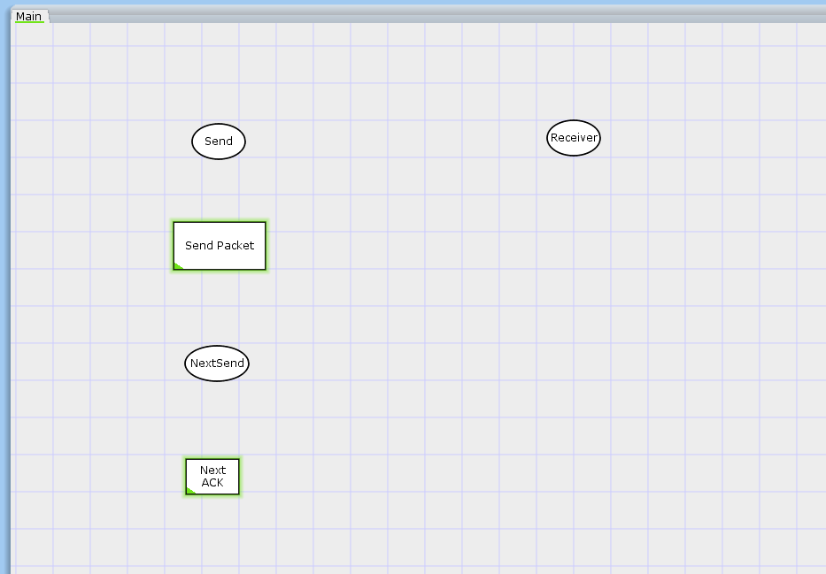
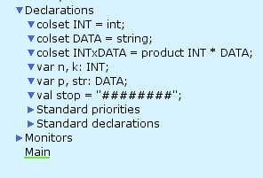
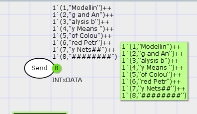
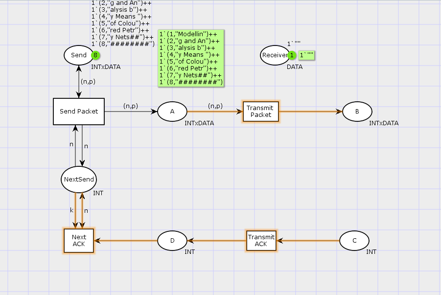
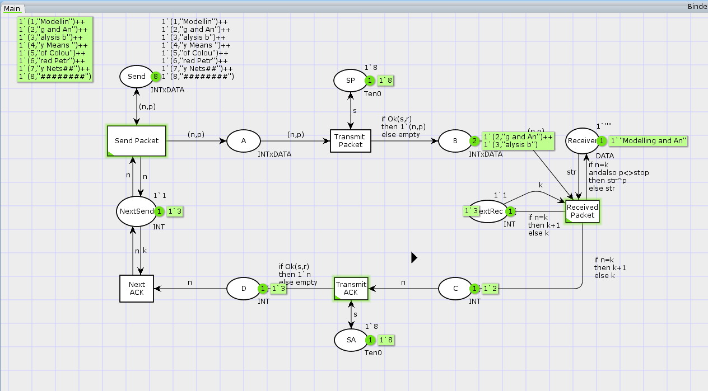

---
## Front matter
title: "Лабораторная работа 12. Пример моделирования простого протокола передачи данных"
author: "Абакумова Олеся Максимовна, НФИбд-02-22"

## Generic otions
lang: ru-RU
toc-title: "Содержание"

## Bibliography
bibliography: bib/cite.bib
csl: pandoc/csl/gost-r-7-0-5-2008-numeric.csl

## Pdf output format
toc: true # Table of contents
toc-depth: 2
lof: true # List of figures
lot: true # List of tables
fontsize: 12pt
linestretch: 1.5
papersize: a4
documentclass: scrreprt
## I18n polyglossia
polyglossia-lang:
  name: russian
  options:
	- spelling=modern
	- babelshorthands=true
polyglossia-otherlangs:
  name: english
## I18n babel
babel-lang: russian
babel-otherlangs: english
## Fonts
mainfont: IBM Plex Serif
romanfont: IBM Plex Serif
sansfont: IBM Plex Sans
monofont: IBM Plex Mono
mathfont: STIX Two Math
mainfontoptions: Ligatures=Common,Ligatures=TeX,Scale=0.94
romanfontoptions: Ligatures=Common,Ligatures=TeX,Scale=0.94
sansfontoptions: Ligatures=Common,Ligatures=TeX,Scale=MatchLowercase,Scale=0.94
monofontoptions: Scale=MatchLowercase,Scale=0.94,FakeStretch=0.9
mathfontoptions:
## Biblatex
biblatex: true
biblio-style: "gost-numeric"
biblatexoptions:
  - parentracker=true
  - backend=biber
  - hyperref=auto
  - language=auto
  - autolang=other*
  - citestyle=gost-numeric
## Pandoc-crossref LaTeX customization
figureTitle: "Рис."
tableTitle: "Таблица"
listingTitle: "Листинг"
lofTitle: "Список иллюстраций"
lotTitle: "Список таблиц"
lolTitle: "Листинги"
## Misc options
indent: true
header-includes:
  - \usepackage{indentfirst}
  - \usepackage{float} # keep figures where there are in the text
  - \floatplacement{figure}{H} # keep figures where there are in the text
---


# Цель работы

Реализовать модель простого протокола передачи данных

# Задание

1. Построить модель простого протокола передачи данных

2. Выполнить упражнение

# Теоретическое введение

Рассмотрим ненадёжную сеть передачи данных, состоящую из источника, получателя.
Перед отправкой очередной порции данных источник должен получить от получателя подтверждение о доставке предыдущей порции данных.
Считаем, что пакет состоит из номера пакета и строковых данных. Передавать
будем сообщение «Modelling and Analysis by Means of Coloured Petry Nets», разбитое
по 8 символов.

# Выполнение лабораторной работы
## Построение модели с помощью CPNTools

Основные состояния: источник (Send), получатель (Receiver).
Действия (переходы): отправить пакет (Send Packet), отправить подтверждение
(Send ACK).
Промежуточное состояние: следующий посылаемый пакет (NextSend).
Зададим декларации модели (рис. [-@fig:001]) и состояния (рис. [-@fig:002]):

{#fig:001 width=70%}

{#fig:002 width=70%}

Состояние Send имеет тип INTxDATA и следующую начальную маркировку (в
соответствии с передаваемой фразой) (рис. [-@fig:003])

{#fig:003 width=70%}

{#fig:004 width=70%}

Стоповый байт ("########") определяет, что сообщение закончилось.
Состояние Receiver имеет тип DATA и начальное значение 1`"" (т.е. пустая
строка, поскольку состояние собирает данные и номер пакета его не интересует).
Состояние NextSend имеет тип INT и начальное значение 1`1.
Поскольку пакеты представляют собой кортеж, состоящий из номера пакета и строки, то выражение у двусторонней дуги будет иметь значение (n,p).
Кроме того, необходимо взаимодействовать с состоянием, которое будет сообщать
номер следующего посылаемого пакета данных. Поэтому переход Send Packet
соединяем с состоянием NextSend двумя дугами с выражениями n.
Также необходимо получать информацию с подтверждениями о получении данных. От перехода Send Packet к состоянию NextSend дуга с выражением n,
обратно — k.

Зададим промежуточные состояния (A, B с типом INTxDATA, C, D с типом
INTxDATA) для переходов (рис. 12.2): передать пакет Transmit Packet (передаём
(n,p)), передать подтверждение Transmit ACK (передаём целое число k) (рис. [-@fig:005]).

{#fig:005 width=70%}

Добавляем переход получения пакета (Receive Packet).
От состояния Receiver идёт дуга к переходу Receive Packet со значением той
строки (str), которая находится в состоянии Receiver. Обратно: проверяем, что
номер пакета новый и строка не равна стоп-биту. Если это так, то строку добавляем
к полученным данным.
Кроме того, необходимо знать, каким будет номер следующего пакета. Для этого
добавляем состояние NextRec с типом INT и начальным значением 1`1 (один пакет),
связываем его дугами с переходом Receive Packet. Причём к переходу идёт дуга
с выражением k, от перехода — if n=k then k+1 else k.
Связываем состояния B и C с переходом Receive Packet. От состояния B
к переходу Receive Packet — выражение (n,p), от перехода Receive Packet
к состоянию C — выражение if n=k then k+1 else k.
От перехода Receive Packet к состоянию Receiver:
if n=k andalso p<>stop then str^p else str
(если n=k и мы не получили стоп-байт, то направляем в состояние строку и к ней
прикрепляем p, в противном случае посылаем толко строку).
На переходах Transmit Packet и Transmit ACK зададим потерю пакетов. Для
этого на интервале от 0 до 10 зададим пороговое значение и, если передаваемое значение превысит этот порог, то считаем, что произошла потеря пакета, если нет, то
передаём пакет дальше. Для этого задаём вспомогательные состояния SP и SA с типом
Ten0 и начальным значением 1`8, соединяем с соответствующими переходами.
В декларациях задаём:

```
colset Ten0 = int with 0..10;
colset Ten1 = int with 0..10;
var s: Ten0;
var r: Ten1;

```
и определяем функцию (если нет превышения порога, то истина, если нет — ложь):

```
fun Ok(s:Ten0, r:Ten1)=(r<=s);
```
Задаём выражение от перехода Transmit Packet к состоянию B:

```
if Ok(s,r) then 1`(n,p) else empty
```

Задаём выражение от перехода Transmit ACK к состоянию D:

```
if Ok(s,r) then 1`n else empty
```

Таким образом, получим модель простого протокола передачи данных (рис. [-@fig:006]).
Пакет последовательно проходит: состояние Send, переход Send Packet, состояние A, с некоторой вероятностью переход Transmit Packet, состояние B, попадает
на переход Receive Packet, где проверяется номер пакета и если нет совпадения,
то пакет направляется в состояние Received, а номер пакета передаётся последовательно в состояние C, с некоторой вероятностью в переход Transmit ACK,
далее в состояние D, переход Receive ACK, состояние NextSend (увеличивая на 1
номер следующего пакета), переход Send Packet. Так продолжается до тех пор,
пока не будут переданы все части сообщения. Последней будет передана стоп-последовательность.

{#fig:006 width=70%}

Также моно запустить модель и понаблюдать за ее работой (рис. [-@fig:007]):

{#fig:007 width=70%}

## Выполнение упражнения

Сформируем отчет о пространстве состояний:

```

CPN Tools state space report for:
/cygdrive/C/Users/user/Downloads/12lab.cpn
Report generated: Sat Apr 26 22:01:45 2025


 Statistics
------------------------------------------------------------------------

  State Space
     Nodes:  35836
     Arcs:   603776
     Secs:   300
     Status: Partial

  Scc Graph
     Nodes:  18801
     Arcs:   508242
     Secs:   7


 Boundedness Properties
------------------------------------------------------------------------

  Best Integer Bounds
                             Upper      Lower
     Main'A 1                23         0
     Main'B 1                11         0
     Main'C 1                7          0
     Main'D 1                5          0
     Main'NextRec 1          1          1
     Main'NextSend 1         1          1
     Main'Receiver 1         1          1
     Main'SA 1               1          1
     Main'SP 1               1          1
     Main'Send 1             8          8

  Best Upper Multi-set Bounds
     Main'A 1            23`(1,"Modellin")++
17`(2,"g and An")++
12`(3,"alysis b")++
7`(4,"y Means ")++
2`(5,"of Colou")
     Main'B 1            11`(1,"Modellin")++
8`(2,"g and An")++
6`(3,"alysis b")++
3`(4,"y Means ")++
1`(5,"of Colou")
     Main'C 1            7`2++
6`3++
4`4++
2`5
     Main'D 1            5`2++
4`3++
3`4++
1`5
     Main'NextRec 1      1`1++
1`2++
1`3++
1`4++
1`5
     Main'NextSend 1     1`1++
1`2++
1`3++
1`4++
1`5
     Main'Receiver 1     1`""++
1`"Modellin"++
1`"Modelling and An"++
1`"Modelling and Analysis b"++
1`"Modelling and Analysis by Means "
     Main'SA 1           1`8
     Main'SP 1           1`8
     Main'Send 1         1`(1,"Modellin")++
1`(2,"g and An")++
1`(3,"alysis b")++
1`(4,"y Means ")++
1`(5,"of Colou")++
1`(6,"red Petr")++
1`(7,"y Nets##")++
1`(8,"########")

  Best Lower Multi-set Bounds
     Main'A 1            empty
     Main'B 1            empty
     Main'C 1            empty
     Main'D 1            empty
     Main'NextRec 1      empty
     Main'NextSend 1     empty
     Main'Receiver 1     empty
     Main'SA 1           1`8
     Main'SP 1           1`8
     Main'Send 1         1`(1,"Modellin")++
1`(2,"g and An")++
1`(3,"alysis b")++
1`(4,"y Means ")++
1`(5,"of Colou")++
1`(6,"red Petr")++
1`(7,"y Nets##")++
1`(8,"########")


 Home Properties
------------------------------------------------------------------------

  Home Markings
     None


 Liveness Properties
------------------------------------------------------------------------

  Dead Markings
     12678 [35836,35835,35834,35833,35832,...]

  Dead Transition Instances
     None

  Live Transition Instances
     None


 Fairness Properties
------------------------------------------------------------------------

  Impartial Transition Instances
     Main'Send_Packet 1
     Main'Transmit_Packet 1

  Fair Transition Instances
     None

  Just Transition Instances
     None

  Transition Instances with No Fairness
     Main'Next_ACK 1
     Main'Received_Packet 1
     Main'Transmit_ACK 1

```

Получив отчет о пространстве состояний, также можем построить граф (рис. [-@fig:008]):

{#fig:008 width=70%}

Как можно заметить на иллюстрации поместился не весь граф пространства состояний, это было очевидно из еще полученного отчета, что граф будет неверотно огромным.

# Выводы

В процессе выполнения данной лабораторной работы я реализовала модель простого протокола передачи данных.
