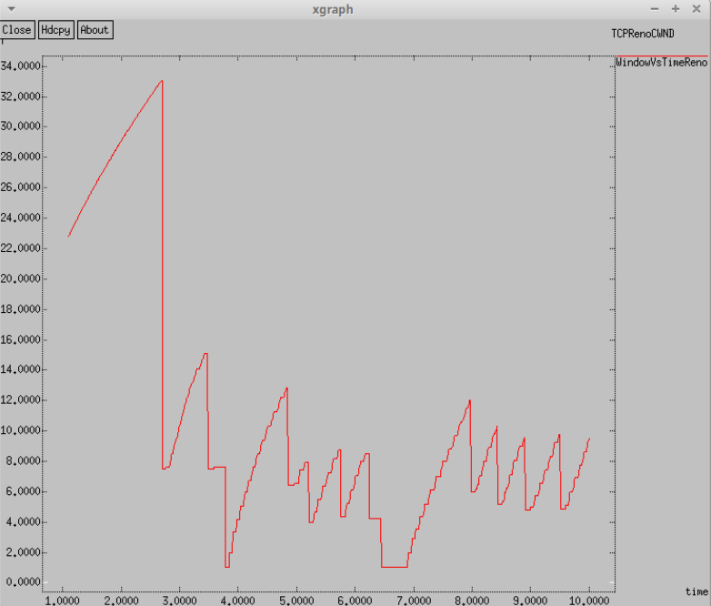
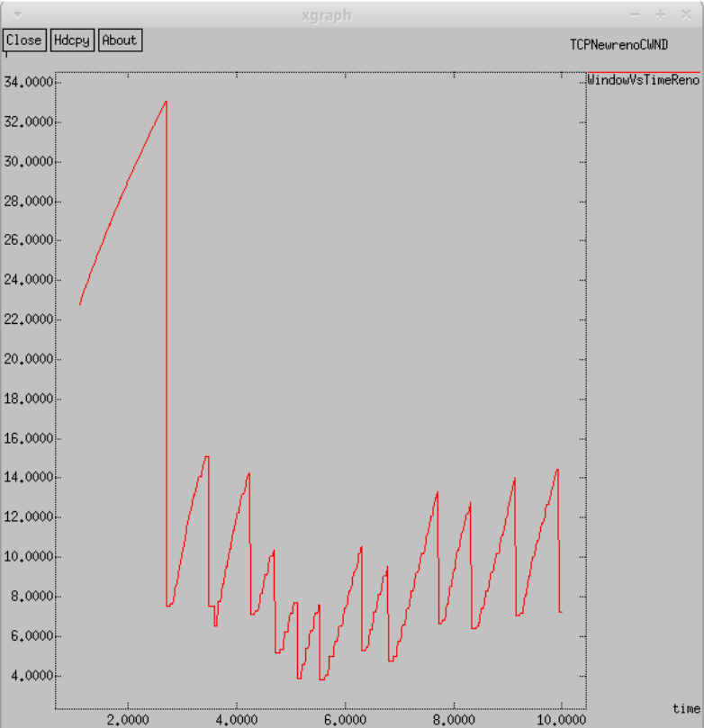
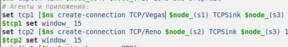
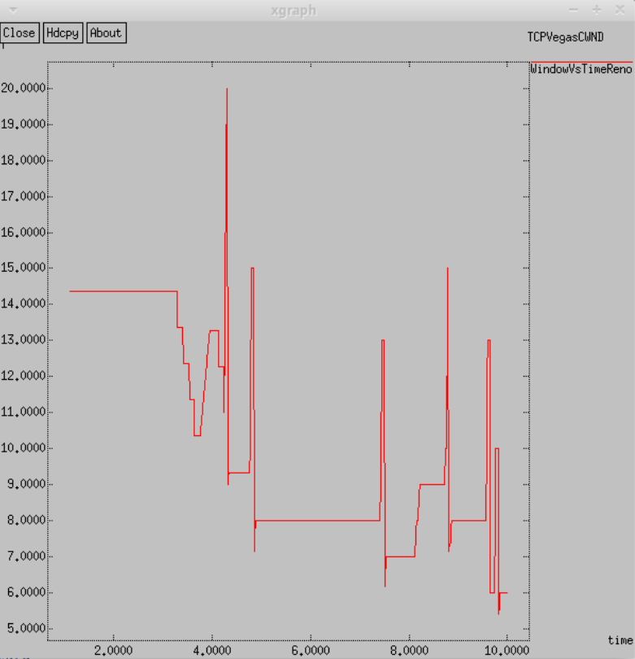
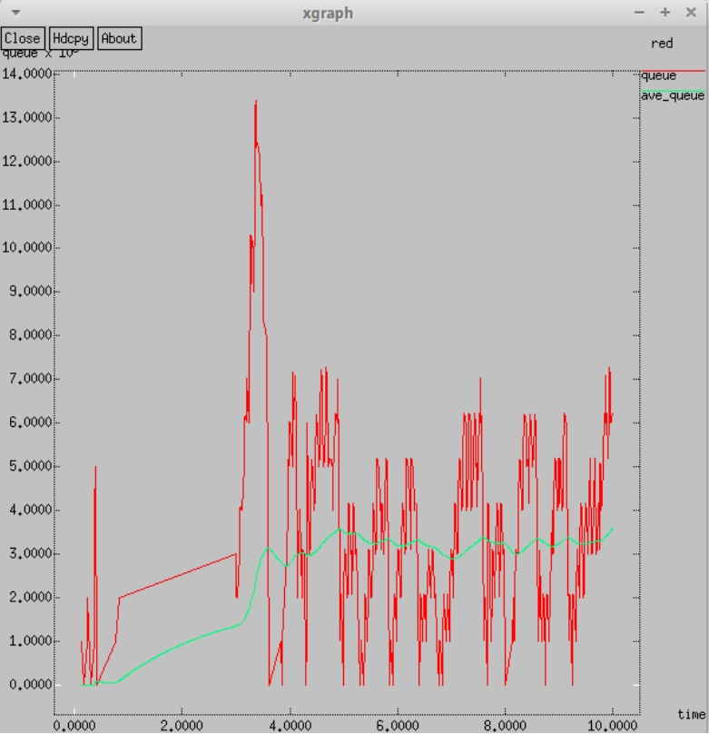
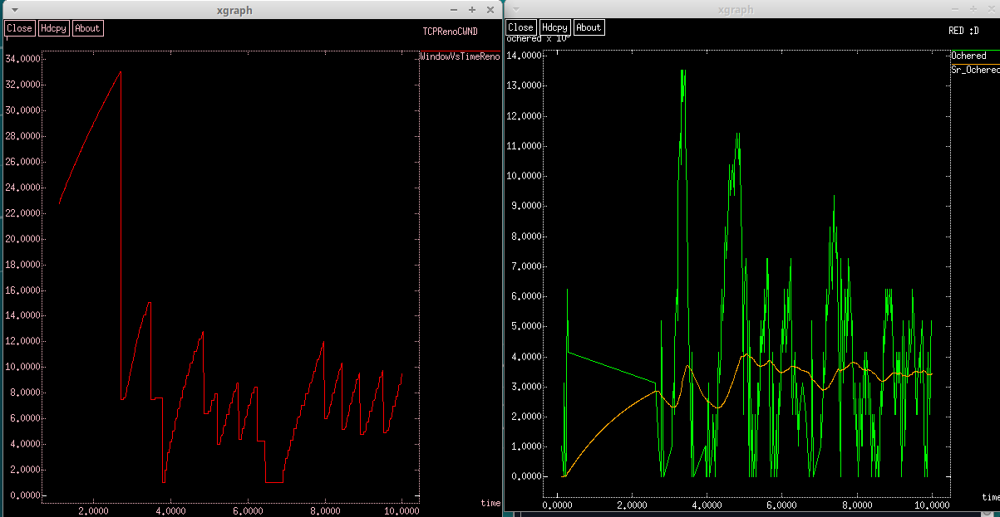

---
## Front matter
title: "Лабораторная работа 2. Исследование протокола TCP и алгоритма управления очередью RED"
author: "Абакумова Олеся Максимовна, НФИбд-02-22"

## Generic otions
lang: ru-RU
toc-title: "Содержание"

## Bibliography
bibliography: bib/cite.bib
csl: pandoc/csl/gost-r-7-0-5-2008-numeric.csl

## Pdf output format
toc: true # Table of contents
toc-depth: 2
lof: true # List of figures
lot: true # List of tables
fontsize: 12pt
linestretch: 1.5
papersize: a4
documentclass: scrreprt
## I18n polyglossia
polyglossia-lang:
  name: russian
  options:
	- spelling=modern
	- babelshorthands=true
polyglossia-otherlangs:
  name: english
## I18n babel
babel-lang: russian
babel-otherlangs: english
## Fonts
mainfont: IBM Plex Serif
romanfont: IBM Plex Serif
sansfont: IBM Plex Sans
monofont: IBM Plex Mono
mathfont: STIX Two Math
mainfontoptions: Ligatures=Common,Ligatures=TeX,Scale=0.94
romanfontoptions: Ligatures=Common,Ligatures=TeX,Scale=0.94
sansfontoptions: Ligatures=Common,Ligatures=TeX,Scale=MatchLowercase,Scale=0.94
monofontoptions: Scale=MatchLowercase,Scale=0.94,FakeStretch=0.9
mathfontoptions:
## Biblatex
biblatex: true
biblio-style: "gost-numeric"
biblatexoptions:
  - parentracker=true
  - backend=biber
  - hyperref=auto
  - language=auto
  - autolang=other*
  - citestyle=gost-numeric
## Pandoc-crossref LaTeX customization
figureTitle: "Рис."
tableTitle: "Таблица"
listingTitle: "Листинг"
lofTitle: "Список иллюстраций"
lotTitle: "Список таблиц"
lolTitle: "Листинги"
## Misc options
indent: true
header-includes:
  - \usepackage{indentfirst}
  - \usepackage{float} # keep figures where there are in the text
  - \floatplacement{figure}{H} # keep figures where there are in the text
---

# Цель работы

Исследовать протокол TCP и алгоритм управления очередью RED.

# Теоретическое введение

**Протокол управления передачей** (Transmission Control Protocol, **TCP**) имеет средства управления потоком и коррекции ошибок, ориентирован на установление соединения.

**Random early detection (RED)** (Произвольное Раннее Обнаружение) — один из алгоритмов AQM для управления переполнением очередей маршрутизаторов. 

# Выполнение лабораторной работы
## Пример с дисциплиной RED

**Постановка задачи**

Описание моделируемой сети:

- сеть состоит из 6 узлов;
- между всеми узлами установлено дуплексное соединение с различными пропускной способностью и задержкой 10 мс (см. рис. 2.4);
- узел r1 использует очередь с дисциплиной RED для накопления пакетов, максимальный размер которой составляет 25;
- TCP-источники на узлах s1 и s2 подключаются к TCP-приёмнику на узле s3;
- генераторы трафика FTP прикреплены к TCP-агентам.

Требуется разработать сценарий, реализующий модель согласно рис. 2.4, по-
строить в Xgraph график изменения TCP-окна, график изменения длины очереди
и средней длины очереди.

**Реализация модели**

Для начала по аналогии с предыдущими лабораторными работами в рабочем каталоге создадим файл,предположим RED.tcl и откроем его на редактировании в любом доступном редакторе,я выбрала nano.
Он должен содержать следующее:

```bash

set ns [new Simulator]
set nf [open out.nam w]
$ns namtrace-all $nf
set f [open out.tr w]
$ns trace-all $f

# открытие на запись файла трассировки out.tr
# для регистрации всех событий
set f [open out.tr w]
# все регистрируемые события будут записаны в переменную f
$ns trace-all $f
# Процедура finish:
proc finish {} {
global tchan_
# подключение кода AWK:
set awkCode {
{
if ($1 == "Q" && NF>2) {
print $2, $3 >> "temp.q";
set end $2
}
else if ($1 == "a" && NF>2)
print $2, $3 >> "temp.a";
}
}
set f [open temp.queue w]
puts $f "TitleText: RED :D"
puts $f "Device: Postscript"
if { [info exists tchan_] } {
close $tchan_
}
exec rm -f temp.q temp.a
exec touch temp.a temp.q

exec awk $awkCode all.q
puts $f \"Ochered"
exec cat temp.q >@ $f
puts $f \n\"Sr_Ochered"
exec cat temp.a >@ $f
close $f

# Запуск xgraph с графиками окна TCP и очереди:
exec xgraph -bb -tk -x time -t "TCPRenoCWND" WindowVsTimeReno &
exec xgraph -bb -tk -x time -y queue temp.queue &
exit 0
}
# Формирование файла с данными о размере окна TCP:
proc plotWindow {tcpSource file} {
global ns
set time 0.01
set now [$ns now]
set cwnd [$tcpSource set cwnd_]
puts $file "$now $cwnd"
$ns at [expr $now+$time] "plotWindow $tcpSource $file"
}

# Узлы сети:
set N 5
for {set i 1} {$i < $N} {incr i} {
set node_(s$i) [$ns node]
}
set node_(r1) [$ns node]
set node_(r2) [$ns node]
# Соединения:

$ns duplex-link $node_(s1) $node_(r1) 10Mb 2ms DropTail
$ns duplex-link $node_(s2) $node_(r1) 10Mb 3ms DropTail
$ns duplex-link $node_(r1) $node_(r2) 1.5Mb 20ms RED
$ns queue-limit $node_(r1) $node_(r2) 25
$ns queue-limit $node_(r2) $node_(r1) 25
$ns duplex-link $node_(s3) $node_(r2) 10Mb 4ms DropTail
$ns duplex-link $node_(s4) $node_(r2) 10Mb 5ms DropTail
# Агенты и приложения:
set tcp1 [$ns create-connection TCP/Reno $node_(s1) TCPSink $node_(s3) 0]
$tcp1 set window_ 15
set tcp2 [$ns create-connection TCP/Reno $node_(s2) TCPSink $node_(s3) 1]
$tcp2 set window_ 15
set ftp1 [$tcp1 attach-source FTP]
set ftp2 [$tcp2 attach-source FTP]

# Мониторинг размера окна TCP:
set windowVsTime [open WindowVsTimeReno w]
set qmon [$ns monitor-queue $node_(r1) $node_(r2) [open qm.out w] 0.1];
[$ns link $node_(r1) $node_(r2)] queue-sample-timeout;
# Мониторинг очереди:
set redq [[$ns link $node_(r1) $node_(r2)] queue]
set tchan_ [open all.q w]
$redq trace curq_
$redq trace ave_
$redq attach $tchan_
# Добавление at-событий:
$ns at 0.0 "$ftp1 start"
$ns at 1.1 "plotWindow $tcp1 $windowVsTime"
$ns at 3.0 "$ftp2 start"
$ns at 10 "finish"
# запуск модели
$ns run

```
После сохранения файла,мы используем команду **ns** и получаем следующие графики (рис. [-@fig:001]):

{#fig:001 width=70%}

{#fig:002 width=70%}

По графику можно наблюдать, что средняя длина очереди варьируется от 2 до 4, в то время как максимальное значение достигает 14.

## Упражнение

- Измените в модели на узле s1 тип протокола TCP с Reno на NewReno, затем на
Vegas. Сравните и поясните результаты.
- Внесите изменения при отображении окон с графиками (измените цвет фона,
цвет траекторий, подписи к осям, подпись траектории в легенде).

Для того,чтобы получить графики, которые будут отражать новые результаты,нам необходимо изменить следующие строки.Сначала для Newreno (рис. [-@fig:003]):

{#fig:003 width=70%}

Мы получаем следующие результаты (рис. [-@fig:004]):

{#fig:004 width=70%}

{#fig:005 width=70%}

Аналогично графику с типом Reno, средняя длина очереди колеблется в диапазоне от 2 до 4, при этом максимальное значение достигает 14. Графики демонстрируют схожесть. В обоих алгоритмах размер окна продолжает увеличиваться до тех пор, пока не произойдет потеря сегмента.

Теперь рассмотрим вариант с Vegas (рис. [-@fig:006]):

{#fig:006 width=70%}

И мы получаем следующие результаты (рис. [-@fig:007]):

{#fig:007 width=70%}

{#fig:008 width=70%}

На графике видно, что средняя длина очереди колеблется в пределах от 2 до 4, при этом чаще наблюдаются меньшие значения по сравнению с типами Reno и NeReno. Максимальное значение длины очереди достигает 14. Явные различия также наблюдаются в динамике изменения размера окна. У TCP Vegas максимальный размер окна составляет 20, в отличие от 34 у NewReno. Примечательно, что TCP Vegas способен выявлять перегрузку в сети до того, как произойдет потеря пакета, и сразу же снижает размер окна. Таким образом, TCP Vegas эффективно справляется с перегрузкой без потерь пакетов.

Теперь внесем изменения при отображении окон с графиками.Для того,чтобы изменить цвет фона,
цвет траекторий, подписи к осям, подпись траектории в легенде, можно внести следующие изменения в файл:

```bash

set f [open temp.queue w]
puts $f "TitleText: RED :D"
puts $f "Device: Postscript"
puts $f "0.Color: Green"
puts $f "1.Color: orange"
if { [info exists tchan_] } {
close $tchan_
}
exec rm -f temp.q temp.a
exec touch temp.a temp.q

exec awk $awkCode all.q
puts $f \"Ochered"
exec cat temp.q >@ $f
puts $f \n\"Sr_Ochered"
exec cat temp.a >@ $f
close $f

# Запуск xgraph с графиками окна TCP и очереди:
exec xgraph -fg pink -bg black -bb -tk -x time -t "TCPRenoCWND" WindowVsTimeReno &
exec xgraph -fg white -bg black -bb -tk -x time -y ochered temp.queue &
exit 0
}

```

Внеся эти настройки в исходный файл, мы значительно видоизменим отображение окон с графиками и получим следующее (рис. [-@fig:009]):

{#fig:009 width=100%}


# Выводы

Во время выполнения данной лабораторной работы я исследовала протокол TCP и алгоритм управления очередью RED, получив некоторые навыки при работе с ними.


