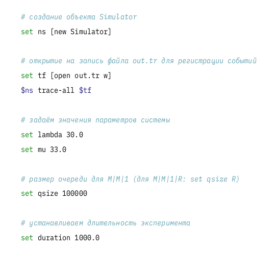
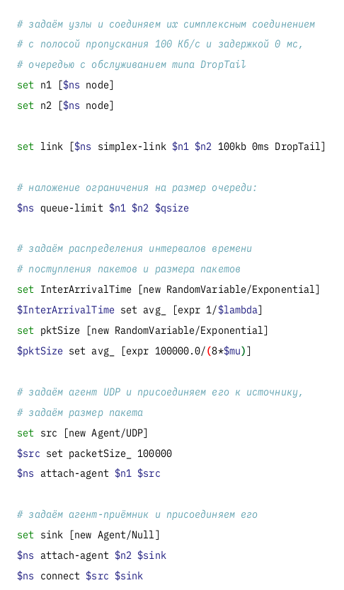
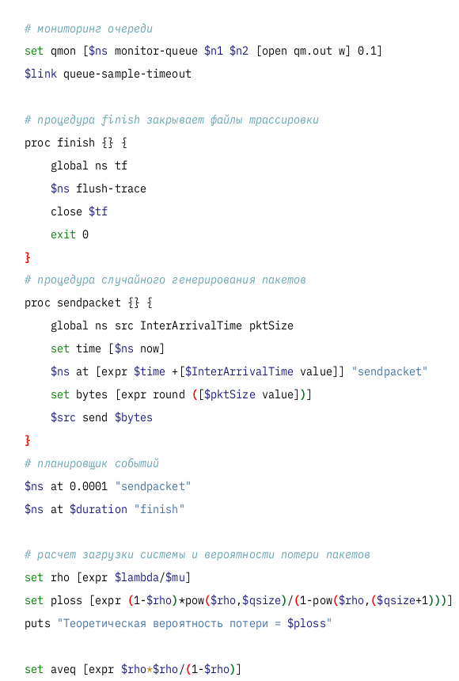
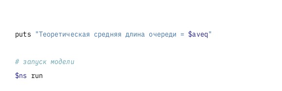
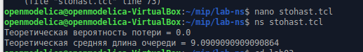
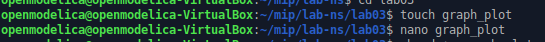
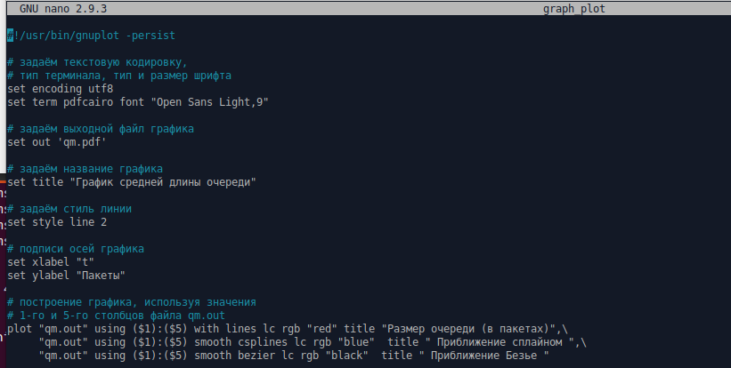
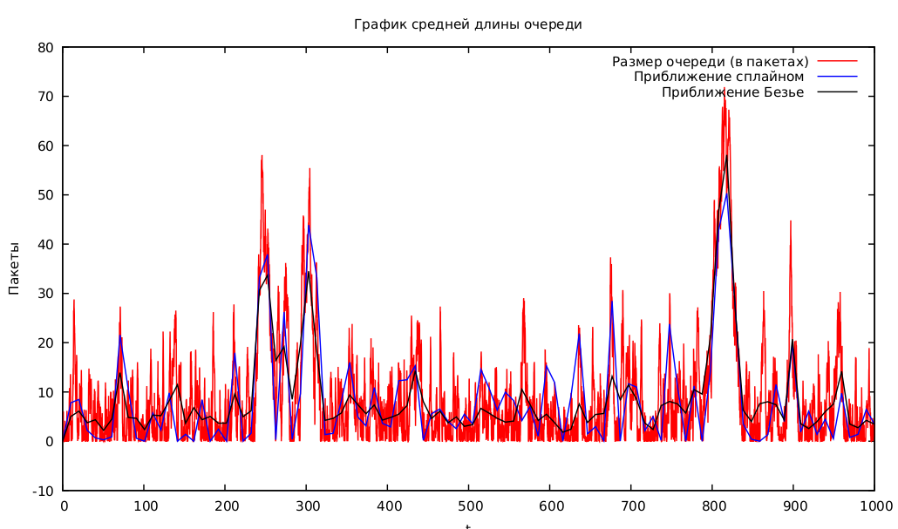

---
## Front matter
lang: ru-RU
title: Лабораторная работа 3. Моделирование стохастических процессов
author:
  - Абакумова О. М.
institute:
  - Российский университет дружбы народов, Москва, Россия

## i18n babel
babel-lang: russian
babel-otherlangs: english

## Formatting pdf
toc: false
toc-title: Содержание
slide_level: 2
aspectratio: 169
section-titles: true
theme: metropolis
header-includes:
 - \metroset{progressbar=frametitle,sectionpage=progressbar,numbering=fraction}
mainfont: Open Sans Light
---

# Информация

## Докладчик

:::::::::::::: {.columns align=center}
::: {.column width="70%"}

  * Абакумова Олеся Максимовна
  * Студентка
  * Российский университет дружбы народов
  * 1132220832@pfur.ru
  * <https://github.com/omabakumova>

:::
::: {.column width="30%"}

:::
::::::::::::::

# Цель работы

Приобретение навыков моделирования сетей передачи данных с помощью средства имитационного моделирования NS-2, а также анализ полученных результатов
моделирования.

# Задания 

- Реализовать модель на NS-2
- Построить график в GNUplot

# Выполнение лабораторной работы

## Реализация модели на NS-2

{#fig:001 width=40%}

## Реализация модели на NS-2

{#fig:002 width=25%}

## Реализация модели на NS-2

{#fig:003 width=30%}

## Реализация модели на NS-2

{#fig:004 width=70%}

## Реализация модели на NS-2

{#fig:005 width=70%}

## График в GNUplot

{#fig:006 width=70%}

## График в GNUplot

{#fig:007 width=70%}

## График в GNUplot

{#fig:008 width=70%}

## График в GNUplot

{#fig:009 width=65%}

# Выводы

Во время выполнения данной лабораторной работы я приобрела навыки моделирования стохастических процессов, используя NS-2 и построила график, используя в качестве инструмента GNUplot.

