---
## Front matter
lang: ru-RU
title: Лабораторная работа 4. Задание для самостоятельного выполнения
author:
  - Абакумова О. М.
institute:
  - Российский университет дружбы народов, Москва, Россия

## i18n babel
babel-lang: russian
babel-otherlangs: english

## Formatting pdf
toc: false
toc-title: Содержание
slide_level: 2
aspectratio: 169
section-titles: true
theme: metropolis
header-includes:
 - \metroset{progressbar=frametitle,sectionpage=progressbar,numbering=fraction}
mainfont: Open Sans Light
---

# Информация

## Докладчик

:::::::::::::: {.columns align=center}
::: {.column width="70%"}

  * Абакумова Олеся Максимовна
  * Студентка
  * Российский университет дружбы народов
  * 1132220832@pfur.ru
  * <https://github.com/omabakumova>

:::
::: {.column width="30%"}

:::
::::::::::::::

# Цель работы

На основе пройденного материала в прошлых лабораторных работах, выполнить самостоятельное задание.

# Задания 

1. Для приведённой схемы разработать имитационную модель в пакете NS-2.
2. Построить график изменения размера окна TCP (в Xgraph и в GNUPlot);
3. Построить график изменения длины очереди и средней длины очереди на первом
маршрутизаторе.

# Выполнение лабораторной работы

## Требования к моделируемой сети

- сеть состоит из N TCP-источников, N TCP-приёмников, двух маршрутизаторов
R1 и R2 между источниками и приёмниками;
- между TCP-источниками и первым маршрутизатором установлены дуплексные
соединения с пропускной способностью 100 Мбит/с и задержкой 20 мс очередью
типа DropTail;
- между TCP-приёмниками и вторым маршрутизатором установлены дуплексные
соединения с пропускной способностью 100 Мбит/с и задержкой 20 мс очередью
типа DropTail;

## Требования к моделируемой сети

- между маршрутизаторами установлено симплексное соединение (R1–R2) с пропускной способностью 20 Мбит/с и задержкой 15 мс очередью типа RED,
размером буфера 300 пакетов; в обратную сторону — симплексное соединение (R2–R1) с пропускной способностью 15 Мбит/с и задержкой 20 мс очередью
типа DropTail;
- данные передаются по протоколу FTP поверх TCPReno;
- параметры алгоритма RED: qmin = 75, qmax = 150, qw = 0, 002, pmax = 0.1;
- максимальный размер TCP-окна 32; размер передаваемого пакета 500 байт; время
моделирования — не менее 20 единиц модельного времени.

## Разработка имитационной модели в пакете NS-2.

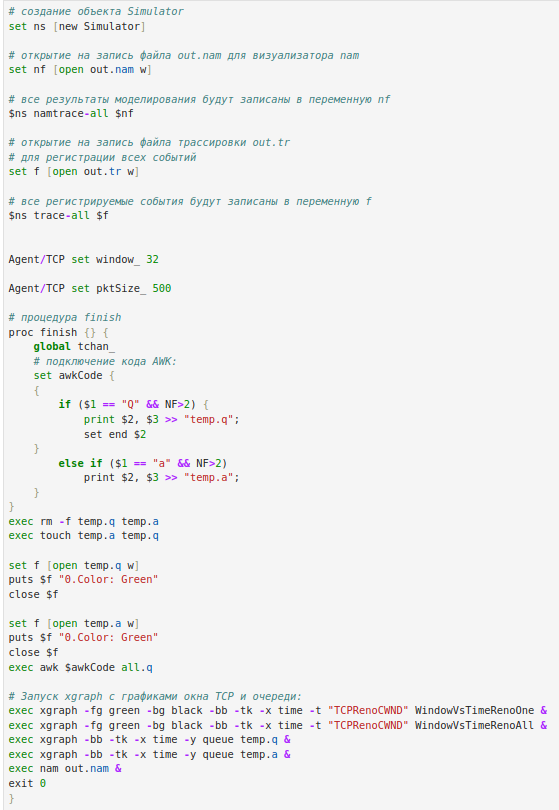{#fig:001 width=30%}

## Разработка имитационной модели в пакете NS-2.

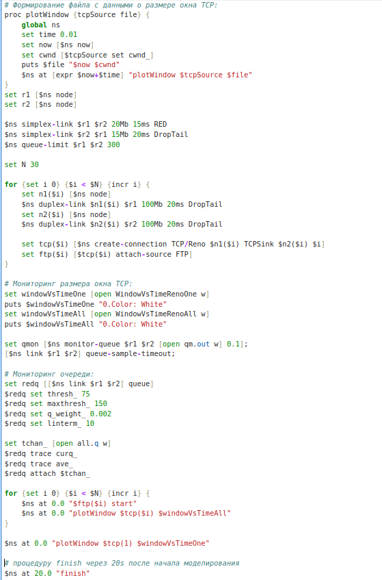{#fig:002 width=30%}

## Разработка имитационной модели в пакете NS-2.

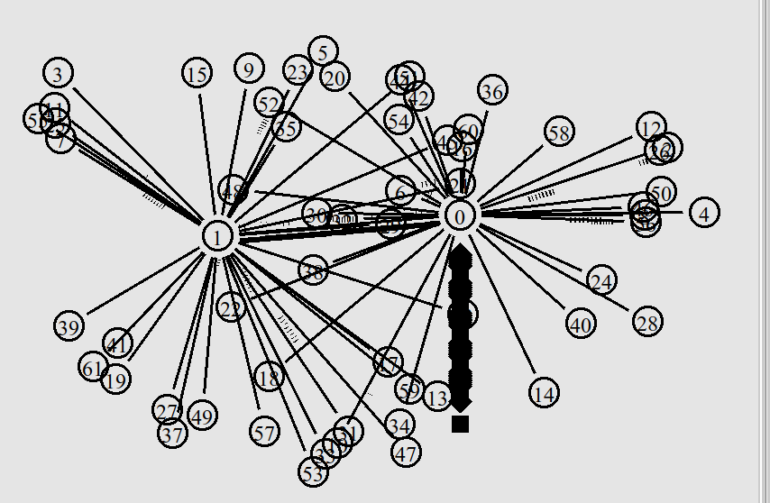{#fig:003 width=60%}

## Графики в Xgraph

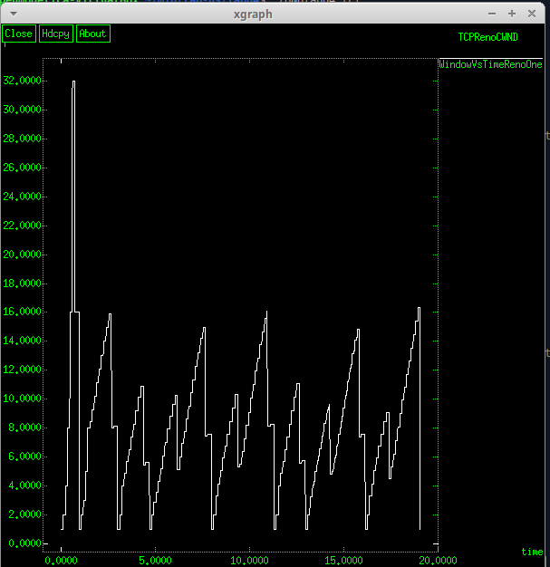{#fig:004 width=35%}

## Графики в Xgraph

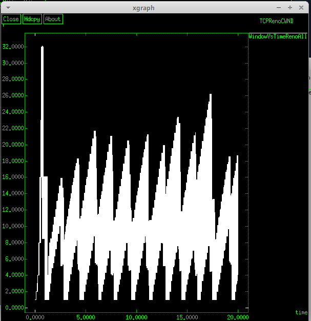{#fig:005 width=35%}

## Графики в Xgraph

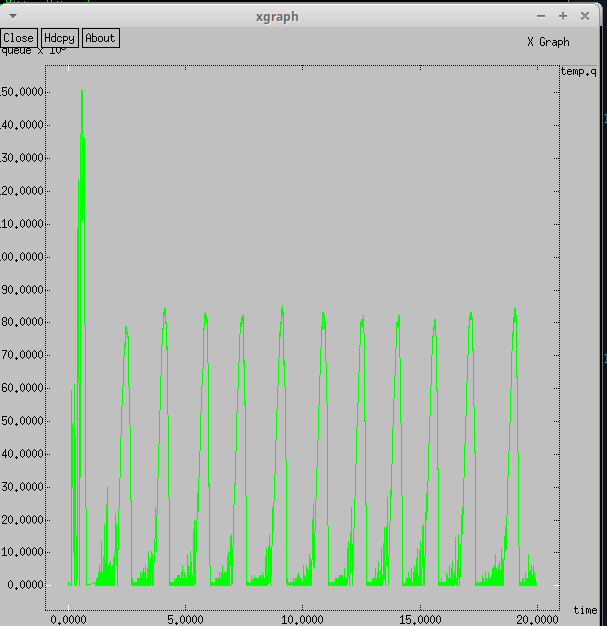{#fig:006 width=35%}

## Графики в Xgraph

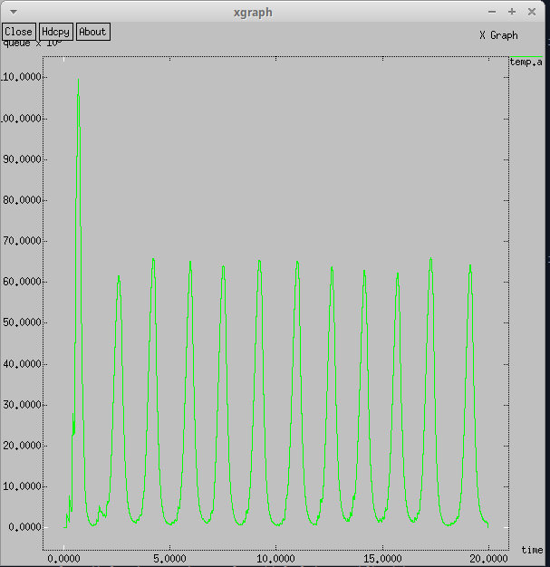{#fig:007 width=35%}

## Графики в GNUplot

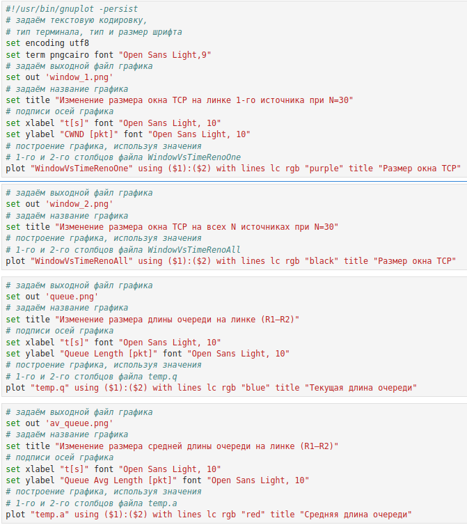{#fig:008 width=30%}

## Графики в GNUplot

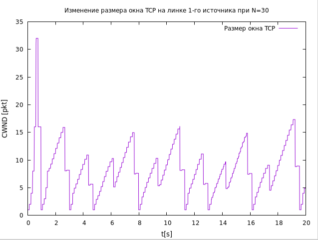{#fig:009 width=50%}

## Графики в GNUplot

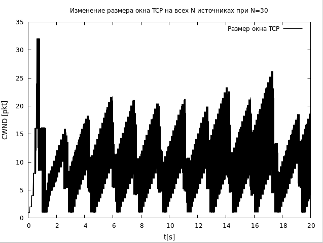{#fig:010 width=50%}

## Графики в GNUplot

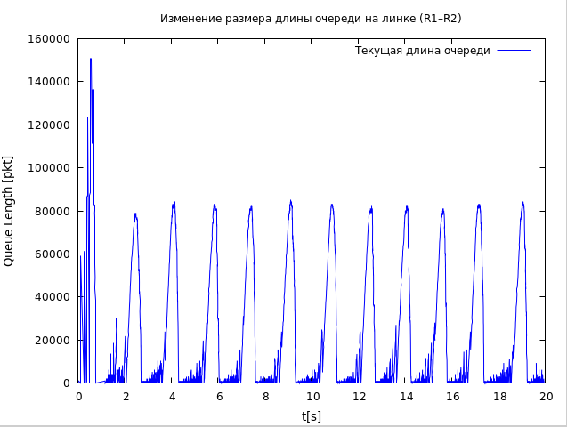{#fig:011 width=50%}

## Графики в GNUplot

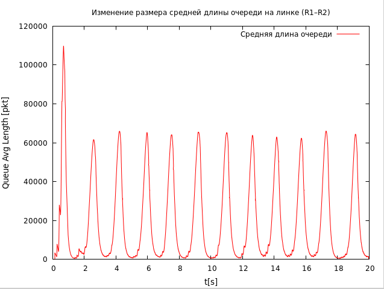{#fig:012 width=50%}

# Выводы

Во время выполнения данной лабораторной работы я применила, приобретенные в предыдущих лабораторных работах навыки и реализовала самостоятельно модель сети со всеми сопутствующими графиками, используя Xgraph и GNUplot.

