---
## Front matter
title: "Лабораторная работа 5. Модель эпидемии (SIR)"
author: "Абакумова Олеся Максимовна, НФИбд-02-22"

## Generic otions
lang: ru-RU
toc-title: "Содержание"

## Bibliography
bibliography: bib/cite.bib
csl: pandoc/csl/gost-r-7-0-5-2008-numeric.csl

## Pdf output format
toc: true # Table of contents
toc-depth: 2
lof: true # List of figures
lot: true # List of tables
fontsize: 12pt
linestretch: 1.5
papersize: a4
documentclass: scrreprt
## I18n polyglossia
polyglossia-lang:
  name: russian
  options:
	- spelling=modern
	- babelshorthands=true
polyglossia-otherlangs:
  name: english
## I18n babel
babel-lang: russian
babel-otherlangs: english
## Fonts
mainfont: IBM Plex Serif
romanfont: IBM Plex Serif
sansfont: IBM Plex Sans
monofont: IBM Plex Mono
mathfont: STIX Two Math
mainfontoptions: Ligatures=Common,Ligatures=TeX,Scale=0.94
romanfontoptions: Ligatures=Common,Ligatures=TeX,Scale=0.94
sansfontoptions: Ligatures=Common,Ligatures=TeX,Scale=MatchLowercase,Scale=0.94
monofontoptions: Scale=MatchLowercase,Scale=0.94,FakeStretch=0.9
mathfontoptions:
## Biblatex
biblatex: true
biblio-style: "gost-numeric"
biblatexoptions:
  - parentracker=true
  - backend=biber
  - hyperref=auto
  - language=auto
  - autolang=other*
  - citestyle=gost-numeric
## Pandoc-crossref LaTeX customization
figureTitle: "Рис."
tableTitle: "Таблица"
listingTitle: "Листинг"
lofTitle: "Список иллюстраций"
lotTitle: "Список таблиц"
lolTitle: "Листинги"
## Misc options
indent: true
header-includes:
  - \usepackage{indentfirst}
  - \usepackage{float} # keep figures where there are in the text
  - \floatplacement{figure}{H} # keep figures where there are in the text
---

# Цель работы

Используя Scilab, xcos и OpenModelica реализовать модель эпидемии(SIR).

## Теоретическое введение

Модель SIR предложена в 1927 г. (W. O. Kermack, A. G. McKendrick).
Предполагается, что особи популяции размера N могут находиться в трёх различ-
ных состояниях:
- S (susceptible, уязвимые) — здоровые особи, которые находятся в группе риска
и могут подхватить инфекцию;
- I (infective, заражённые, распространяющие заболевание) — заразившиеся пере-
носчики болезни;
- R (recovered/removed, вылечившиеся) — те, кто выздоровел и перестал распро-
странять болезнь (в эту категорию относят, например, приобретших иммунитет
или умерших).
Если предположить, что каждый член популяции может контактировать с каждым,
то задача о распространении эпидемии описывается системой дифференциальных
уравнений:

где $\beta$ -- скорость заражения, $\nu$ -- скорость выздоровления.
$$
\begin{cases}
  \dot s = - \beta s(t)i(t); \\
  \dot i = \beta s(t)i(t) - \nu i(t);\\
  \dot r = \nu i(t),
\end{cases}
$$

# Задание

1. Реализовать модель эпидемии(SIR).
2. Выполнить задание для самостоятельного выполнения.

# Выполнение лабораторной работы
## Реализация модели эпидемии(SIR)

В меню Моделирование, Задать переменные окружения зададим значения переменных $\beta$ и $\nu$  (рис. [-@fig:001]):

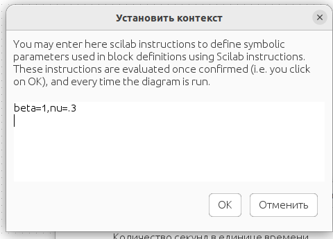{#fig:001 width=70%}

Теперь реализуем модель в xcos с помощью следующих блоков в палитре,она будет выглядеть следующим образом (рис. [-@fig:002]):

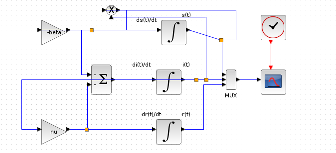{#fig:002 width=70%}

Зададим начальные значения в блоках интегрирования (рис. [-@fig:003]):

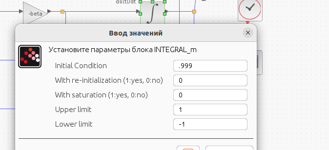{#fig:003 width=70%}

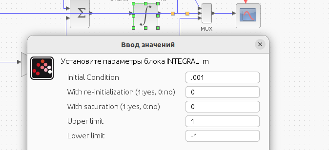{#fig:004 width=70%}

Последнее,что мы делаем прежде чем вывести модель,задаем конечное времени интгерирования равное 30 секундам в меню моделирования во вкладке для установки.После установки конечного времени интегрирования мы запускаем нашу модель (рис. [-@fig:005]):

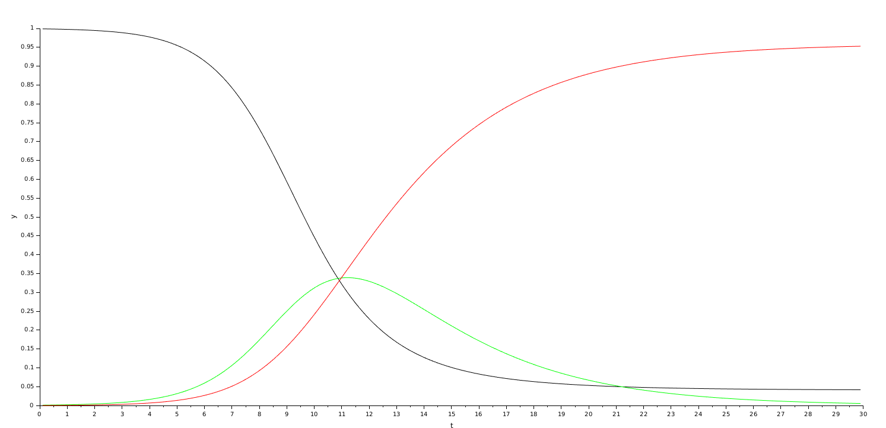{#fig:005 width=70%}

Реализуем теперь нашу модель с помощью блока Modelica в xcos (рис. [-@fig:006]):

{#fig:006 width=70%}

Необходимо теперь настроить параметры блока Modelica для нашей модели (рис. [-@fig:007]):

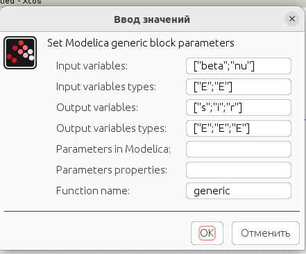{#fig:007 width=70%}

{#fig:008 width=70%}

 При запуске модели мы получаем следующий график аналогичный тому,что мы получали ранее (рис. [-@fig:009]):

{#fig:009 width=70%}

Теперь реализуем модель SIR в OpenModelica.Для этого нам нужно лишь в новом созданном для модели файле указать листинг и время моделирования равное 30 секундам (рис. [-@fig:010]):

{#fig:010 width=70%}

При реализации в OpenModelica мы получаем следующее (рис. [-@fig:011]):

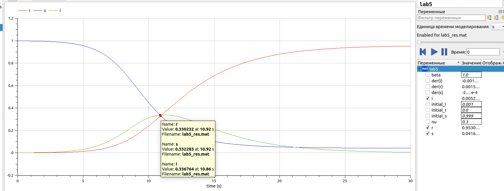{#fig:011 width=70%}

Что является полностью идентичным графиком всем ранее полученным.

## Задание для самостоятельного выполнения

В дополнение к предположениям, которые были сделаны для модели SIR, пред-
положим, что учитываются демографические процессы, в частности, что смертность
в популяции полностью уравновешивает рождаемость, а все рожденные индивидуу-
мы появляются на свет абсолютно здоровыми. Тогда получим следующую систему
уравнений:

$$
\begin{cases}
  \dot s = - \beta s(t)i(t) + \mu (N - s(t); \\
  \dot i = \beta s(t)i(t) - \nu i(t) - \mu i(t);\\
  \dot r = \nu i(t) - \mu r(t),
\end{cases}
$$

где $\mu$ — константа, которая равна коэффициенту смертности и рождаемости.

Требуется:
- реализовать модель SIR с учётом процесса рождения / гибели особей в xcos (в
том числе и с использованием блока Modelica), а также в OpenModelica;
- построить графики эпидемического порога при различных значениях параметров
модели (в частности изменяя параметр µ);
- сделать анализ полученных графиков в зависимости от выбранных значений
параметров модели.

Для начала реализуем нашу модель SIR с учетом процесса рождения/гибели в xcos.Мы также возьмем за основу нашу прежде созданную <<схему>> блоков и получим следующее (рис. [-@fig:012]):

{#fig:012 width=70%}

Все параметры в установке контекста и конечного времени интегрирования остаются теми же, за исключением добавления параметра $\mu = 0.2$ При запуске модели с такими параметрами, мы получаем следующий вывод (рис. [-@fig:013]):

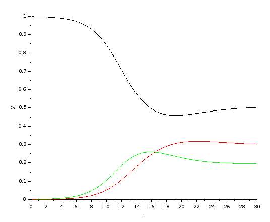{#fig:013 width=70%}

Теперь попробуем реализовать нашу модель с помощью блока Modelica.Она будет выглядеть почти аналогично той, что мы реализовали ранее за исключением добавления блока для $\mu$ (рис. [-@fig:014]):

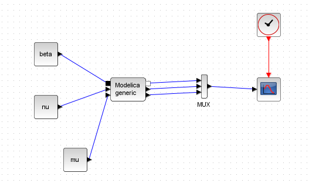{#fig:014 width=70%}

Для нее трубется задать следующие парамтеры и листинг (рис. [-@fig:015]):

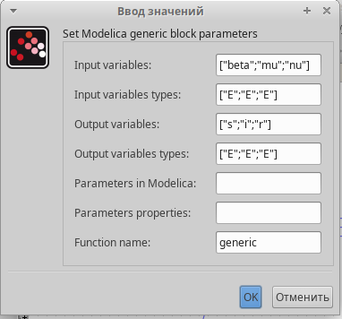{#fig:015 width=70%}

{#fig:016 width=70%}

Выполнив запуск мы не получим ничего хорошего к сожалению,по какой-то причине график не поддавался никаким исправлениям и оставался таким какой он есть :(  (рис. [-@fig:017]):

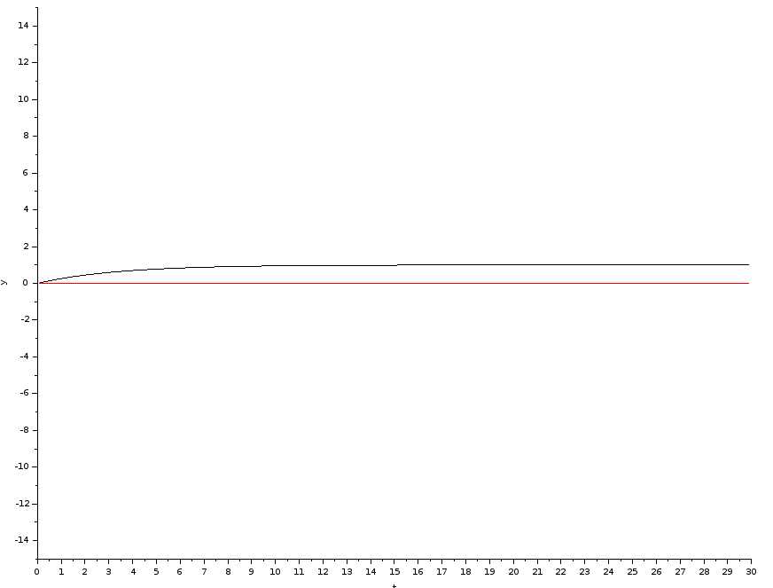{#fig:017 width=70%}

Удача улыбнулась в OpenModelica.Там необходимо было также немного изменить листинг предыдущей модели следующим образом (рис. [-@fig:018]):

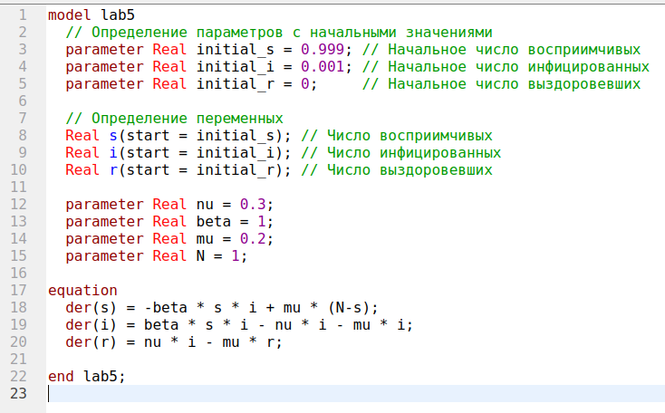{#fig:018 width=70%}

При запуске получаем следующий результат (рис. [-@fig:019]):

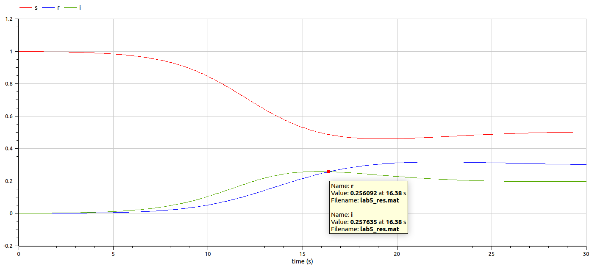{#fig:019 width=70%}

Теперь рассмотрим различные подстановки значений в $\mu$ для реализации в xcos и OpenModelica (рис. [-@fig:020]):

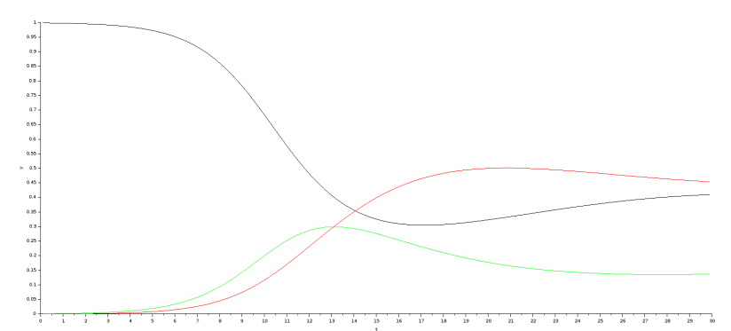{#fig:020 width=70%}

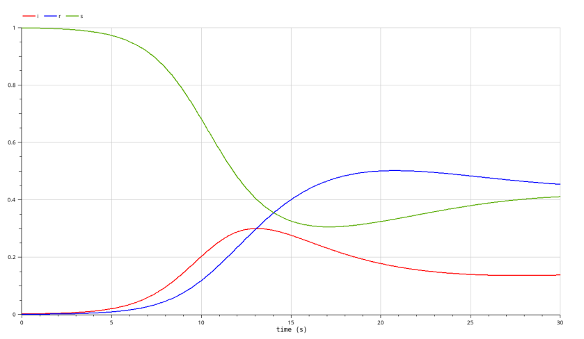{#fig:021 width=70%}

{#fig:022 width=70%}

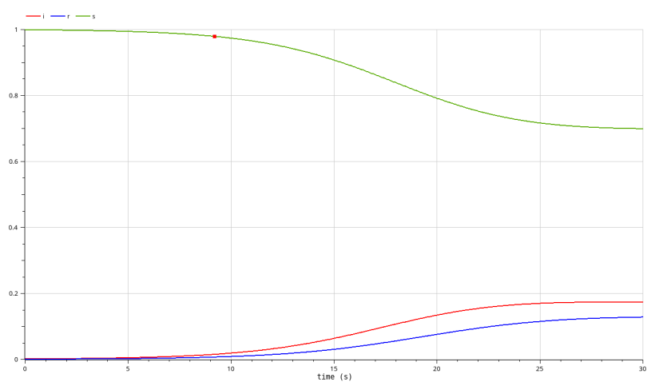{#fig:023 width=70%}

Показатель $\mu$ вносит в модель элемент гибкости. В исходной модели SIR количество заболевших в конечном итоге достигает нуля, поскольку либо все приобретают иммунитет, либо болезнь не успевает распространиться (однако этот случай не рассматривается в данной лабораторной работе). При введении в модель показателей рождаемости и смертности, а также соответствующих изменений в расчетных формулах, число инфицированных может не снижаться до нуля. Это объясняется тем, что умирать могут не только заболевшие, но и выздоровевшие, обладающие иммунитетом, которых заменяют новорожденные без иммунной защиты. Таким образом, в популяции всегда остается определенная доля людей, подверженных заболеваниям.

Важно отметить, что с увеличением значения µ графики становятся более пологими с течением времени, и меньшее количество людей получает иммунитет к болезни. Кроме того, в определенный момент времени большая часть популяции оказывается заболевшей, что происходит после установления равновесия между различными группами населения.

# Выводы

Во время выполнения данной лабораторной работы я реализовала модель эпидемии (SIR) с помощью Scilab,подсистемы xcos и OpenModelica.
