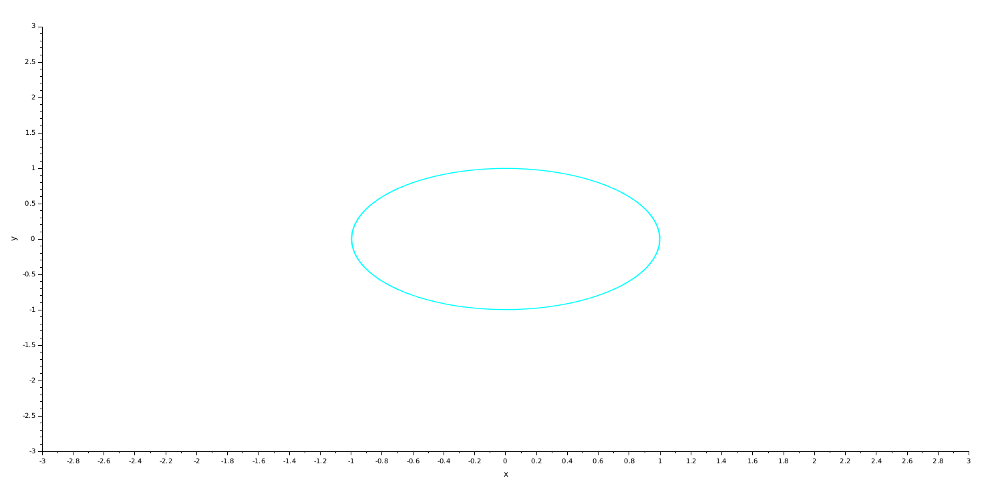
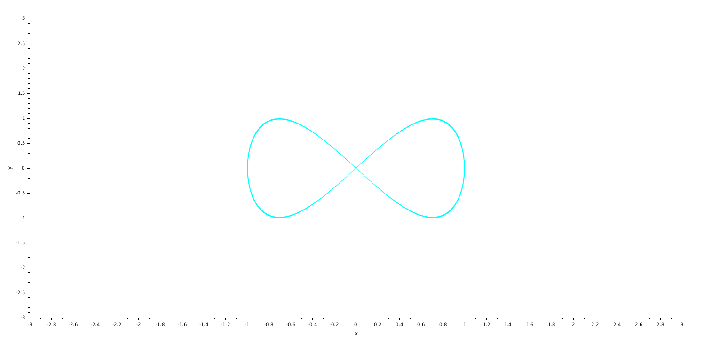
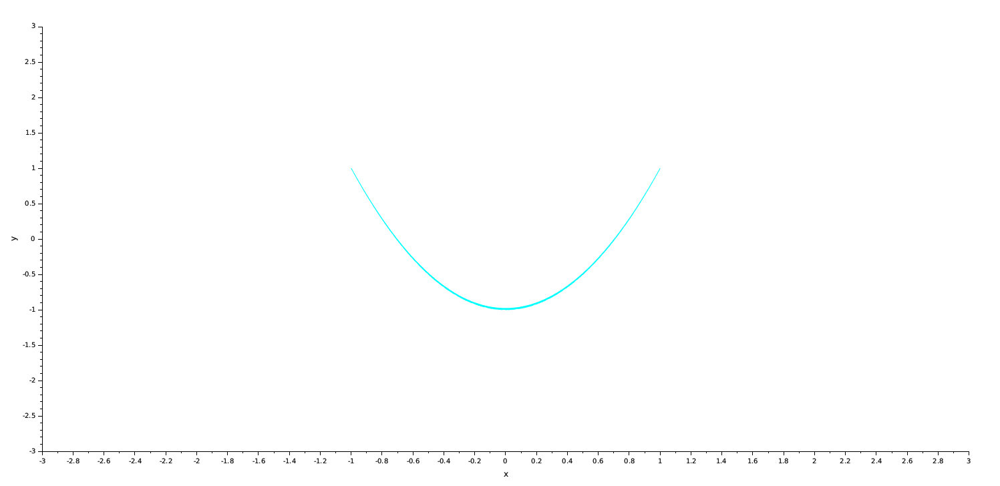
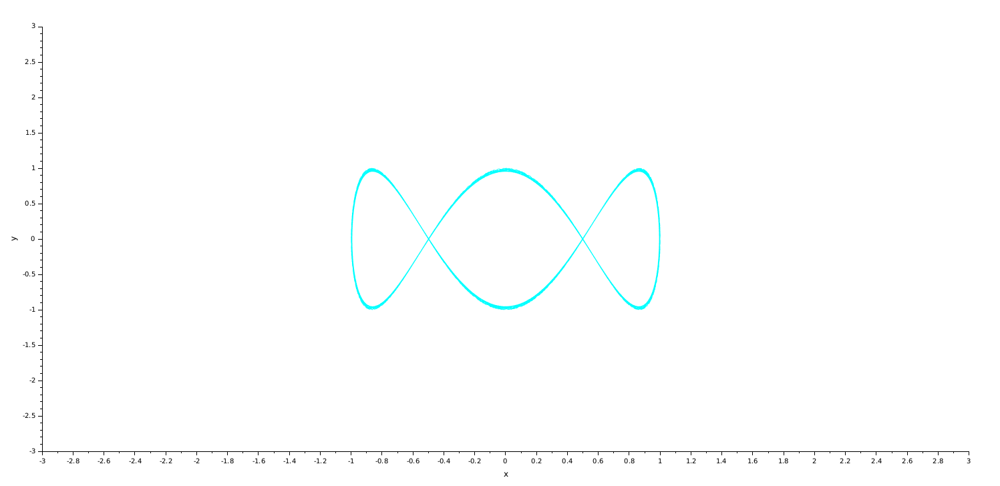
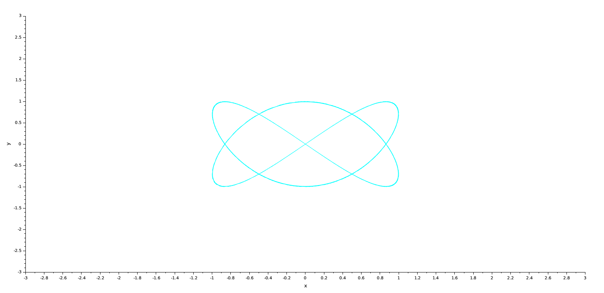
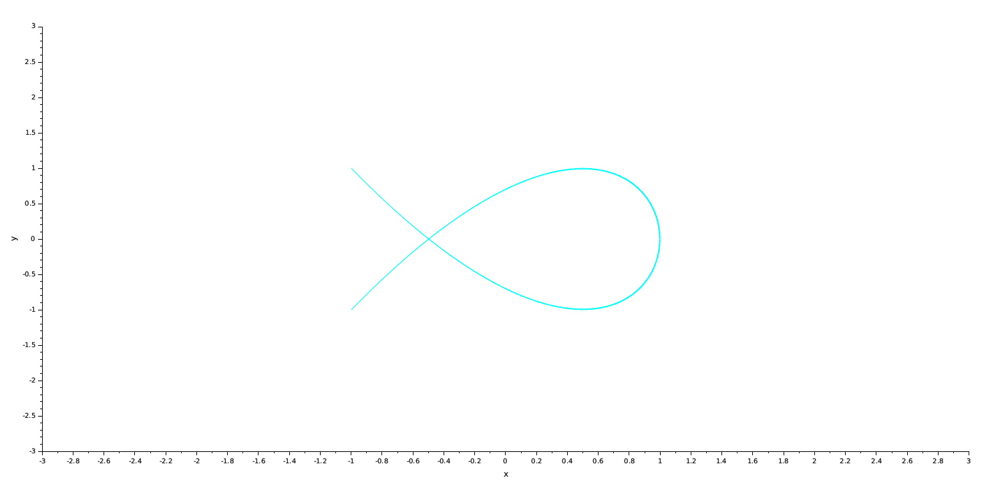

---
## Front matter
title: "Упражнение на построение фигур Лиссажу с помощью xcos"
author: "Абакумова Олеся Максимовна, НФИбд-02-22"

## Generic otions
lang: ru-RU
toc-title: "Содержание"

## Bibliography
bibliography: bib/cite.bib
csl: pandoc/csl/gost-r-7-0-5-2008-numeric.csl

## Pdf output format
toc: true # Table of contents
toc-depth: 2
lof: true # List of figures
lot: true # List of tables
fontsize: 12pt
linestretch: 1.5
papersize: a4
documentclass: scrreprt
## I18n polyglossia
polyglossia-lang:
  name: russian
  options:
	- spelling=modern
	- babelshorthands=true
polyglossia-otherlangs:
  name: english
## I18n babel
babel-lang: russian
babel-otherlangs: english
## Fonts
mainfont: IBM Plex Serif
romanfont: IBM Plex Serif
sansfont: IBM Plex Sans
monofont: IBM Plex Mono
mathfont: STIX Two Math
mainfontoptions: Ligatures=Common,Ligatures=TeX,Scale=0.94
romanfontoptions: Ligatures=Common,Ligatures=TeX,Scale=0.94
sansfontoptions: Ligatures=Common,Ligatures=TeX,Scale=MatchLowercase,Scale=0.94
monofontoptions: Scale=MatchLowercase,Scale=0.94,FakeStretch=0.9
mathfontoptions:
## Biblatex
biblatex: true
biblio-style: "gost-numeric"
biblatexoptions:
  - parentracker=true
  - backend=biber
  - hyperref=auto
  - language=auto
  - autolang=other*
  - citestyle=gost-numeric
## Pandoc-crossref LaTeX customization
figureTitle: "Рис."
tableTitle: "Таблица"
listingTitle: "Листинг"
lofTitle: "Список иллюстраций"
lotTitle: "Список таблиц"
lolTitle: "Листинги"
## Misc options
indent: true
header-includes:
  - \usepackage{indentfirst}
  - \usepackage{float} # keep figures where there are in the text
  - \floatplacement{figure}{H} # keep figures where there are in the text
---

# Цель работы

Используя Scilab и xcos, построить фигуры Лиссажу по заданным параметрам.

## Теоретическое введение

Общее математическое выражение для кривой Лиссажу:

$$
\begin{cases}
  x(t) = A \cdot \sin(at + \delta) \\
  y(t) = B \cdot \sin(bt) \\
\end{cases}
$$

где A, B — амплитуды колебаний, a, b — частоты, $\delta$ — сдвиг фаз.

# Задание

1. Построить в xcos фигуры Лиссажу со следующими параметрами:
   - $A = B = 1, a = 2, b = 2, \delta = 0; \pi/4;\pi/2;3\pi/4;\pi$;
   - $A = B = 1, a = 2, b = 4, \delta = 0; \pi/4;\pi/2;3\pi/4;\pi$;
   - $A = B = 1, a = 2, b = 6, \delta = 0; \pi/4;\pi/2;3\pi/4;\pi$;
   - $A = B = 1, a = 2, b = 3, \delta = 0; \pi/4;\pi/2;3\pi/4;\pi$;

# Выполнение лабораторной работы
## Упражнение.

Для построения последующих фигур построим модель вида (рис. [-@fig:001]):

{#fig:001 width=70%}

Для начала построим фигуры со следующими параметрами:

1. $A = B = 1, a = 2, b = 2, \delta = 0$ (рис. [-@fig:002]):

{#fig:002 width=70%}

2. $A = B = 1, a = 2, b = 2, \delta = \pi/4$ (рис. [-@fig:003]):

{#fig:003 width=70%}

3. $A = B = 1, a = 2, b = 2, \delta = \pi/2$ (рис. [-@fig:004]):

{#fig:004 width=70%}

4. $A = B = 1, a = 2, b = 2, \delta = 3\pi/4$ (рис. [-@fig:005]):

{#fig:005 width=70%}

4. $A = B = 1, a = 2, b = 2, \delta = \pi$ (рис. [-@fig:006]):

{#fig:006 width=70%}

Аналогичным образом построим фигуры Лиссажу с другими параметрами,в данном случае у нас будут различны друг от друга параметры частот:

1. $A = B = 1, a = 2, b = 4, \delta = 0$ (рис. [-@fig:007]):

{#fig:007 width=70%}

2. $A = B = 1, a = 2, b = 4, \delta = \pi/4$ (рис. [-@fig:008]):

{#fig:008 width=70%}

3. $A = B = 1, a = 2, b = 4, \delta = \pi/2$ (рис. [-@fig:009]):

{#fig:009 width=70%}

4. $A = B = 1, a = 2, b = 2, \delta = 3\pi/4$ (рис. [-@fig:010]):

{#fig:010 width=70%}

4. $A = B = 1, a = 2, b = 4, \delta = \pi$ (рис. [-@fig:011]):

{#fig:011 width=70%}

Далее рассмотрим фигуры со следующим параметром частоты:

1. $A = B = 1, a = 2, b = 6, \delta = 0$ (рис. [-@fig:012]):

{#fig:012 width=70%}

2. $A = B = 1, a = 2, b = 6, \delta = \pi/4$ (рис. [-@fig:013]):

{#fig:013 width=70%}

3. $A = B = 1, a = 2, b = 6, \delta = \pi/2$ (рис. [-@fig:014]):

{#fig:014 width=70%}

4. $A = B = 1, a = 2, b = 6, \delta = 3\pi/4$ (рис. [-@fig:015]):

{#fig:015 width=70%}

4. $A = B = 1, a = 2, b = 6, \delta = \pi$ (рис. [-@fig:016]):

{#fig:016 width=70%}

В последнем пункте задания также поменяем только частоту на уже нечетное значение и посмотрим какие фигуры мы получим:

1. $A = B = 1, a = 2, b = 3, \delta = 0$ (рис. [-@fig:017]):

{#fig:017 width=70%}

2. $A = B = 1, a = 2, b = 3, \delta = \pi/4$ (рис. [-@fig:018]):

{#fig:018 width=70%}

3. $A = B = 1, a = 2, b = 3, \delta = \pi/2$ (рис. [-@fig:019]):

{#fig:019 width=70%}

4. $A = B = 1, a = 2, b = 3, \delta = 3\pi/4$ (рис. [-@fig:020]):

{#fig:020 width=70%}

4. $A = B = 1, a = 2, b = 3, \delta = \pi$ (рис. [-@fig:021]):

{#fig:021 width=70%}

# Выводы

Во время выполнения данной лабораторной работы я применила, приобретенные навыки работы с Scilab и подсистемой xcos, и реализовала ряд фигур Лиссажу по заданным параметрам.

