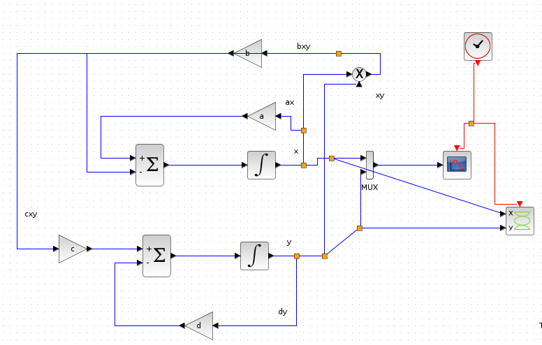
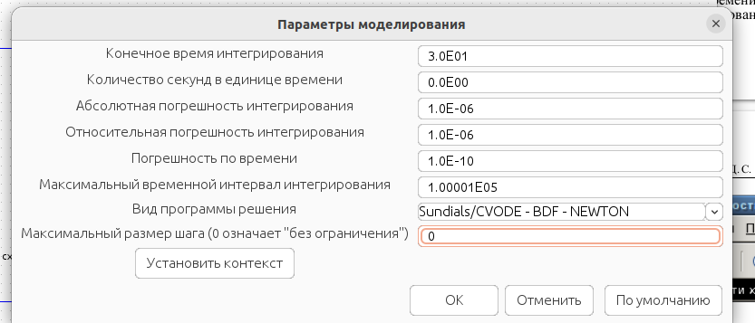
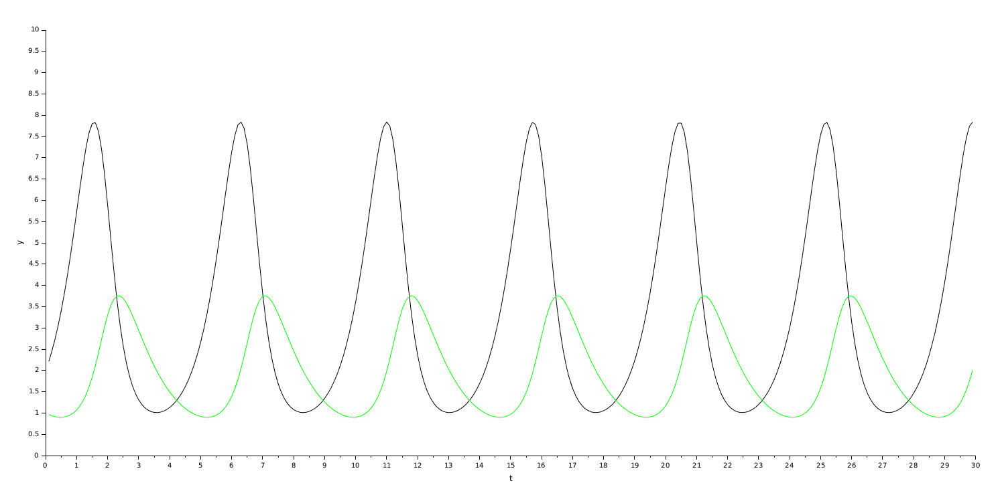
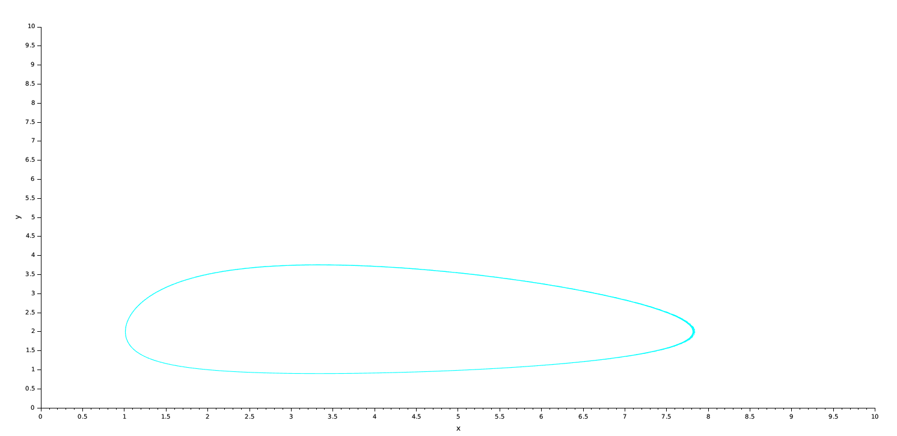
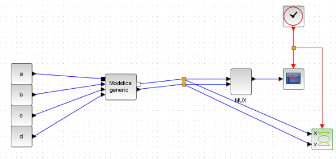
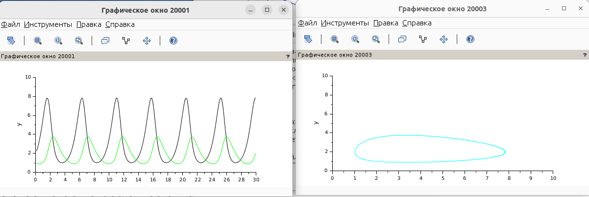

---
## Front matter
lang: ru-RU
title: Лабораторная работа 6. Модель <<хищник–жертва>>
author:
  - Абакумова О. М.
institute:
  - Российский университет дружбы народов, Москва, Россия

## i18n babel
babel-lang: russian
babel-otherlangs: english

## Formatting pdf
toc: false
toc-title: Содержание
slide_level: 2
aspectratio: 169
section-titles: true
theme: metropolis
header-includes:
 - \metroset{progressbar=frametitle,sectionpage=progressbar,numbering=fraction}
 - '\makeatletter'
 - '\makeatother'
mainfont: Open Sans Light

---

# Информация

## Докладчик

:::::::::::::: {.columns align=center}
::: {.column width="70%"}

  * Абакумова Олеся Максимовна
  * Студентка
  * Российский университет дружбы народов
  * 1132220832@pfur.ru
  * <https://github.com/omabakumova>

:::
::: {.column width="30%"}

:::
::::::::::::::

# Цель работы

Используя xcos,блок Modelica и OpenModelica реализовать модель <<хищник–жертва>> .

# Задания 

1. Реализовать модель в xcos.
2. Реализовать модель с помощью блока Modelica в xcos.
3. Реализовать модель в OpenModelica.

## Задания 

$$
\begin{cases}
  \dot x = ax - bxy \\
  \dot y = cxy - dy,
\end{cases}
$$

где $x$ — количество жертв; $y$ — количество хищников; $a, b, c, d$ — коэффициенты, отражающие взаимодействия между видами: $a$ — коэффициент рождаемости
жертв; $b$ — коэффициент убыли жертв; $c$ — коэффициент рождения хищников; $d$ —
коэффициент убыли хищников.

# Выполнение лабораторной работы

## Реализация модели в xcos

{#fig:001 width=70%}

## Реализация модели в xcos

{#fig:002 width=70%}

## Реализация модели в xcos

{#fig:003 width=70%}

## Реализация модели в xcos

{#fig:004 width=70%}

## Реализация модели в xcos

{#fig:005 width=70%}

## Реализация модели в xcos

{#fig:006 width=70%}

## Реализация модели в xcos

{#fig:007 width=70%}

## Реализация модели с помощью блока Modelica в xcos

{#fig:008 width=50%}

## Реализация модели с помощью блока Modelica в xcos

{#fig:009 width=50%}

## Реализация модели с помощью блока Modelica в xcos

{#fig:010 width=70%}

## Реализация модели с помощью блока Modelica в xcos

{#fig:011 width=70%}

## Реализация модели в OpenModelica

{#fig:012 width=60%}

## Реализация модели в OpenModelica

{#fig:013 width=70%}

## Реализация модели в OpenModelica

{#fig:014 width=70%}

# Выводы

Во время выполнения данной лабораторной работы я реализовала модель модель <<хищник–жертва>> в xcos,также с помощью блока Modelica и в OpenModelica.
