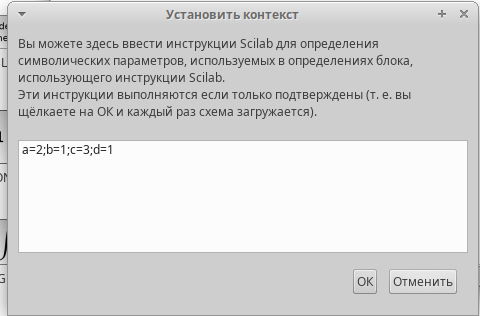
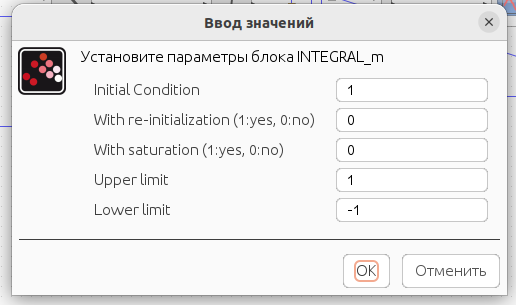
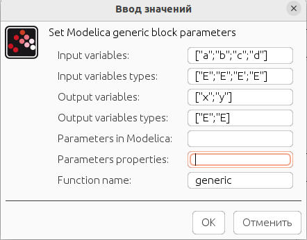
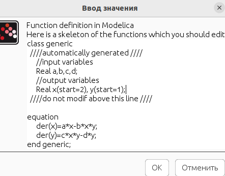
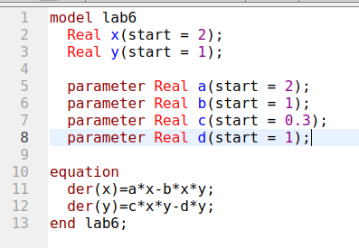
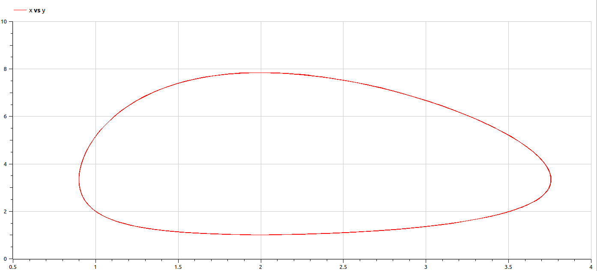
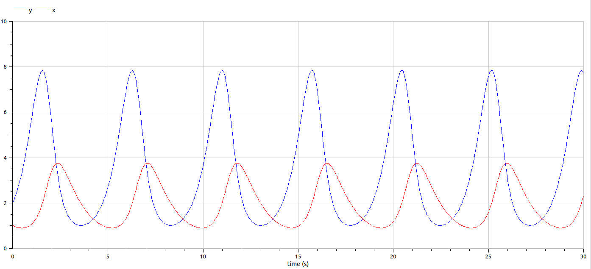

---
## Front matter
title: "Лабораторная работа 6. Модель <<хищник–жертва>>"
author: "Абакумова Олеся Максимовна, НФИбд-02-22"

## Generic otions
lang: ru-RU
toc-title: "Содержание"

## Bibliography
bibliography: bib/cite.bib
csl: pandoc/csl/gost-r-7-0-5-2008-numeric.csl

## Pdf output format
toc: true # Table of contents
toc-depth: 2
lof: true # List of figures
lot: true # List of tables
fontsize: 12pt
linestretch: 1.5
papersize: a4
documentclass: scrreprt
## I18n polyglossia
polyglossia-lang:
  name: russian
  options:
	- spelling=modern
	- babelshorthands=true
polyglossia-otherlangs:
  name: english
## I18n babel
babel-lang: russian
babel-otherlangs: english
## Fonts
mainfont: IBM Plex Serif
romanfont: IBM Plex Serif
sansfont: IBM Plex Sans
monofont: IBM Plex Mono
mathfont: STIX Two Math
mainfontoptions: Ligatures=Common,Ligatures=TeX,Scale=0.94
romanfontoptions: Ligatures=Common,Ligatures=TeX,Scale=0.94
sansfontoptions: Ligatures=Common,Ligatures=TeX,Scale=MatchLowercase,Scale=0.94
monofontoptions: Scale=MatchLowercase,Scale=0.94,FakeStretch=0.9
mathfontoptions:
## Biblatex
biblatex: true
biblio-style: "gost-numeric"
biblatexoptions:
  - parentracker=true
  - backend=biber
  - hyperref=auto
  - language=auto
  - autolang=other*
  - citestyle=gost-numeric
## Pandoc-crossref LaTeX customization
figureTitle: "Рис."
tableTitle: "Таблица"
listingTitle: "Листинг"
lofTitle: "Список иллюстраций"
lotTitle: "Список таблиц"
lolTitle: "Листинги"
## Misc options
indent: true
header-includes:
  - \usepackage{indentfirst}
  - \usepackage{float} # keep figures where there are in the text
  - \floatplacement{figure}{H} # keep figures where there are in the text
---

# Цель работы

Используя xcos,блок Modelica и OpenModelica реализовать модель <<хищник–жертва>> .

## Теоретическое введение

Модель <<хищник–жертва>> (модель Лотки — Вольтерры) представляет собой модель
межвидовой конкуренции. В математической
форме модель имеет вид:

$$
\begin{cases}
  \dot x = ax - bxy \\
  \dot y = cxy - dy,
\end{cases}
$$

где $x$ — количество жертв; $y$ — количество хищников; $a, b, c, d$ — коэффициенты, отражающие взаимодействия между видами: $a$ — коэффициент рождаемости
жертв; $b$ — коэффициент убыли жертв; $c$ — коэффициент рождения хищников; $d$ —
коэффициент убыли хищников.

# Задание

1. Реализовать модель в xcos.
2. Реализовать модель с помощью блока Modelica в xcos.
3. Реализовать модель в OpenModelica.

# Выполнение лабораторной работы
## Реализация модели в xcos

В меню Моделирование зададим начальные данные (рис. [-@fig:001]):

{#fig:001 width=70%}

Теперь реализуем модель в xcos с помощью следующих блоков в палитре,она будет выглядеть следующим образом (рис. [-@fig:002]):

{#fig:002 width=70%}

В параметрах блоков интегрирования необходимо задать начальные значения (рис. [-@fig:003]):

{#fig:003 width=70%}

{#fig:004 width=70%}

Последнее,что мы делаем прежде чем вывести модель,задаем конечное времени интегрирования равное 30 секундам в меню моделирования во вкладке для установки.После установки конечного времени интегрирования мы запускаем нашу модель (рис. [-@fig:005]):

{#fig:005 width=70%}

После запуска мы получаем следующие результаты (рис. [-@fig:006]):

{#fig:006 width=70%}

{#fig:007 width=70%}

## Реализация модели с помощью блока Modelica в xcos

Все начальные данные заданные прежде в контексте остаются неизменными.Зададим параметры блока Modelica (рис. [-@fig:008]):

{#fig:008 width=70%}

{#fig:009 width=70%}

Итоговая модель с использованием блока Modelica будет выглядеть следующим образом (рис. [-@fig:010]):

{#fig:010 width=70%}

После запуска мы получаем аналогичные прежде полученным графики (рис. [-@fig:011]):

{#fig:011 width=70%}

## Реализация модели в OpenModelica

Реализуем модель <<хищник-жертва>> в OpenModelica.Для этого укажем следующий листинг (рис. [-@fig:012]):

{#fig:012 width=70%}

После указания времени моделирования в параметрах моделирования равное 30 секундам,мы запускаем и получаем те же графики, что и в xcos только в OpenModelica (рис. [-@fig:013]):

{#fig:013 width=70%}

{#fig:014 width=70%}

# Выводы

Во время выполнения данной лабораторной работы я реализовала модель модель <<хищник–жертва>> в xcos,также с помощью блока Modelica и в OpenModelica.
