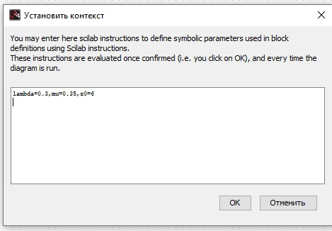
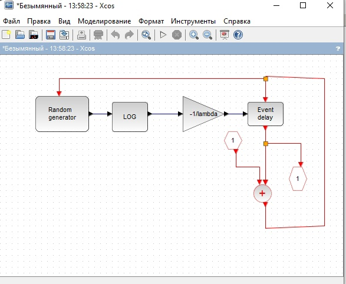
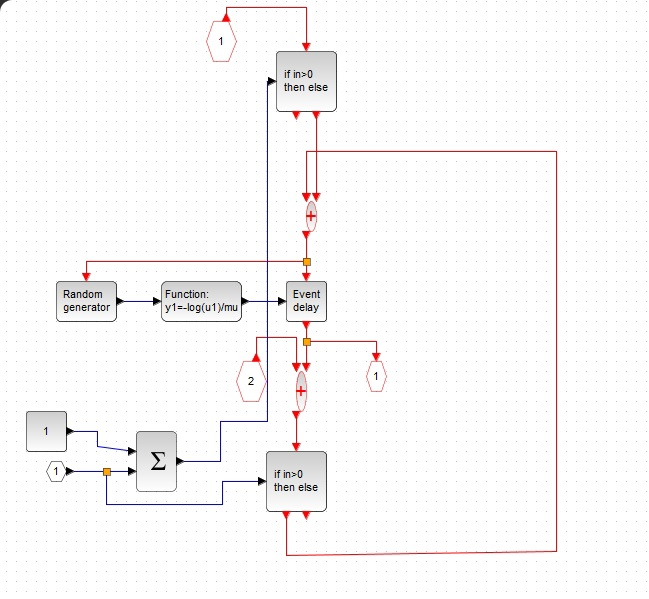
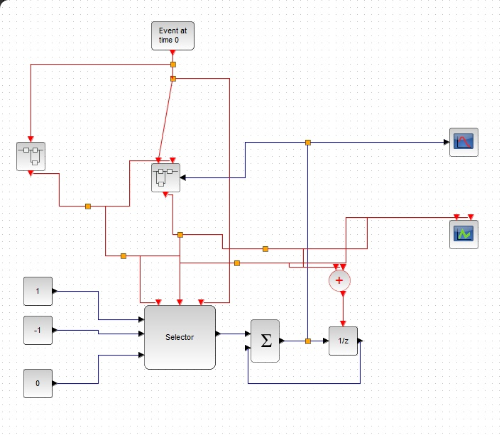
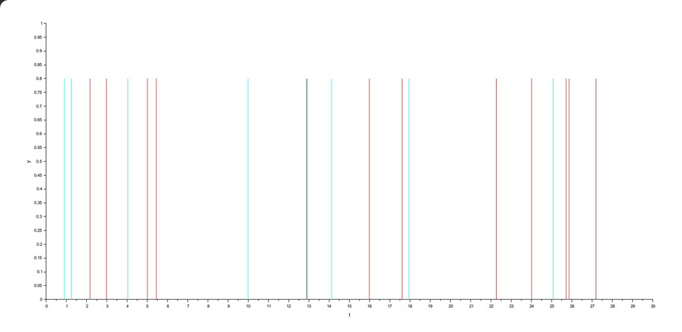
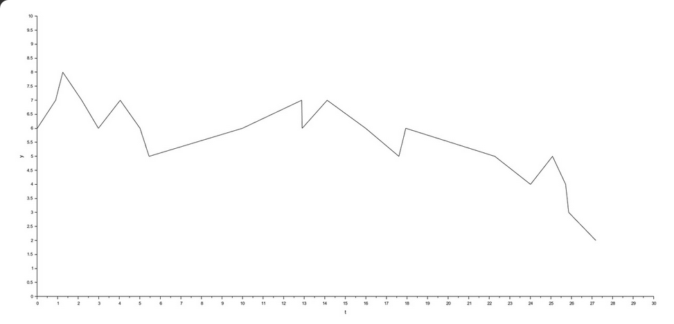

---
## Front matter
title: "Лабораторная работа 7. Модель $M |M |1|∞$"
author: "Абакумова Олеся Максимовна, НФИбд-02-22"

## Generic otions
lang: ru-RU
toc-title: "Содержание"

## Bibliography
bibliography: bib/cite.bib
csl: pandoc/csl/gost-r-7-0-5-2008-numeric.csl

## Pdf output format
toc: true # Table of contents
toc-depth: 2
lof: true # List of figures
lot: true # List of tables
fontsize: 12pt
linestretch: 1.5
papersize: a4
documentclass: scrreprt
## I18n polyglossia
polyglossia-lang:
  name: russian
  options:
	- spelling=modern
	- babelshorthands=true
polyglossia-otherlangs:
  name: english
## I18n babel
babel-lang: russian
babel-otherlangs: english
## Fonts
mainfont: IBM Plex Serif
romanfont: IBM Plex Serif
sansfont: IBM Plex Sans
monofont: IBM Plex Mono
mathfont: STIX Two Math
mainfontoptions: Ligatures=Common,Ligatures=TeX,Scale=0.94
romanfontoptions: Ligatures=Common,Ligatures=TeX,Scale=0.94
sansfontoptions: Ligatures=Common,Ligatures=TeX,Scale=MatchLowercase,Scale=0.94
monofontoptions: Scale=MatchLowercase,Scale=0.94,FakeStretch=0.9
mathfontoptions:
## Biblatex
biblatex: true
biblio-style: "gost-numeric"
biblatexoptions:
  - parentracker=true
  - backend=biber
  - hyperref=auto
  - language=auto
  - autolang=other*
  - citestyle=gost-numeric
## Pandoc-crossref LaTeX customization
figureTitle: "Рис."
tableTitle: "Таблица"
listingTitle: "Листинг"
lofTitle: "Список иллюстраций"
lotTitle: "Список таблиц"
lolTitle: "Листинги"
## Misc options
indent: true
header-includes:
  - \usepackage{indentfirst}
  - \usepackage{float} # keep figures where there are in the text
  - \floatplacement{figure}{H} # keep figures where there are in the text
---

# Цель работы

Используя xcos, реализовать модель  $M |M |1|∞$.

# Задание

1. Реализовать модель $M |M |1|∞$ в xcos с использованием суперблоков.

# Выполнение лабораторной работы
## Реализация модели в xcos

Рассмотрим пример моделирования в xcos системы массового обслуживания типа $M |M |1|∞$. Зафиксируем начальные данные: $\lambda$ = 0.3, $\mu$ = 0.35, $z0$ = 6(рис. [-@fig:001]):

{#fig:001 width=70%}

Теперь реализуем cуперблок, моделирующий поступление заявок (рис. [-@fig:002]):

{#fig:002 width=70%}

Аналогичным образом настроим суперблок для обработки заявок (рис. [-@fig:003]):

{#fig:003 width=70%}

Суперблоки можно реализовать,либо взяв нужный блок из палитры,либо реализовав в пространстве модель для него и позже объединить это в суперблок.В моем случае я сначала реализовала для каждого супеоблока схему из блоков,а потом объединила их в суперблоки, настроив соединения непосредственно уже в самом суперблоке.

Сама итоговая модель массового обслуживания с суперблоками будет выглядеть следующим образом (рис. [-@fig:004]):

{#fig:004 width=70%}

После запуска мы получаем следующие результаты (рис. [-@fig:005]):

{#fig:005 width=85%}

{#fig:006 width=85%}

# Выводы

Во время выполнения данной лабораторной работы я реализовала модель $M |M |1|∞$ в xcos с использованием суперблоков.
