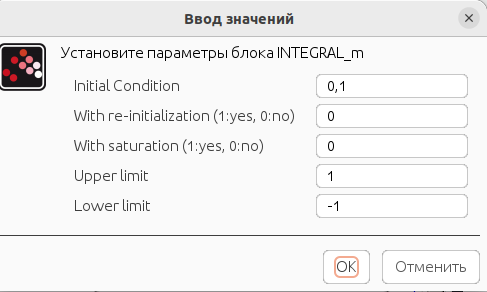
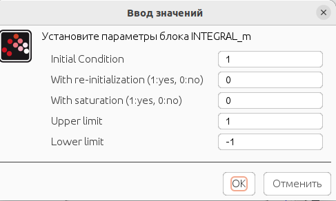
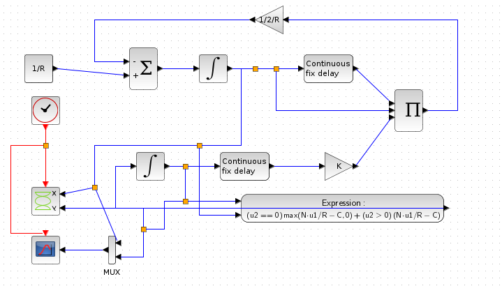
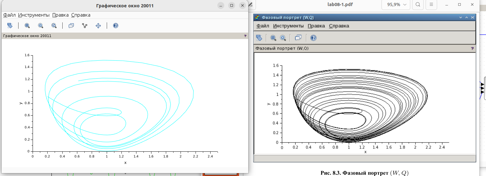
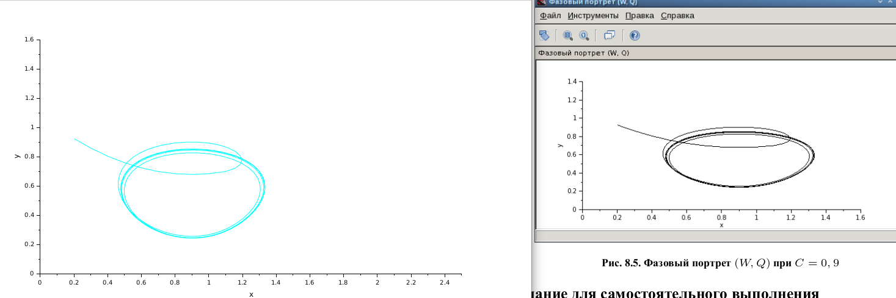
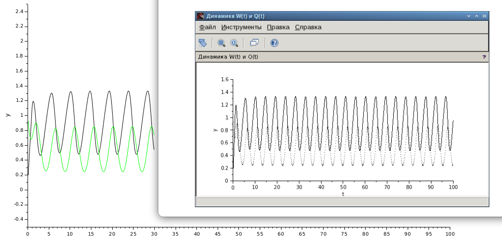

---
## Front matter
lang: ru-RU
title: Лабораторная работа 8. Модель TCP/AQM
author:
  - Абакумова О. М.
institute:
  - Российский университет дружбы народов, Москва, Россия


## i18n babel
babel-lang: russian
babel-otherlangs: english

## Formatting pdf
toc: false
toc-title: Содержание
slide_level: 2
aspectratio: 169
section-titles: true
theme: metropolis
header-includes:
 - \metroset{progressbar=frametitle,sectionpage=progressbar,numbering=fraction}
 - '\makeatletter'
 - '\makeatother'
mainfont: Open Sans Light

---

# Информация

## Докладчик

:::::::::::::: {.columns align=center}
::: {.column width="70%"}

  * Абакумова Олеся Максимовна
  * Студентка
  * Российский университет дружбы народов
  * 1132220832@pfur.ru
  * <https://github.com/omabakumova>

:::
::: {.column width="30%"}


:::
::::::::::::::

# Цель работы

Используя xcos и OpenModelica реализовать модель TCP/AQM.

# Задания 

1. Реализовать модель TCP/AQM в xcos и OpenModelica.

2. Выполнить задание для самостоятельного выполнения.

# Задания 

$$
\begin{cases}
  \dot{W}(t) = \frac{1}{R} - \frac{W(t)W(t-R)}{2R} KQ(t-R) ; \\
  \dot{Q}(t) = 
  \begin{cases}
    \frac{N W(t)}{R} - C, & Q(t) < 0; \\
    \max\left(\frac{N W(t)}{R} - C, 0\right), &  Q(t) = 0.
  \end{cases}
\end{cases}
$$


# Выполнение лабораторной работы

## Реализация модели в xcos

{#fig:001 width=60%}

## Реализация модели в xcos

{#fig:002 width=70%}

## Реализация модели в xcos

{#fig:003 width=70%}

## Реализация модели в xcos

{#fig:004 width=70%}

## Реализация модели в xcos

{#fig:005 width=70%}

## Реализация модели в xcos

{#fig:006 width=70%}

## Реализация модели в xcos

{#fig:007 width=60%}

## Реализация модели в xcos

{#fig:008 width=70%}

## Реализация модели в xcos

{#fig:009 width=70%}

## Задание для самостоятельного выполнения

```Modelica
  Real W(start = 0.1);
  Real Q(start = 1);
  parameter Real N(start = 1);
  parameter Real R(start = 1);
  parameter Real K(start = 5.3);
  parameter Real C(start = 0.9);
equation
  der(W) = 1/R - (W*delay(W, R)*K*delay(Q, R))/(2*R);
  if (Q > 0) then
        der(Q) = N*W/R-C;
  else
        der(Q) = max(N*W/R-C, 0);
  end if;
```
## Задание для самостоятельного выполнения

{#fig:010 width=70%}

## Задание для самостоятельного выполнения

{#fig:011 width=70%}


# Выводы

Во время выполнения данной лабораторной работы я реализовала модель TCP/AQM  в xcos и Openmodelica.
