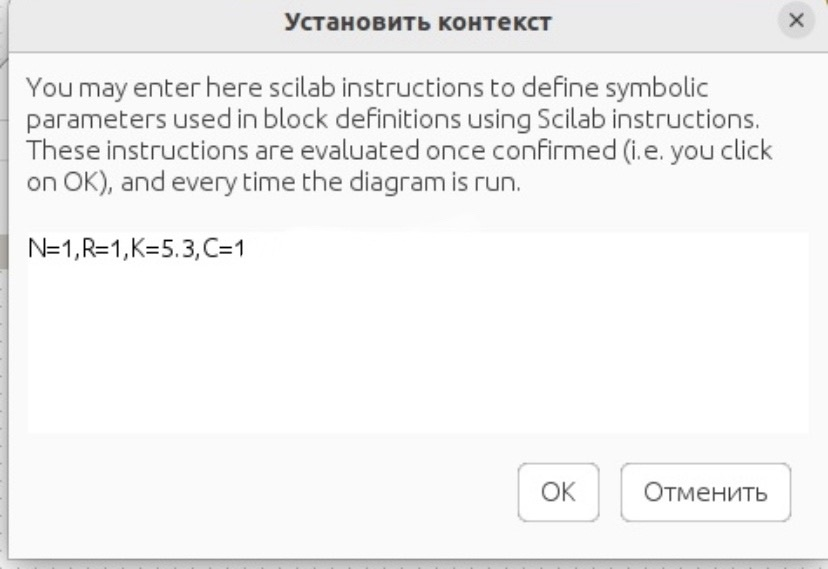
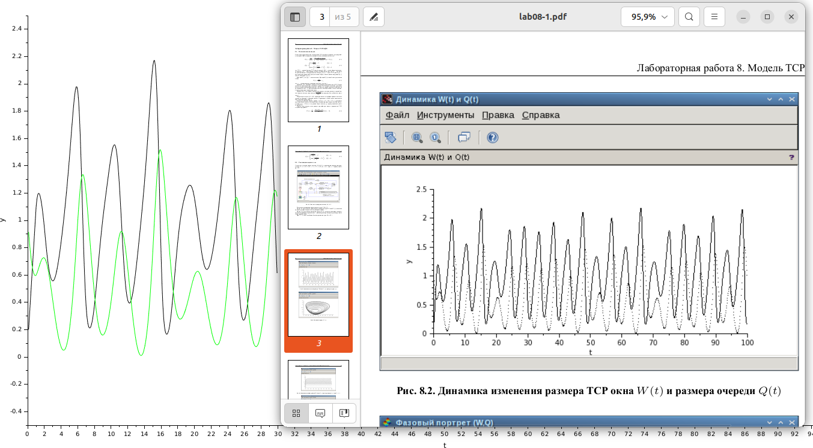
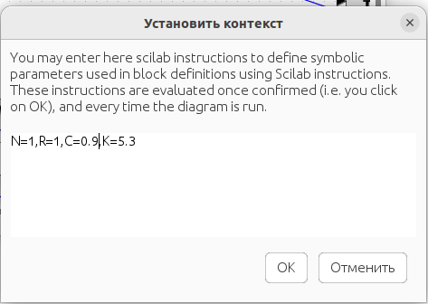
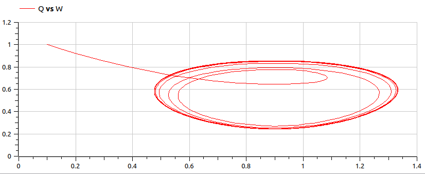
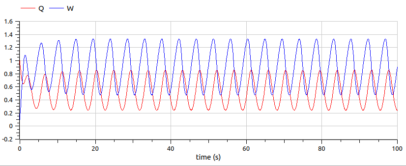

---
## Front matter
title: "Лабораторная работа 8. Модель TCP/AQM"
author: "Абакумова Олеся Максимовна, НФИбд-02-22"

## Generic otions
lang: ru-RU
toc-title: "Содержание"

## Bibliography
bibliography: bib/cite.bib
csl: pandoc/csl/gost-r-7-0-5-2008-numeric.csl

## Pdf output format
toc: true # Table of contents
toc-depth: 2
lof: true # List of figures
lot: true # List of tables
fontsize: 12pt
linestretch: 1.5
papersize: a4
documentclass: scrreprt
## I18n polyglossia
polyglossia-lang:
  name: russian
  options:
	- spelling=modern
	- babelshorthands=true
polyglossia-otherlangs:
  name: english
## I18n babel
babel-lang: russian
babel-otherlangs: english
## Fonts
mainfont: IBM Plex Serif
romanfont: IBM Plex Serif
sansfont: IBM Plex Sans
monofont: IBM Plex Mono
mathfont: STIX Two Math
mainfontoptions: Ligatures=Common,Ligatures=TeX,Scale=0.94
romanfontoptions: Ligatures=Common,Ligatures=TeX,Scale=0.94
sansfontoptions: Ligatures=Common,Ligatures=TeX,Scale=MatchLowercase,Scale=0.94
monofontoptions: Scale=MatchLowercase,Scale=0.94,FakeStretch=0.9
mathfontoptions:
## Biblatex
biblatex: true
biblio-style: "gost-numeric"
biblatexoptions:
  - parentracker=true
  - backend=biber
  - hyperref=auto
  - language=auto
  - autolang=other*
  - citestyle=gost-numeric
## Pandoc-crossref LaTeX customization
figureTitle: "Рис."
tableTitle: "Таблица"
listingTitle: "Листинг"
lofTitle: "Список иллюстраций"
lotTitle: "Список таблиц"
lolTitle: "Листинги"
## Misc options
indent: true
header-includes:
  - \usepackage{indentfirst}
  - \usepackage{float} # keep figures where there are in the text
  - \floatplacement{figure}{H} # keep figures where there are in the text
---


# Цель работы

Используя xcos и OpenModelica реализовать модель TCP/AQM.

# Задание

1. Реализовать модель TCP/AQM в xcos и OpenModelica.

2. Выполнить задание для самостоятельного выполнения.

# Теоретическое введение

Рассмотрим упрощённую модель поведения TCP-подобного трафика с регулируемой
некоторым AQM алгоритмом динамической интенсивностью потока:

$$
\begin{cases}
  \dot{W}(t) = \frac{1}{R} - \frac{W(t)W(t-R)}{2R} KQ(t-R) ; \\
  \dot{Q}(t) = 
  \begin{cases}
    \frac{N W(t)}{R} - C, & Q(t) < 0; \\
    \max\left(\frac{N W(t)}{R} - C, 0\right), &  Q(t) = 0.
  \end{cases}
\end{cases}
$$

Модель была упрощена постредством принятия,что $N(t) ≡ N$ , $R(t) ≡ R$, т.е. указанные
величины будем считать постоянными, не изменяющимися во времени. Кроме того,
положим $p(·) = KQ(t)$, т.е. функция сброса пакетов $p(·)$ пропорциональна длине
очереди $Q(t)$.

# Выполнение лабораторной работы
## Реализация модели в xcos

Зададим начальный параметры во вкладке установки контекста (рис. [-@fig:001]):

{#fig:001 width=70%}

В блоках интегрирования по условию модели зададим параметры $W(0) = 0,1$  и $Q(0) = 1$ (рис. [-@fig:002]):

{#fig:002 width=70%}

{#fig:003 width=70%}

Схема xcos, моделирующая систему, с начальными значениями параметров $N = 1$, $R = 1$, $K = 5,3$, $C = 1$, $W(0)=0,1$, $Q(0)=1$ будет выглядеть следующим образом (рис. [-@fig:004]):

{#fig:004 width=70%}

При запуске схемы мы получаем кривые и косые графики, но мне дали permission(Дмитрий Сергеевич) оставить как есть (рис. [-@fig:005]):

{#fig:005 width=70%}

{#fig:006 width=70%}

Важно заметить, что фазовый портрет ощущает себя значительно лучше, если немного потрудиться над настройками осей в графике.

Изменим параметр $C$ на $C = 0,9$ и посмотрим, что получится теперь (рис. [-@fig:007]):

{#fig:007 width=70%}

На выходе получаем следующие графики (рис. [-@fig:008]):

{#fig:008 width=70%}

{#fig:009 width=70%}

## Задание для самостоятельного выполнения

Реализуем теперь модель с помощью OpenModelica с параметром $C = 0,9$.Для реализации был составен следующий листинг:

```Modelica
model lab8
  Real W(start = 0.1);
  Real Q(start = 1);
  parameter Real N(start = 1);
  parameter Real R(start = 1);
  parameter Real K(start = 5.3);
  parameter Real C(start = 0.9);
  
equation
  der(W) = 1/R - (W*delay(W, R)*K*delay(Q, R))/(2*R);
  if (Q > 0) then
        der(Q) = N*W/R-C;
  else
        der(Q) = max(N*W/R-C, 0);
  end if;
 annotation(experiment(StartTime=0, StopTime=100, Tolerance=1e-6, Interval=0.05));
end lab8;
```

При запуске моделирования получаем следующие результаты (рис. [-@fig:010]):

{#fig:010 width=70%}

{#fig:011 width=70%}

# Выводы

Во время выполнения данной лабораторной работы я реализовала модель TCP/AQM  в xcos и Openmodelica.
