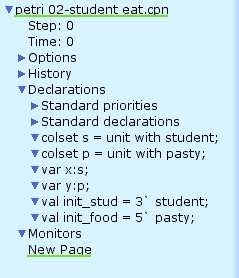
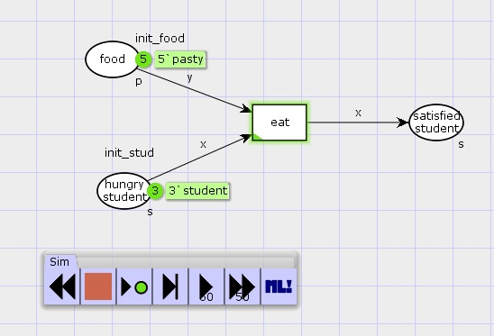

---
## Front matter
lang: ru-RU
title: Лабораторная работа 9. Модель «Накорми студентов»
author:
  - Абакумова О. М.
institute:
  - Российский университет дружбы народов, Москва, Россия


## i18n babel
babel-lang: russian
babel-otherlangs: english

## Formatting pdf
toc: false
toc-title: Содержание
slide_level: 2
aspectratio: 169
section-titles: true
theme: metropolis
header-includes:
 - \metroset{progressbar=frametitle,sectionpage=progressbar,numbering=fraction}
 - '\makeatletter'
 - '\makeatother'
mainfont: Open Sans Light

---

# Информация

## Докладчик

:::::::::::::: {.columns align=center}
::: {.column width="70%"}

  * Абакумова Олеся Максимовна
  * Студентка
  * Российский университет дружбы народов
  * 1132220832@pfur.ru
  * <https://github.com/omabakumova>

:::
::: {.column width="30%"}


:::
::::::::::::::

# Цель работы

Реализовать модель «Накорми студентов» с помощью CPN Tools и накормить студентов.

# Задание

1. Построить модель «Накорми студентов» в CPN Tools.

2. Выполнить упражнение

# Задание

Рассмотрим пример студентов, обедающих пирогами. Голодный студент становится сытым после того, как съедает пирог.
Таким образом, имеем:
- два типа фишек: «пироги» и «студенты»;

- три позиции: «голодный студент», «пирожки», «сытый студент»;

- один переход: «съесть пирожок».

{#fig:001 width=30%}


# Выполнение лабораторной работы

## Реализация модели «Накорми студентов»

{#fig:002 width=70%}

## Реализация модели «Накорми студентов»

{#fig:003 width=30%}

## Реализация модели «Накорми студентов»

{#fig:004 width=50%}

## Реализация модели «Накорми студентов»

{#fig:005 width=60%}

## Упражнение

{#fig:006 width=70%}

## Упражнение

```

 Statistics
------------------------------------------------------------------------

  State Space
     Nodes:  4
     Arcs:   3
     Secs:   0
     Status: Full

```

## Упражнение

```
 Boundedness Properties
------------------------------------------------------------------------
  Best Integer Bounds
                             Upper      Lower
     New_Page'food 1         5          2
     New_Page'hungry_student 1
                             3          0
     New_Page'satisfied_student 1
                             3          0
```
                      
## Упражнение
```
  Best Upper Multi-set Bounds
     New_Page'food 1     5`pasty
     New_Page'hungry_student 1
                         3`student
     New_Page'satisfied_student 1
                         3`student                   
  Best Lower Multi-set Bounds
     New_Page'food 1     2`pasty
     New_Page'hungry_student 1
                         empty
     New_Page'satisfied_student 1
                         empty
```

# Выводы

Во время выполнения данной лабораторной работы я реализовала модель «Накорми студентов».
