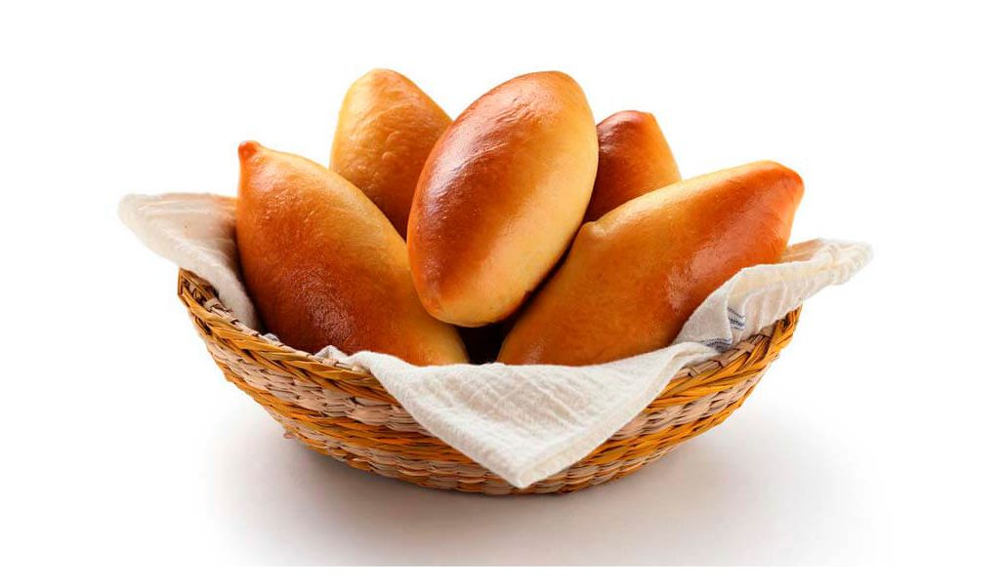
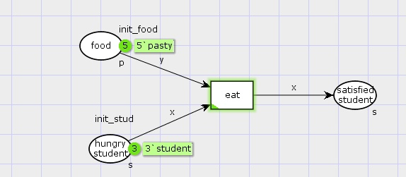
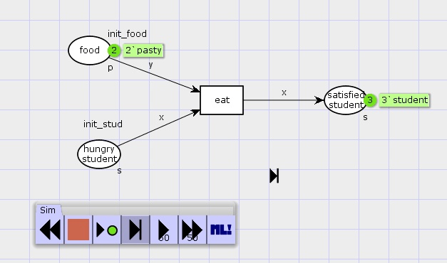
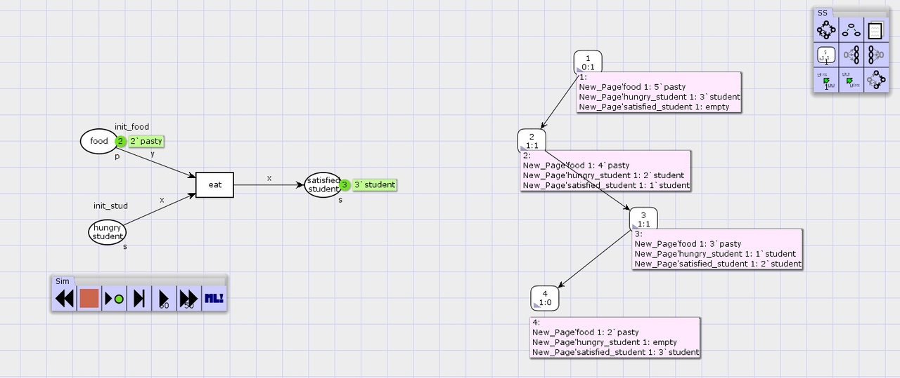

---
## Front matter
title: "Лабораторная работа 9. Модель «Накорми студентов»"
author: "Абакумова Олеся Максимовна, НФИбд-02-22"

## Generic otions
lang: ru-RU
toc-title: "Содержание"

## Bibliography
bibliography: bib/cite.bib
csl: pandoc/csl/gost-r-7-0-5-2008-numeric.csl

## Pdf output format
toc: true # Table of contents
toc-depth: 2
lof: true # List of figures
lot: true # List of tables
fontsize: 12pt
linestretch: 1.5
papersize: a4
documentclass: scrreprt
## I18n polyglossia
polyglossia-lang:
  name: russian
  options:
	- spelling=modern
	- babelshorthands=true
polyglossia-otherlangs:
  name: english
## I18n babel
babel-lang: russian
babel-otherlangs: english
## Fonts
mainfont: IBM Plex Serif
romanfont: IBM Plex Serif
sansfont: IBM Plex Sans
monofont: IBM Plex Mono
mathfont: STIX Two Math
mainfontoptions: Ligatures=Common,Ligatures=TeX,Scale=0.94
romanfontoptions: Ligatures=Common,Ligatures=TeX,Scale=0.94
sansfontoptions: Ligatures=Common,Ligatures=TeX,Scale=MatchLowercase,Scale=0.94
monofontoptions: Scale=MatchLowercase,Scale=0.94,FakeStretch=0.9
mathfontoptions:
## Biblatex
biblatex: true
biblio-style: "gost-numeric"
biblatexoptions:
  - parentracker=true
  - backend=biber
  - hyperref=auto
  - language=auto
  - autolang=other*
  - citestyle=gost-numeric
## Pandoc-crossref LaTeX customization
figureTitle: "Рис."
tableTitle: "Таблица"
listingTitle: "Листинг"
lofTitle: "Список иллюстраций"
lotTitle: "Список таблиц"
lolTitle: "Листинги"
## Misc options
indent: true
header-includes:
  - \usepackage{indentfirst}
  - \usepackage{float} # keep figures where there are in the text
  - \floatplacement{figure}{H} # keep figures where there are in the text
---


# Цель работы

Реализовать модель «Накорми студентов» с помощью CPN Tools и накормить студентов.

# Задание

1. Построить модель «Накорми студентов» в CPN Tools.

2. Выполнить упражнение

# Теоретическое введение

CPN Tools --- специальное программное средство, предназначенное для мо-
делирования иерархических временных раскрашенных сетей Петри. Такие сети
эквивалентны машине Тьюринга и составляют универсальную алгоритмическую
систему, позволяющую описать произвольный объект.
CPN Tools позволяет визуализировать модель с помощью графа сети Петри и применить язык программирования CPN ML (Colored Petri Net Markup Language) для
формализованного описания модели.
Назначение CPN Tools:

- разработка сложных объектов и моделирование процессов в различных прикладных областях, в том числе:

- моделирование производственных и бизнес-процессов;

- моделирование систем управления производственными системами и роботами;

- спецификация и верификация протоколов, оценка пропускной способности сетей

и качества обслуживания, проектирование телекоммуникационных устройств
и сетей.
Основные функции CPN Tools:

- создание (редактирование) моделей;

- анализ поведения моделей с помощью имитации динамики сети Петри;

- построение и анализ пространства состояний модели.

Рассмотрим пример студентов, обедающих пирогами. Голодный студент становится сытым после того, как съедает пирог (рис. [-@fig:001]).
Таким образом, имеем:
- два типа фишек: «пироги» и «студенты»;

- три позиции: «голодный студент», «пирожки», «сытый студент»;

- один переход: «съесть пирожок».

{#fig:001 width=70%}

# Выполнение лабораторной работы
## Реализация модели «Накорми студентов»

Рисуем граф сети. Для этого с помощью контекстного меню создаём новую
сеть, добавляем позиции, переход и дуги (рис. [-@fig:002]):

{#fig:002 width=70%}

В меню задаём новые декларации модели: типы фишек, начальные значения
позиций, выражения для дуг.
После этого задаем тип **s** фишкам, относящимся к студентам, тип **p** --- фишкам,
относящимся к пирогам, задаём значения переменных **x** и **y** для дуг и начальные
значения мультимножеств **init_stud** и **init_food** (рис. [-@fig:003]):

{#fig:003 width=70%}

После запуска фишки типа «пирожки» из позиции «еда» и фишки типа «студенты» из позиции «голодный студент», пройдя через переход «кушать», попадают
в позицию «сытый студент» и преобразуются в тип «студенты» (рис. [-@fig:004]):

{#fig:004 width=70%}

{#fig:005 width=70%}

## Упражнение

Теперь вычислим пространство состояний (рис. [-@fig:006]):

{#fig:006 width=70%}

Теперь сформуируем отчет о пространстве состояний:

```

CPN Tools state space report for:
<unsaved net>
Report generated: Sat Apr  5 14:30:52 2025


 Statistics
------------------------------------------------------------------------

  State Space
     Nodes:  4
     Arcs:   3
     Secs:   0
     Status: Full

  Scc Graph
     Nodes:  4
     Arcs:   3
     Secs:   0


 Boundedness Properties
------------------------------------------------------------------------

  Best Integer Bounds
                             Upper      Lower
     New_Page'food 1         5          2
     New_Page'hungry_student 1
                             3          0
     New_Page'satisfied_student 1
                             3          0

  Best Upper Multi-set Bounds
     New_Page'food 1     5`pasty
     New_Page'hungry_student 1
                         3`student
     New_Page'satisfied_student 1
                         3`student

  Best Lower Multi-set Bounds
     New_Page'food 1     2`pasty
     New_Page'hungry_student 1
                         empty
     New_Page'satisfied_student 1
                         empty


 Home Properties
------------------------------------------------------------------------

  Home Markings
     [4]


 Liveness Properties
------------------------------------------------------------------------

  Dead Markings
     [4]

  Dead Transition Instances
     None

  Live Transition Instances
     None


 Fairness Properties
------------------------------------------------------------------------
     No infinite occurrence sequences.
     
```
     
Отчет анализирует сеть Петри с **4** состояниями и **3** переходами, моделирующую систему с «пирожками», «голодными» и «сытыми студентами», где количество пирожков варьируется от 2 до 5, а количество голодных и сытых студентов от 0 до 3. Состояние **4** является «домашним» и «мертвым», что означает возможность возврата к нему, но невозможность его покинуть.Бесконечные циклы отсутствуют.


# Выводы

Во время выполнения данной лабораторной работы я реализовала модель «Накорми студентов».
