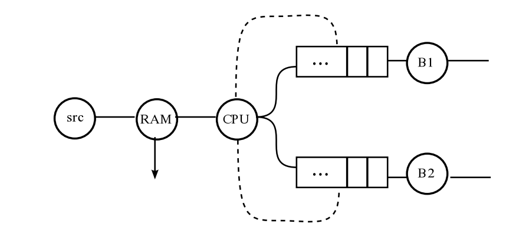
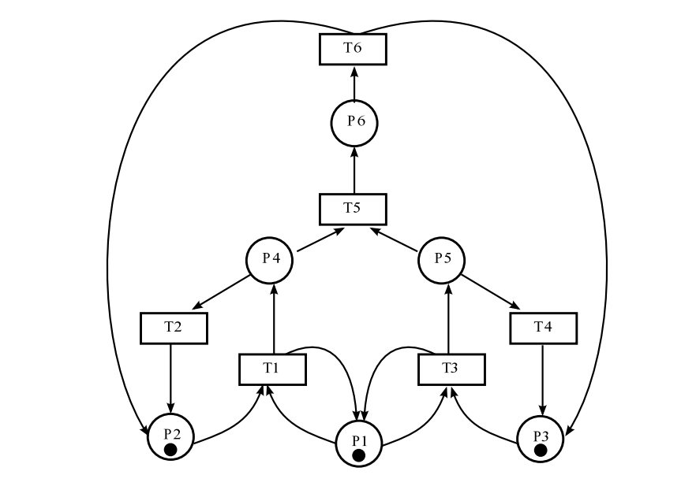
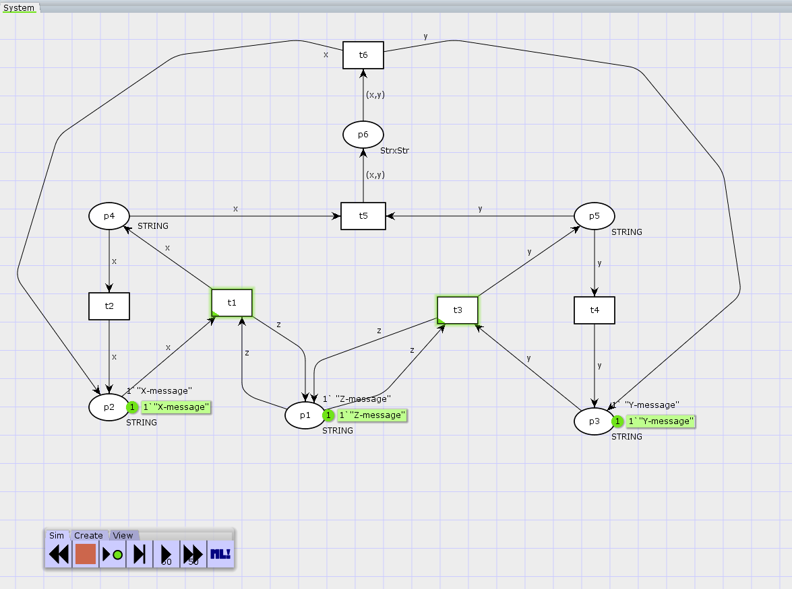
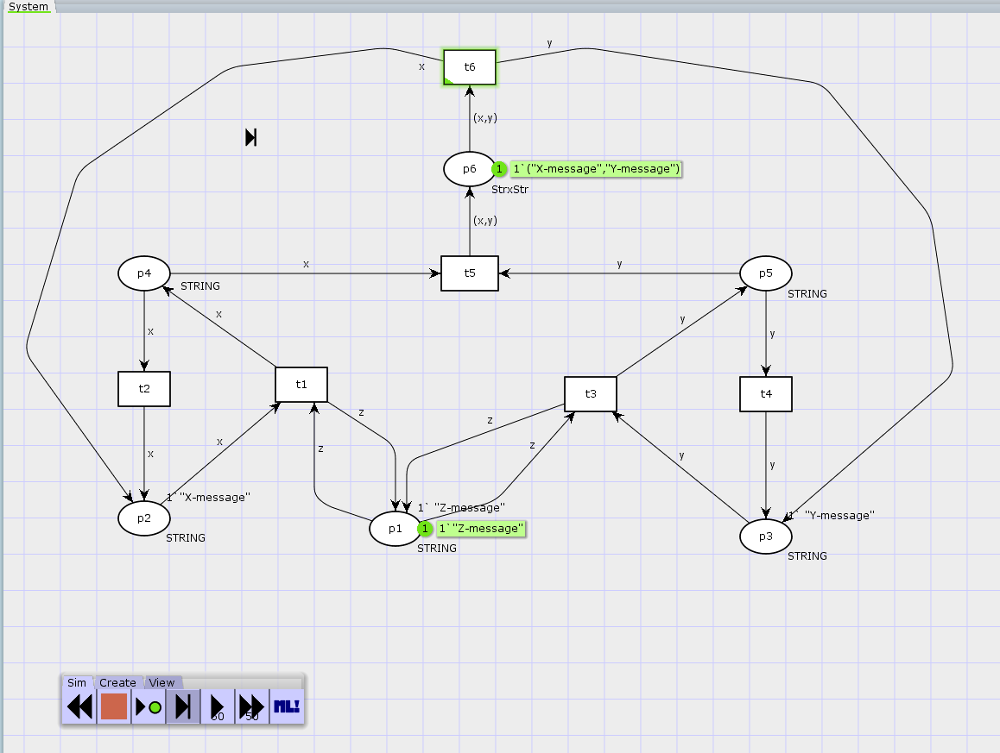
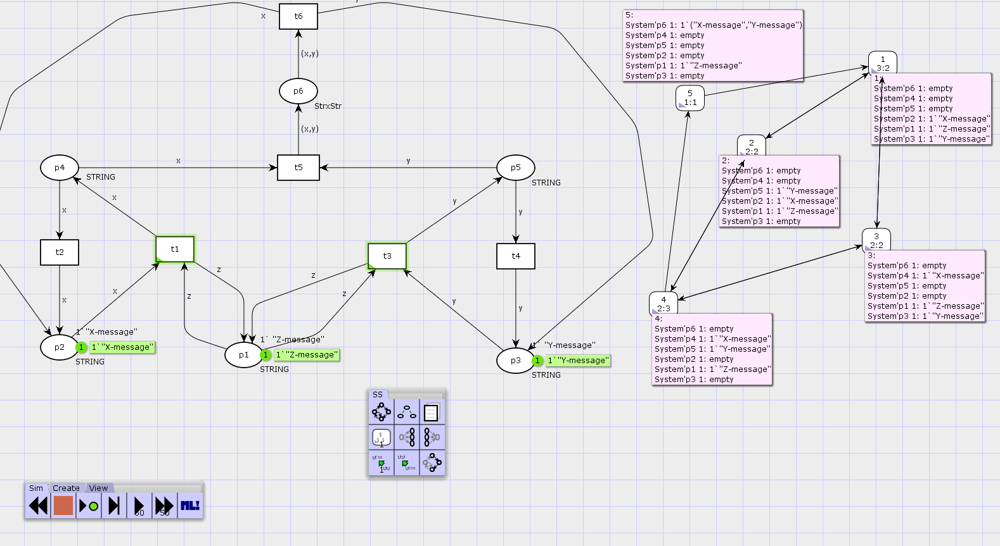

---
## Front matter
lang: ru-RU
title: Лабораторная работа 13. Задание для самостоятельного выполнения
author:
  - Абакумова О. М.
institute:
  - Российский университет дружбы народов, Москва, Россия


## i18n babel
babel-lang: russian
babel-otherlangs: english

## Formatting pdf
toc: false
toc-title: Содержание
slide_level: 2
aspectratio: 169
section-titles: true
theme: metropolis
header-includes:
 - \metroset{progressbar=frametitle,sectionpage=progressbar,numbering=fraction}
 - '\makeatletter'
 - '\makeatother'
mainfont: Open Sans Light

---

# Информация

## Докладчик

:::::::::::::: {.columns align=center}
::: {.column width="70%"}

  * Абакумова Олеся Максимовна
  * Студентка
  * Российский университет дружбы народов
  * 1132220832@pfur.ru
  * <https://github.com/omabakumova>

:::
::: {.column width="30%"}


:::
::::::::::::::

# Цель работы

Выполнить задание для самостоятельного выполнения.

# Задание

1. Построить модель из задания для самостоятельного выполнения

# Схема модели

{#fig:001 width=50%}

# Описание модели

{#fig:002 width=50%}

# Выполнение лабораторной работы
## Анализ сети

{#fig:003 width=50%}

## Анализ сети

1. В каждом узле сети может находиться либо 0, либо 1 фишка, что означает, что сеть является безопасной.

2. Сеть является 1-ограниченной, так как максимальное количество фишек в любой позиции не превышает 1 (k = 1).

3. Общее число фишек в сети изменяется в процессе работы, следовательно, сеть не является строго сохраняющей (не сохраняет количество фишек относительно вектора взвешивания).

4. Все переходы в сети могут быть активированы при подходящей маркировке, поэтому в данной сети нет тупиковых состояний.

## Построение модели в CPNTools

{#fig:004 width=70%}

## Построение модели с помощью CPNTools

{#fig:005 width=50%}

## Построение модели с помощью CPNTools

{#fig:006 width=50%}

## Построение модели с помощью CPNTools

{#fig:007 width=50%}

## Построение модели с помощью CPNTools

{#fig:008 width=50%}

## Построение модели с помощью CPNTools

```
 Statistics
------------------------------------------------------------------------

  State Space
     Nodes:  5
     Arcs:   10
     Secs:   0
     Status: Full

  Scc Graph
     Nodes:  1
     Arcs:   0
     Secs:   0

```
## Построение модели с помощью CPNTools

{#fig:009 width=50%}


# Выводы

В процессе выполнения данной лабораторной работы я реализовала модель сети Петри в качестве самостоятельного задания.
