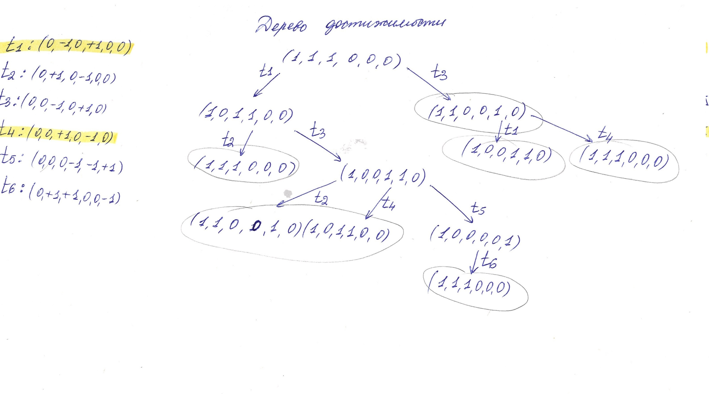
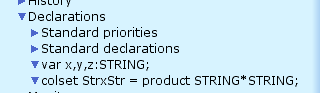
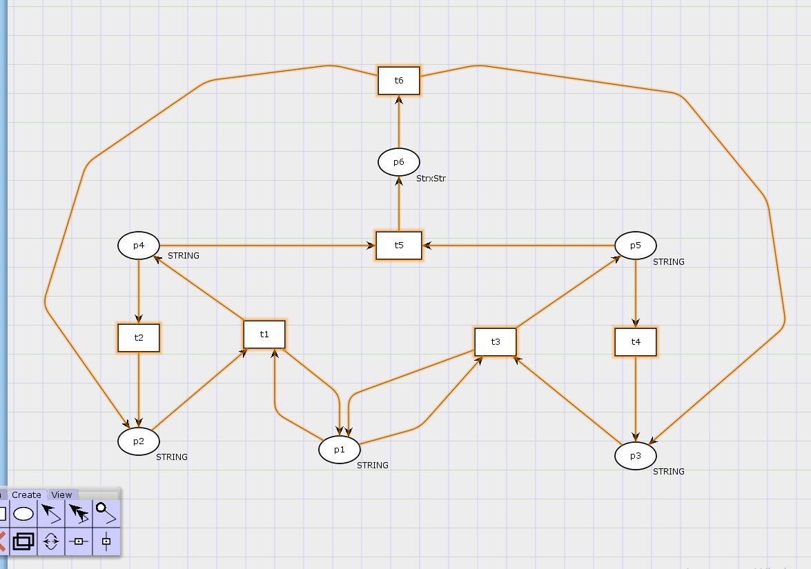
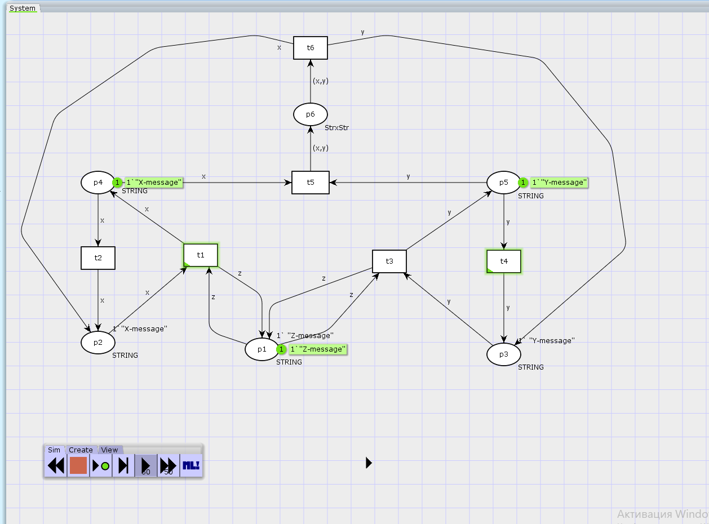

---
## Front matter
title: "Лабораторная работа 13. Задание для самостоятельного выполнения"
author: "Абакумова Олеся Максимовна, НФИбд-02-22"

## Generic otions
lang: ru-RU
toc-title: "Содержание"

## Bibliography
bibliography: bib/cite.bib
csl: pandoc/csl/gost-r-7-0-5-2008-numeric.csl

## Pdf output format
toc: true # Table of contents
toc-depth: 2
lof: true # List of figures
lot: true # List of tables
fontsize: 12pt
linestretch: 1.5
papersize: a4
documentclass: scrreprt
## I18n polyglossia
polyglossia-lang:
  name: russian
  options:
	- spelling=modern
	- babelshorthands=true
polyglossia-otherlangs:
  name: english
## I18n babel
babel-lang: russian
babel-otherlangs: english
## Fonts
mainfont: IBM Plex Serif
romanfont: IBM Plex Serif
sansfont: IBM Plex Sans
monofont: IBM Plex Mono
mathfont: STIX Two Math
mainfontoptions: Ligatures=Common,Ligatures=TeX,Scale=0.94
romanfontoptions: Ligatures=Common,Ligatures=TeX,Scale=0.94
sansfontoptions: Ligatures=Common,Ligatures=TeX,Scale=MatchLowercase,Scale=0.94
monofontoptions: Scale=MatchLowercase,Scale=0.94,FakeStretch=0.9
mathfontoptions:
## Biblatex
biblatex: true
biblio-style: "gost-numeric"
biblatexoptions:
  - parentracker=true
  - backend=biber
  - hyperref=auto
  - language=auto
  - autolang=other*
  - citestyle=gost-numeric
## Pandoc-crossref LaTeX customization
figureTitle: "Рис."
tableTitle: "Таблица"
listingTitle: "Листинг"
lofTitle: "Список иллюстраций"
lotTitle: "Список таблиц"
lolTitle: "Листинги"
## Misc options
indent: true
header-includes:
  - \usepackage{indentfirst}
  - \usepackage{float} # keep figures where there are in the text
  - \floatplacement{figure}{H} # keep figures where there are in the text
---


# Цель работы

Выполнить задание для самостоятельного выполнения.

# Задание

1. Построить модель из задания для самостоятельного выполнения

# Схема модели

Заявка (команды программы, операнды) поступает в оперативную память (ОП), затем
передается на прибор (центральный процессор, ЦП) для обработки. После этого
заявка может равновероятно обратиться к оперативной памяти или к одному из двух
внешних запоминающих устройств (B1 и B2). Прежде чем записать информацию на
внешний накопитель, необходимо вторично обратиться к центральному процессору,
определяющему состояние накопителя и выдающему необходимую управляющую
информацию. Накопители (B1 и B2) могут работать в 3-х режимах:

1. B1 — занят, B2 — свободен;

2. B2 — свободен, B1 — занят;

3. B1 — занят, B2 — занят.

Схема модели представлена ниже (рис. [-@fig:001]):

{#fig:001 width=70%}

На схеме:

- src --- источник заявок;

- B1 и B2 --- накопители для хранения заявок;

- RAM --- оперативная память;

- CPU --- центральный процессор;

- B1, B1 --- внешние запоминающие устройства.

# Описание модели

Множество позиций:
P1 --- состояние оперативной памяти (свободна / занята);

P2 --- состояние внешнего запоминающего устройства B1 (свободно / занято);

P3 --- состояние внешнего запоминающего устройства B2 (свободно / занято);

P4 --- работа на ОП и B1 закончена;

P5 --- работа на ОП и B2 закончена;

P6 --- работа на ОП, B1 и B2 закончена;

Множество переходов:

T1 --- ЦП работает только с RAM и B1;

T2 --- обрабатываются данные из RAM и с B1 переходят на устройство вывода;

T3 --- CPU работает только с RAM и B2;

T4 --- обрабатываются данные из RAM и с B2 переходят на устройство вывода;

T5 --- CPU работает только с RAM и с B1, B2;

T6 --- обрабатываются данные из RAM, B1, B2 и переходят на устройство вывода.

Функционирование сети Петри можно расматривать как срабатывание переходов,
в ходе которого происходит перемещение маркеров по позициям:

- работа CPU с RAM и B1 отображается запуском перехода T1 (удаление маркеров
из P1, P2 и появление в P1, P4), что влечет за собой срабатывание перехода T2,
т.е. передачу данных с RAM и B1 на устройство вывода;

- работа CPU с RAM и B2 отображается запуском перехода T3 (удаление маркеров
из P1 и P3 и появление в P1 и P5), что влечет за собой срабатывание перехода T4,
т.е. передачу данных с RAM и B2 на устройство вывода;

- работа CPU с RAM, B1 и B2 отображается запуском перехода T5 (удаление
маркеров из P4 и P5 и появление в P6), далее срабатывание перехода T6, и данные
из RAM, B1 и B2 передаются на устройство вывода;

- состояние устройств восстанавливается при срабатывании: RAM --- переходов
T1 или T2; B1 --- переходов T2 или T6; B2 --- переходов T4 или T6.

Сеть Петри моделируемой системы представлена ниже (рис. [-@fig:002]):

{#fig:002 width=70%}

# Выполнение лабораторной работы
## Анализ сети

Используя теоретические методы анализа сетей Петри, проведем анализ сети,
изображённой на рис. [-@fig:002] (с помощью построения дерева достижимости). Определим, является ли сеть безопасной, ограниченной, сохраняющей, имеются ли
тупики (рис. [-@fig:003]):

{#fig:003 width=80%}

Исходя из проведенного анализа,можно выделить следующее:

1. Безопасность сети
В каждом узле сети может находиться либо 0, либо 1 фишка, что означает, что сеть является безопасной.

2. Ограниченность сети
Сеть является 1-ограниченной, так как максимальное количество фишек в любой позиции не превышает 1 (k = 1).

3. Сохранение количества фишек
Общее число фишек в сети изменяется в процессе работы, следовательно, сеть не является строго сохраняющей (не сохраняет количество фишек относительно вектора взвешивания).

4. Отсутствие тупиков
Все переходы в сети могут быть активированы при подходящей маркировке, поэтому в данной сети нет тупиковых состояний.

## Построение модели в CPNTools

Создадим новый рабочий файл в CPNTools.После создания можно задать необходимые для работы сети декларации (рис. [-@fig:004]):

{#fig:004 width=70%}

Создав необходимые декларации можно построить модель сети в рабочей области (рис. [-@fig:005]):

{#fig:005 width=70%}

Теперь добавим в модель тип и маркировку,также у всех дуг обозначим их выражения (рис. [-@fig:006]):

{#fig:006 width=70%}

Теперь запустим модель и понаблюдаем за ее работой (рис. [-@fig:007]):

{#fig:007 width=70%}

{#fig:008 width=70%}

Теперь сформируем отчёт о пространстве состояний:

```
CPN Tools state space report for:
<unsaved net>
Report generated: Sat May  3 19:34:59 2025


 Statistics
------------------------------------------------------------------------

  State Space
     Nodes:  5
     Arcs:   10
     Secs:   0
     Status: Full

  Scc Graph
     Nodes:  1
     Arcs:   0
     Secs:   0


 Boundedness Properties
------------------------------------------------------------------------

  Best Integer Bounds
                             Upper      Lower
     System'p1 1             1          1
     System'p2 1             1          0
     System'p3 1             1          0
     System'p4 1             1          0
     System'p5 1             1          0
     System'p6 1             1          0

  Best Upper Multi-set Bounds
     System'p1 1         1`"Z-message"
     System'p2 1         1`"X-message"
     System'p3 1         1`"Y-message"
     System'p4 1         1`"X-message"
     System'p5 1         1`"Y-message"
     System'p6 1         1`("X-message","Y-message")

  Best Lower Multi-set Bounds
     System'p1 1         1`"Z-message"
     System'p2 1         empty
     System'p3 1         empty
     System'p4 1         empty
     System'p5 1         empty
     System'p6 1         empty


 Home Properties
------------------------------------------------------------------------

  Home Markings
     All


 Liveness Properties
------------------------------------------------------------------------

  Dead Markings
     None

  Dead Transition Instances
     None

  Live Transition Instances
     All


 Fairness Properties
------------------------------------------------------------------------

  Impartial Transition Instances
     None

  Fair Transition Instances
     System't6 1

  Just Transition Instances
     System't5 1

  Transition Instances with No Fairness
     System't1 1
     System't2 1
     System't3 1
     System't4 1
     
```
После получения отчета можно построить граф пространства состояний (рис. [-@fig:009]):

{#fig:009 width=70%}

# Выводы

В процессе выполнения данной лабораторной работы я реализовала модель сети Петри в качестве самостоятельного задания.
