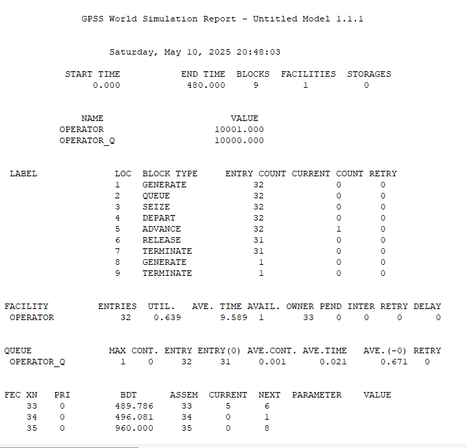
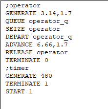
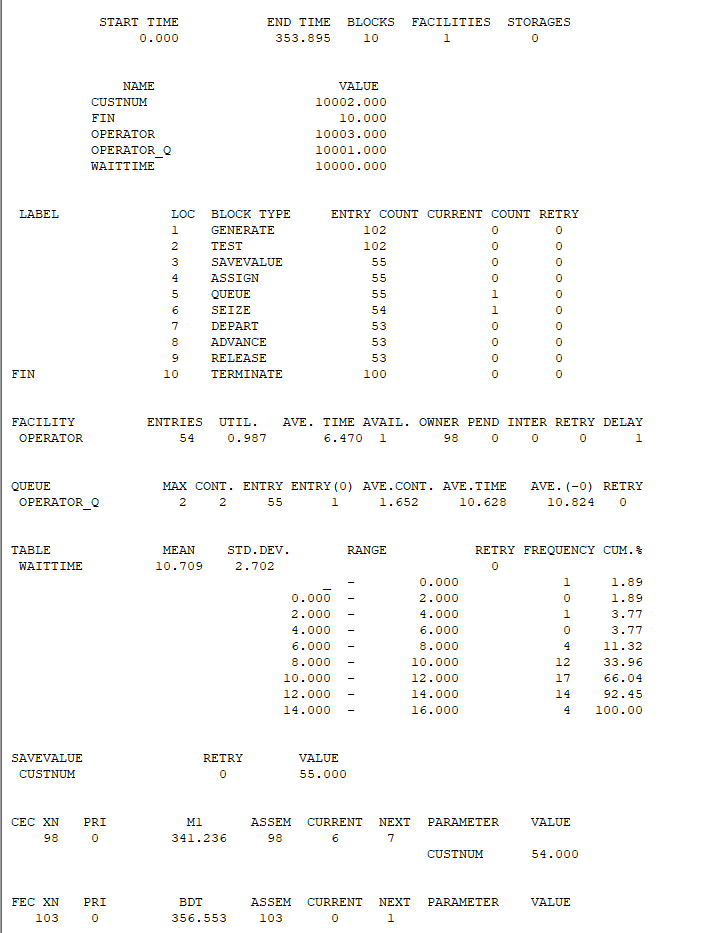
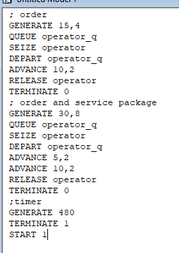
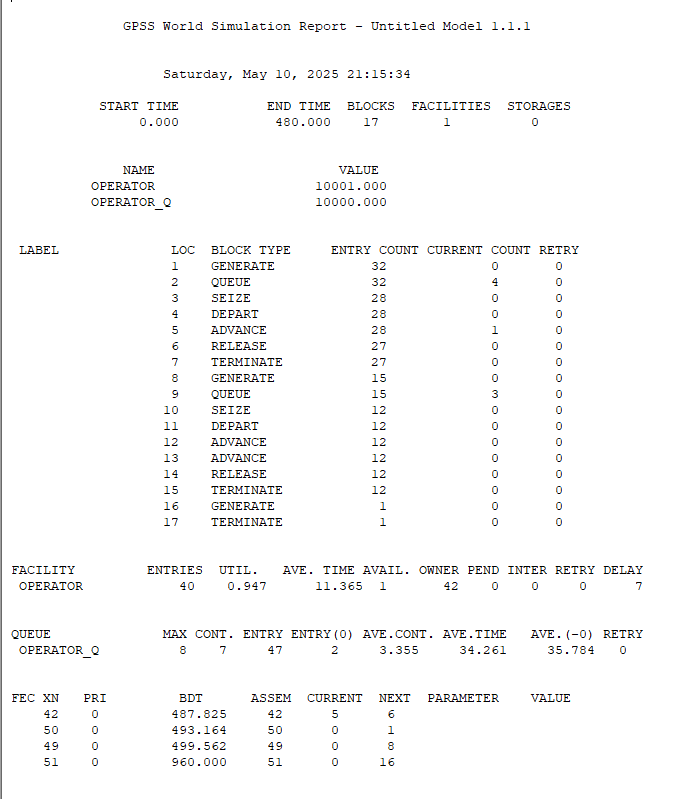
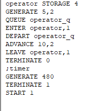

---
## Front matter
lang: ru-RU
title: Лабораторная работа 14. Модели обработки заказов
author:
  - Абакумова О. М.
institute:
  - Российский университет дружбы народов, Москва, Россия

## i18n babel
babel-lang: russian
babel-otherlangs: english

## Formatting pdf
toc: false
toc-title: Содержание
slide_level: 2
aspectratio: 169
section-titles: true
theme: metropolis
header-includes:
 - \metroset{progressbar=frametitle,sectionpage=progressbar,numbering=fraction}
 - '\makeatletter'
 - '\makeatother'
mainfont: Open Sans Light

---

# Информация

## Докладчик

:::::::::::::: {.columns align=center}
::: {.column width="70%"}

  * Абакумова Олеся Максимовна
  * Студентка
  * Российский университет дружбы народов
  * 1132220832@pfur.ru
  * <https://github.com/omabakumova>

:::
::: {.column width="30%"}

:::
::::::::::::::

# Цель работы

Изучить принципы работы GPSS и реализовать различные модели обработки заказов.

# Задание

1. Реализовать различные модели обработки заказов с помощью GPSS и проанализировать результаты симуляции.

# Выполнение лабораторной работы

# Постановка задачи

В интернет-магазине заказы принимает один оператор. Интервалы поступления
заказов распределены равномерно с интервалом 15 ± 4 мин. Время оформления
заказа также распределено равномерно на интервале 10 ± 2 мин. Обработка поступивших заказов происходит в порядке очереди (FIFO). Требуется разработать
модель обработки заказов в течение 8 часов.

## Реализация модели 

{#fig:001 width=30%}

## Реализация модели 

{#fig:002 width=30%}

## Упражнение

Скорректируем модель в соответствии с изменениями входных
данных: интервалы поступления заказов распределены равномерно с интервалом
3.14 ± 1.7 мин; время оформления заказа также распределено равномерно на интервале 6.66 ± 1.7 мин. Проанализируем отчёт, сравнив результаты с результатами
предыдущего моделирования.

## Упражнение

{#fig:003 width=30%}

## Упражнение

{#fig:004 width=30%}

## Построение гистограммы распределения заявок в очереди

Порядок блоков в модели соответствует порядку фаз обработки заказа в реальной
системе:

1. клиент оставляет заявку на заказ в интернет-магазине;

2. если необходимо, заявка от клиента ожидает в очереди освобождения оператора
для оформления заказа;

3. заявка от клиента принимается оператором для оформления заказа;

4. оператор оформляет заказ;

5. клиент получает подтверждение об оформлении заказа (покидает систему).

## Построение гистограммы распределения заявок в очереди

{#fig:005 width=30%}

## Построение гистограммы распределения заявок в очереди

{#fig:006 width=30%}

## Построение гистограммы распределения заявок в очереди

{#fig:007 width=50%}

## Упражнение

Проанализируем отчет и гистограмму.

- Модельное время: `353.895`  

- Блоков: `10` | Ресурсы: `FACILITIES=1`, `STORAGES=0`  

## Упражнение

- График `WAITIME`:  

  - Пик: **10–12 ед.** (17 транзактов).  
  
  - 92% заявок ждут ≤ **14 ед.**  
  
  - Макс. задержка: **16 ед.**  

## Модель обслуживания двух типов заказов от клиентов в интернет-магазине

В интернет-магазин к одному оператору поступают два типа заявок от клиентов ---
обычный заказ и заказ с оформление дополнительного пакета услуг. Заявки первого
типа поступают каждые 15 ± 4 мин. Заявки второго типа — каждые 30 ± 8 мин.
Оператор обрабатывает заявки по принципу FIFO («"первым пришел --- первым
обслужился"). Время, затраченное на оформление обычного заказа, составляет 10 ±
2 мин, а на оформление дополнительного пакета услуг --- 5 ± 2 мин. Требуется
разработать модель обработки заказов в течение 8 часов, обеспечив сбор данных об
очереди заявок от клиентов.

## Модель обслуживания двух типов заказов от клиентов в интернет-магазине

{#fig:008 width=30%}

## Модель обслуживания двух типов заказов от клиентов в интернет-магазине

{#fig:009 width=30%}

## Задание

**1. Общие параметры:**  

- Модельное время: `480.000`  

- Блоков: `17` | Ресурсы: `FACILITIES=1`  

**2. Статистика:**  

- Транзакты:  

  - Сгенерировано: `48`  
  
  - Обработано: `39` (потери **19%**)  
  
## Упражнение

Скорректируем модель так, чтобы учитывалось условие, что число
заказов с дополнительным пакетом услуг составляет 30% от общего числа заказов.
Используйте оператор TRANSFER. Проанализируем отчёт.

## Упражнение

{#fig:010 width=30%}

## Упражнение

{#fig:011 width=30%}

## Упражнение

**1. Ключевые особенности:**  

- Потери: **26%** (13 из 49 заявок).  

- Очередь:  

  - Макс. длина: **12**  
  
  - Среднее время ожидания: **49.939**  
  
## Модель оформления заказов несколькими операторами

В интернет-магазине заказы принимают 4 оператора. Интервалы поступления заказов распределены равномерно с интервалом 5 ± 2 мин. Время оформления заказа
каждым оператором также распределено равномерно на интервале 10 ± 2 мин. Обработка поступивших заказов происходит в порядке очереди (FIFO). Требуется
определить характеристики очереди заявок на оформление заказов при условии, что
заявка может обрабатываться одним из 4-х операторов в течение восьмичасового
рабочего дня.

## Модель оформления заказов несколькими операторами

{#fig:012 width=30%}

## Модель оформления заказов несколькими операторами

{#fig:013 width=30%}

## Задание

**1. Что появилось:**  

- Использование `STORAGE` (емкость=4).  

**2. Результаты:**  

- Транзакты:  

  - Сгенерировано: `94`  
  
  - Обработано: `91` (потери **3.2%**)  
  
- Очередь:  

  - Макс. длина: **1**  
  
  - Среднее время ожидания: **0.000** 
  
## Задание

Изменим модель : требуется учесть в ней возможные отказы клиентов от заказа
--- когда при подаче заявки на заказ клиент видит в очереди более двух других
заявок, он отказывается от подачи заявки, то есть отказывается от обслуживания
(используем блок `TEST` и стандартный числовой атрибут `Qj` текущей длины
очереди `j`).

## Задание

{#fig:014 width=30%}

## Задание

{#fig:015 width=30%}

## Задание

**1. Изменения:**  

- Добавлен блок `TEST`.  

**2. Итоги:**  

- Показатели аналогичны отчету без изменений.  

- Блок `TEST` не повлиял на производительность.  

# Выводы

В процессе выполнения данной лабораторной работы я изучила приципы работы GPSS и реализовала различные примеры.
