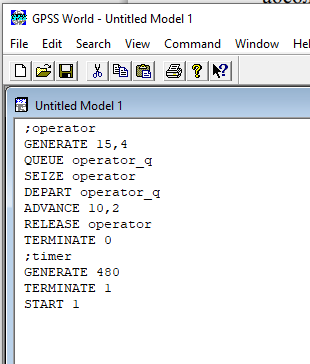
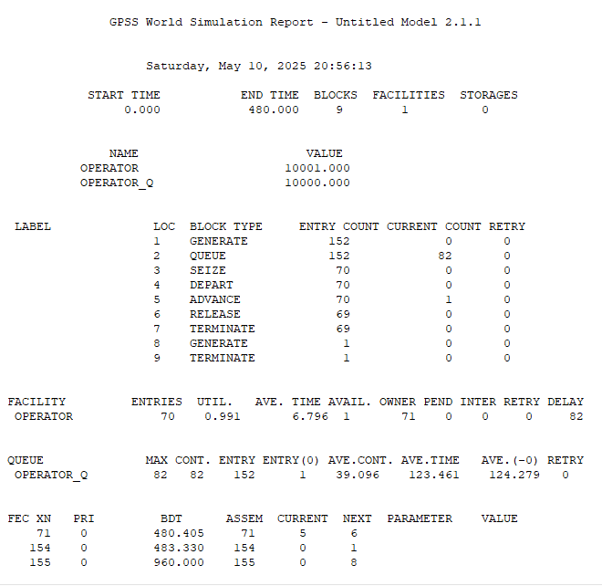
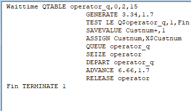
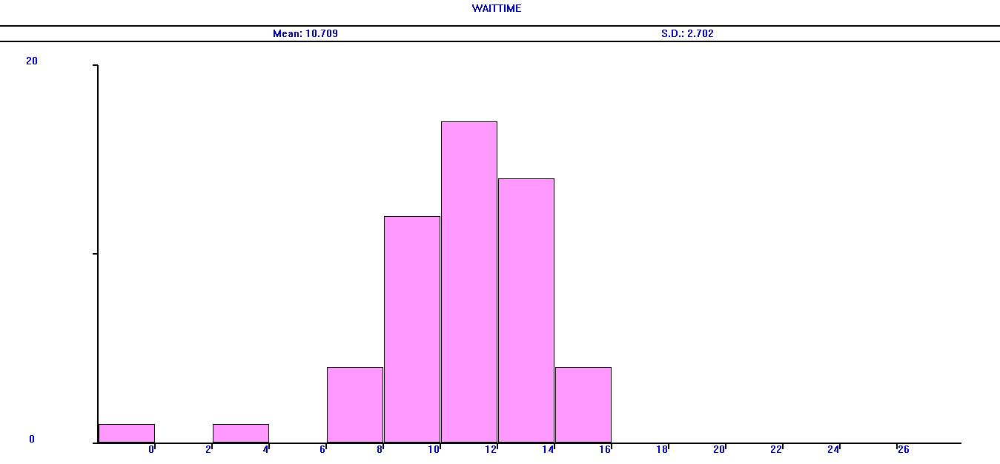
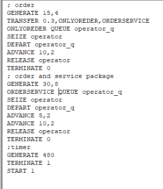
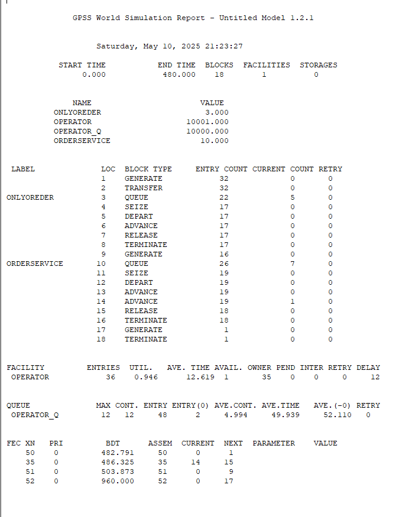
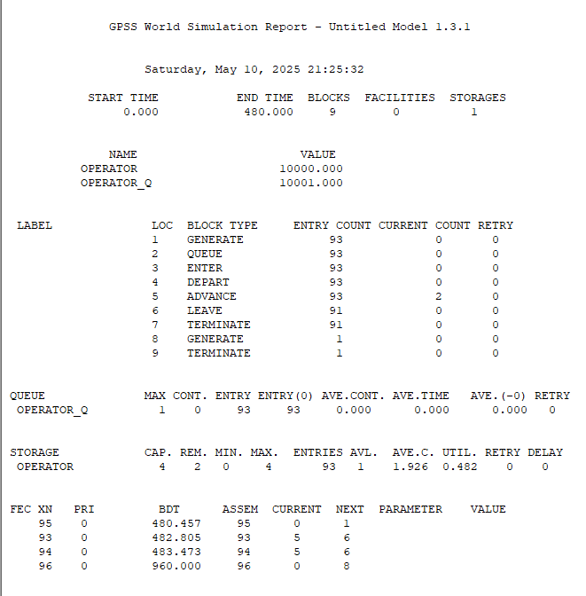
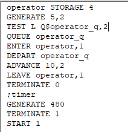
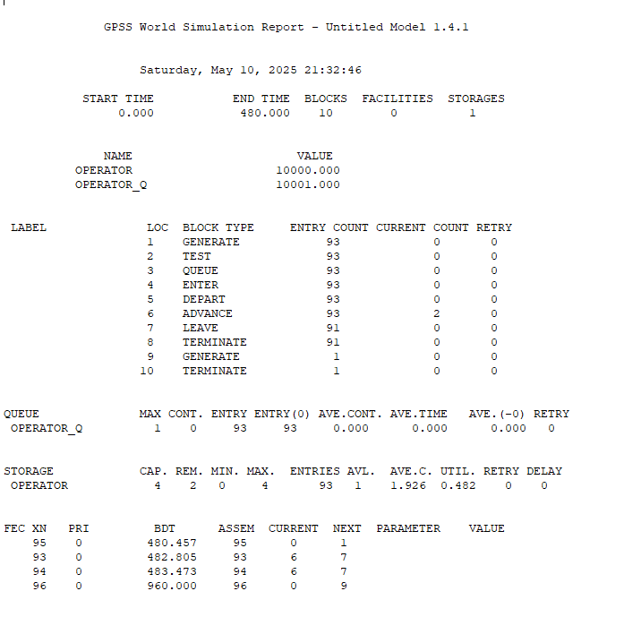

---
## Front matter
title: "Лабораторная работа 14. Модели обработки заказов"
author: "Абакумова Олеся Максимовна, НФИбд-02-22"

## Generic otions
lang: ru-RU
toc-title: "Содержание"

## Bibliography
bibliography: bib/cite.bib
csl: pandoc/csl/gost-r-7-0-5-2008-numeric.csl

## Pdf output format
toc: true # Table of contents
toc-depth: 2
lof: true # List of figures
lot: true # List of tables
fontsize: 12pt
linestretch: 1.5
papersize: a4
documentclass: scrreprt
## I18n polyglossia
polyglossia-lang:
  name: russian
  options:
	- spelling=modern
	- babelshorthands=true
polyglossia-otherlangs:
  name: english
## I18n babel
babel-lang: russian
babel-otherlangs: english
## Fonts
mainfont: IBM Plex Serif
romanfont: IBM Plex Serif
sansfont: IBM Plex Sans
monofont: IBM Plex Mono
mathfont: STIX Two Math
mainfontoptions: Ligatures=Common,Ligatures=TeX,Scale=0.94
romanfontoptions: Ligatures=Common,Ligatures=TeX,Scale=0.94
sansfontoptions: Ligatures=Common,Ligatures=TeX,Scale=MatchLowercase,Scale=0.94
monofontoptions: Scale=MatchLowercase,Scale=0.94,FakeStretch=0.9
mathfontoptions:
## Biblatex
biblatex: true
biblio-style: "gost-numeric"
biblatexoptions:
  - parentracker=true
  - backend=biber
  - hyperref=auto
  - language=auto
  - autolang=other*
  - citestyle=gost-numeric
## Pandoc-crossref LaTeX customization
figureTitle: "Рис."
tableTitle: "Таблица"
listingTitle: "Листинг"
lofTitle: "Список иллюстраций"
lotTitle: "Список таблиц"
lolTitle: "Листинги"
## Misc options
indent: true
header-includes:
  - \usepackage{indentfirst}
  - \usepackage{float} # keep figures where there are in the text
  - \floatplacement{figure}{H} # keep figures where there are in the text
---

# Цель работы

Изучить принципы работы GPSS и реализовать различные модели обработки заказов.

# Задание

1. Реализовать различные модели обработки заказов с помощью GPSS и проанализировать результаты симуляции.

# Выполнение лабораторной работы

# Постановка задачи

В интернет-магазине заказы принимает один оператор. Интервалы поступления
заказов распределены равномерно с интервалом 15 ± 4 мин. Время оформления
заказа также распределено равномерно на интервале 10 ± 2 мин. Обработка поступивших заказов происходит в порядке очереди (FIFO). Требуется разработать
модель обработки заказов в течение 8 часов.

# Построение модели

Порядок блоков в модели соответствует порядку фаз обработки заказа в реальной
системе:

1. клиент оставляет заявку на заказ в интернет-магазине;

2. если необходимо, заявка от клиента ожидает в очереди освобождения оператора
для оформления заказа;

3. заявка от клиента принимается оператором для оформления заказа;

4. оператор оформляет заказ;

5. клиент получает подтверждение об оформлении заказа (покидает систему).

Модель будет состоять из двух частей: моделирование обработки заказов
в интернет-магазине и задание времени моделирования.
Для задания равномерного распределения поступления заказов используем блок
`GENERATE`, для задания равномерного времени обслуживания (задержки в системе)
--- `ADVANCE`. Для моделирования ожидания заявок клиентов в очереди используем
блоки QUEUE и DEPART, в которых в качестве имени очереди укажем operator_q
Для моделирования поступления заявок для оформления заказов к оператору используем блоки `SEIZE` и `RELEASE` с параметром operator — имени "устройства
обслуживания".Таким образом имеем следующее (рис. [-@fig:001]):

{#fig:001 width=70%}

После запуска симуляции получаем отчет (рис. [-@fig:002]):

{#fig:002 width=70%}

Результаты работы модели:

- модельное время в начале моделирования: `START TIME=0.0`;

- абсолютное время или момент, когда счетчик завершений принял значение 0:
`END TIME=480.0`;

- количество блоков, использованных в текущей модели, к моменту завершения
моделирования: `BLOCKS=9`;

- количество одноканальных устройств, использованных в модели к моменту завершения моделирования: `FACILITIES=1`;

- количество многоканальных устройств, использованных в текущей модели к моменту завершения моделирования: `STORAGES=0`.

Имена, используемые в программе модели: `operator`, `operator_q`.
Далее идёт информация о блоках текущей модели, в частности, `ENTRY COUNT` ---
количество транзактов, вошедших в блок с начала процедуры моделирования.
Затем идёт информация об одноканальном устройстве `FACILITY` (оператор,
оформляющий заказ), откуда видим, что к оператору попало 33 заказа от клиентов
(значение поля `OWNER=33`), но одну заявку оператор не успел принять в обработку
до окончания рабочего времени (значение поля `ENTRIES=32`). Полезность работы
оператора составила 0, 639. При этом среднее время занятости оператора составило
9, 589 мин.

Далее информация об очереди:

- `QUEUE=operator_q` --- имя объекта типа «очередь»;

- `MAX=1` --- в очереди находилось не более одной ожидающей заявки от клиента;

- `CONT=0` --- на момент завершения моделирования очередь была пуста;

- `ENTRIES=32` --- общее число заявок от клиентов, прошедших через очередь в течение периода моделирования;

- `ENTRIES(O)=31` --- число заявок от клиентов, попавших к оператору без ожидания
в очереди;

- `AVE.CONT=0, 001` заявок от клиентов в среднем были в очереди;

- `AVE.TIME=0.021` минут в среднем заявки от клиентов провели в очереди (с учётом
всех входов в очередь);

- `AVE.(–0)=0, 671 минут` в среднем заявки от клиентов провели в очереди (без
учета «нулевых» входов в очередь).

В конце отчёта идёт информация о будущих событиях:

- `XN=33` --- порядковый номер заявки от клиента, ожидающей поступления для
оформления заказа у оператора;

- `PRI=0` --- все клиенты (из заявки) равноправны;

- `BDT=489, 786`--- время назначенного события, связанного с данным транзактом;

- `ASSEM=33` --- номер семейства транзактов;

- `CURRENT=5` --- номер блока, в котором находится транзакт;

- `NEXT=6` --- номер блока, в который должен войти транзакт.

### Упражнение

Скорректируем модель (рис. [-@fig:003]) в соответствии с изменениями входных
данных: интервалы поступления заказов распределены равномерно с интервалом
3.14 ± 1.7 мин; время оформления заказа также распределено равномерно на интервале 6.66 ± 1.7 мин. Проанализируем отчёт (рис. [-@fig:004]), сравнив результаты с результатами
предыдущего моделирования.

{#fig:003 width=80%}

{#fig:004 width=70%}

**1. Общие параметры:**  

- Модельное время: `0.000 $\rightarrow$ 480.000`  

- Блоков: `9` | Ресурсы: `FACILITIES=1` (оператор), `STORAGES=0`  

- Очередь: `operator_q`  

**2. Статистика обработки:**  
- Транзакты:  
  - Сгенерировано: `152`  
  - Обработано: `70` (потери **54%**)  
- Ресурс `OPERATOR`:  

  - Загрузка: **99.1%** (критическая)  
  
  - Среднее время обработки: **6.796** ед. 
   
- Очередь:  

  - Макс. длина: **82**  
  
  - Среднее время ожидания: **123.461**  

**3. Проблемы:**  

- Крайняя перегрузка оператора.  

- Колоссальные задержки в очереди.  

- Более половины заявок не обработаны.  

## Построение гистограммы распределения заявок в очереди

Порядок блоков в модели соответствует порядку фаз обработки заказа в реальной
системе:

1. клиент оставляет заявку на заказ в интернет-магазине;

2. если необходимо, заявка от клиента ожидает в очереди освобождения оператора
для оформления заказа;

3. заявка от клиента принимается оператором для оформления заказа;

4. оператор оформляет заказ;

5. клиент получает подтверждение об оформлении заказа (покидает систему).

Модель будет состоять из двух частей: моделирование обработки заказов
в интернет-магазине и задание времени моделирования.
Для задания равномерного распределения поступления заказов используем блок
GENERATE, для задания равномерного времени обслуживания (задержки в системе)
--- `ADVANCE`. Для моделирования ожидания заявок клиентов в очереди используем
блоки `QUEUE` и `DEPART`, в которых в качестве имени очереди укажем `operator_q`
Для моделирования поступления заявок для оформления заказов к оператору используем блоки `SEIZE` и `RELEASE` с параметром operator — имени "устройства
обслуживания".

Требуется, чтобы модельное время было 8 часов. Соответственно, параметр блока
`GENERATE` --- 480 (8 часов по 60 минут, всего 480 минут). Работа программы начинается с оператора START с начальным значением счётчика завершений, равным 1;
заканчивается --- оператором `TERMINATE` с параметром 1, что задаёт ординарность
потока в модели.
Таким образом получаем следующее (рис. [-@fig:005]):

{#fig:005 width=70%}

Здесь `Waittime` --- метка оператора таблицы очередей `QTABLE`, в данном случае
название таблицы очереди заявок на заказы. Строка с оператором `TEST` по смыслу
аналогично действиям оператора `IF` и означает, что если в очереди 0 или 1 заявка,
то осуществляется переход к следующему оператору, в данном случае к оператору
`SAVEVALUE`, в противном случае (в очереди более одной заявки) происходит переход
к оператору с меткой `Fin`, то есть заявка удаляется из системы, не попадая на
обслуживание.
Строка с оператором `SAVEVALUE` с помощью операнда `Custnum` подсчитывает
число заявок на заказ, попавших в очередь. Далее оператору `ASSIGN` присваивается
значение СЧА оператора `Custnum`.
При запуске симуляции получаем следующий отчет и также выведем график с помощью `Table Window` (рис. [-@fig:006]):

{#fig:006 width=70%}

{#fig:007 width=70%}

### Упражнение

Проанализируем отчет и гистограмму.

Отчет:

**1. Общие параметры:**  

- Модельное время: `0.000 $\rightarrow$ 353.895`  

- Блоков: `10` | Ресурсы: `FACILITIES=1`, `STORAGES=0`  

**2. Статистика обработки:**  

- Транзакты:  

  - Сгенерировано: `102`  
  
  - Обработано: `54` (потери **47%**)  
  
- Ресурс `OPERATOR`:  

  - Загрузка: **98.7%**  
  
  - Время обработки: **6.47** ед.  
  
- Очередь:  

  - Макс. длина: **2**  
  
  - Среднее время ожидания: **10.628**  

**3. Проблемы:** 
 
- Почти 100% загрузка оператора.  

- Приемлемое время ожидания, но высокий процент потерь.

**1. Гистограмма:** 
 
- График `WAITIME`:  

  - Пик: **10–12 ед.** (17 транзактов).  
  
  - 92% заявок ждут ≤ **14 ед.**  
  
  - Макс. задержка: **16 ед.**  

**2. Выводы:**  
- Система стабильна, но **на грани** (загрузка 98.7%).  

- Риск сбоев при увеличении нагрузки. 

## Модель обслуживания двух типов заказов от клиентов в интернет-магазине

### Постановка задачи

В интернет-магазин к одному оператору поступают два типа заявок от клиентов ---
обычный заказ и заказ с оформление дополнительного пакета услуг. Заявки первого
типа поступают каждые 15 ± 4 мин. Заявки второго типа — каждые 30 ± 8 мин.
Оператор обрабатывает заявки по принципу FIFO («"первым пришел --- первым
обслужился"). Время, затраченное на оформление обычного заказа, составляет 10 ±
2 мин, а на оформление дополнительного пакета услуг --- 5 ± 2 мин. Требуется
разработать модель обработки заказов в течение 8 часов, обеспечив сбор данных об
очереди заявок от клиентов.

### Построение модели

Необходимо реализовать отличие в оформлении обычных заказов и заказов с дополнительным пакетом услуг. Такую систему можно промоделировать с помощью двух
сегментов. Один из них моделирует оформление обычных заказов, а второй --- заказов с дополнительным пакетом услуг. В каждом из сегментов пара `QUEUE–DEPART`
должна описывать одну и ту же очередь, а пара блоков `SEIZE–RELEASE` должна
описывать в каждом из двух сегментов одно и то же устройство и моделировать
работу оператора.
Реализация будет выглядеть следующим образом (рис. [-@fig:008]):

{#fig:008 width=70%}

После запуска симуляции получаем следующие сведения (рис. [-@fig:009]):

{#fig:009 width=70%}

### Задание

Проанализируем полученные данные:

**1. Общие параметры:**  

- Модельное время: `480.000`  

- Блоков: `17` | Ресурсы: `FACILITIES=1`  

**2. Статистика:**  

- Транзакты:  

  - Сгенерировано: `48`  
  
  - Обработано: `39` (потери **19%**)  
  
- Очередь:  

  - Макс. длина: **8**  
  
  - Среднее время ожидания: **34.261**  
  
- Ресурс:  

  - Загрузка: **94.7%**  
  
  - Время обработки: **11.365** (медленно)  
  
### Упражнение

Скорректируем модель (рис. [-@fig:010]) так, чтобы учитывалось условие, что число
заказов с дополнительным пакетом услуг составляет 30% от общего числа заказов.
Используйте оператор TRANSFER. Проанализируем отчёт (рис. [-@fig:011]).

{#fig:010 width=70%}

{#fig:011 width=70%}

**1. Ключевые особенности:**  

- Потери: **26%** (13 из 49 заявок).  

- Очередь:  

  - Макс. длина: **12**  
  
  - Среднее время ожидания: **49.939**  
  
- Ресурс:  

  - Загрузка: **94.6%**  
  
  - Время обработки: **12.619**  

## Модель оформления заказов несколькими операторами

### Постановка задачи

В интернет-магазине заказы принимают 4 оператора. Интервалы поступления заказов распределены равномерно с интервалом 5 ± 2 мин. Время оформления заказа
каждым оператором также распределено равномерно на интервале 10 ± 2 мин. Обработка поступивших заказов происходит в порядке очереди (FIFO). Требуется
определить характеристики очереди заявок на оформление заказов при условии, что
заявка может обрабатываться одним из 4-х операторов в течение восьмичасового
рабочего дня.

### Построение модели

Реализация такой модели будет выглядеть следующим образом (рис. [-@fig:012]):

{#fig:012 width=70%}

После запуска получаем следующий отчет (рис. [-@fig:013]):

{#fig:013 width=70%}

### Задание

1. Проанализируем полученный отчёт (рис. [-@fig:013]).

**1. Что появилось:**  

- Использование `STORAGE` (емкость=4).  

**2. Результаты:**  

- Транзакты:  

  - Сгенерировано: `94`  
  
  - Обработано: `91` (потери **3.2%**)  
  
- Очередь:  

  - Макс. длина: **1**  
  
  - Среднее время ожидания: **0.000** 
   
- Ресурс:  

  - Загрузка: **48.2%**  
  
  - Свободно: **2** из 4 единиц  

2. Изменим модель (рис. [-@fig:014]): требуется учесть в ней возможные отказы клиентов от заказа
--- когда при подаче заявки на заказ клиент видит в очереди более двух других
заявок, он отказывается от подачи заявки, то есть отказывается от обслуживания
(используем блок `TEST` и стандартный числовой атрибут `Qj` текущей длины
очереди `j`).

{#fig:014 width=70%}

3. Проанализируем отчёт (рис. [-@fig:015]) изменённой модели.

{#fig:015 width=70%}

**1. Изменения:**  

- Добавлен блок `TEST`.  

**2. Итоги:**  

- Показатели аналогичны отчету без изменений.  

- Блок `TEST` не повлиял на производительность.  

# Выводы

В процессе выполнения данной лабораторной работы я изучила приципы работы GPSS и реализовала различные примеры.
