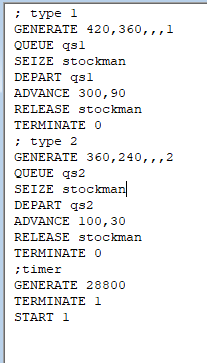
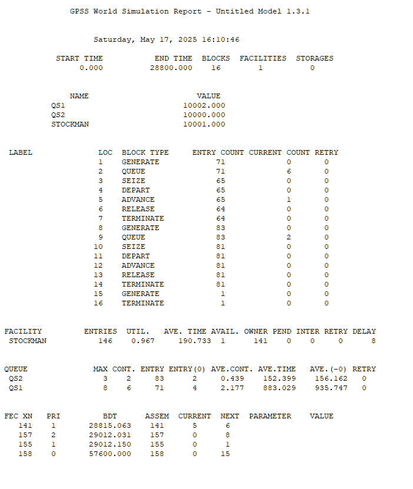
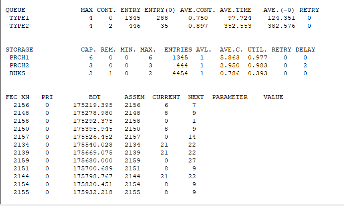

---
## Front matter
lang: ru-RU
title: Лабораторная работа 15. Модели обслуживания с приоритетами
author:
  - Абакумова О. М.
institute:
  - Российский университет дружбы народов, Москва, Россия

## i18n babel
babel-lang: russian
babel-otherlangs: english

## Formatting pdf
toc: false
toc-title: Содержание
slide_level: 2
aspectratio: 169
section-titles: true
theme: metropolis
header-includes:
 - \metroset{progressbar=frametitle,sectionpage=progressbar,numbering=fraction}
 - '\makeatletter'
 - '\makeatother'
mainfont: Open Sans Light

---

# Информация

## Докладчик

:::::::::::::: {.columns align=center}
::: {.column width="70%"}

  * Абакумова Олеся Максимовна
  * Студентка
  * Российский университет дружбы народов
  * 1132220832@pfur.ru
  * <https://github.com/omabakumova>

:::
::: {.column width="30%"}

:::
::::::::::::::

# Цель работы

Изучить принципы работы GPSS для реализации моделей обслуживания с приоритетами.

# Задание

1. Реализовать различные модели обслуживания с приоритетами с помощью GPSS и проанализировать результаты симуляции.

# Выполнение лабораторной работы

# Модель обслуживания механиков на складе

## Постановка задачи

На фабрике на складе работает один кладовщик, который выдает запасные части
механикам, обслуживающим станки. Время, необходимое для удовлетворения запроса, зависит от типа запасной части. Запросы бывают двух категорий. Для первой
категории интервалы времени прихода механиков 420 ± 360 сек., время обслуживания — 300 ± 90 сек. Для второй категории интервалы времени прихода механиков
360 ± 240 сек., время обслуживания — 100 ± 30 сек.
Порядок обслуживания механиков кладовщиком такой: запросы первой категории
обслуживаются только в том случае, когда в очереди нет ни одного запроса второй
категории. Внутри одной категории дисциплина обслуживания --- «первым пришел ---
первым обслужился». Необходимо создать модель работы кладовой, моделирование
выполнять в течение восьмичасового рабочего дня.

## Построение модели

{#fig:001 width=25%}

## Построение модели

{#fig:002 width=35%}

## Построение модели

В ходе моделирования были получены следующие данные:  

- **Общие параметры системы:**  

  - Использовано: **16 блоков**  
  
  - Всего сгенерировано заявок: **154** (71 — тип 1, 83 — тип 2) 
   
  - Обслужено заявок: **145** (64 — тип 1, 81 — тип 2)  
  
# Модель обслуживания в порту судов двух типов

## Постановка задачи

Морские суда двух типов прибывают в порт, где происходит их разгрузка. В порту
есть два буксира, обеспечивающих ввод и вывод кораблей из порта. К первому
типу судов относятся корабли малого тоннажа, которые требуют использования
одного буксира. Корабли второго типа имеют большие размеры, и для их ввода
и вывода из порта требуется два буксира. Из-за различия размеров двух типов
кораблей необходимы и причалы различного размера. Кроме того, корабли имеют
различное время погрузки/разгрузки.
Требуется построить модель системы, в которой можно оценить время ожидания
кораблями каждого типа входа в порт. Время ожидания входа в порт включает время
ожидания освобождения причала и буксира. Корабль, ожидающий освобождения
причала, не обслуживается буксиром до тех пор, пока не будет предоставлен нужный
причал. Корабль второго типа не займёт буксир до тех пор, пока ему не будут
доступны оба буксира.

## Постановка задачи

Параметры модели:

- для корабля первого типа:

  - интервал прибытия: 130 ± 30 мин;
  
  - время входа в порт: 30 ± 7 мин;
  
  - количество доступных причалов: 6;
  
  - время погрузки/разгрузки: 12 ± 2 час;
  
  - время выхода из порта: 20 ± 5 мин;

## Постановка задачи

- для корабля второго типа:

  - интервал прибытия: 390 ± 60 мин;
  
  - время входа в порт: 45 ± 12 мин;
  
  - количество доступных причалов: 3;
  
  - время погрузки/разгрузки: 18 ± 4 час;
  
  - время выхода из порта: 35 ± 10 мин.
  
  - время моделирования: 365 дней по 8 часов.
  
## Построение модели 

{#fig:003 width=30%}

## Построение модели 

{#fig:004 width=35%}

## Построение модели 

{#fig:005 width=50%}

## Построение модели 

**Общие показатели системы:**

- Задействовано ресурсов: 28 блоков обработки

- Всего поступило заявок: 1791 (1345 - корабли 1 типа, 446 - корабли 2 типа)

- Успешно обработано: 1780 заявок (1339 - 1 тип, 441 - 2 тип)

**Эффективность работы:**

- Коэффициент обслуживания: 99.4% (1780/1791)

- Разница в обслуживании категорий: суда 1 типа обслуживались без очереди в 2.8 раза чаще

# Выводы

В процессе выполнения данной лабораторной работы я изучила приципы работы GPSS для реализации моделей обслуживания с приоритетами.
