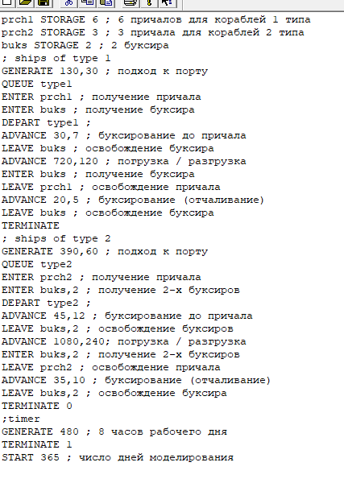
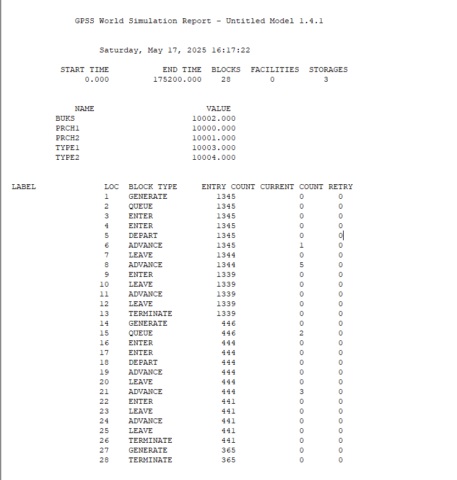

---
## Front matter
title: "Лабораторная работа 15. Модели обслуживания с приоритетами"
author: "Абакумова Олеся Максимовна, НФИбд-02-22"

## Generic otions
lang: ru-RU
toc-title: "Содержание"

## Bibliography
bibliography: bib/cite.bib
csl: pandoc/csl/gost-r-7-0-5-2008-numeric.csl

## Pdf output format
toc: true # Table of contents
toc-depth: 2
lof: true # List of figures
lot: true # List of tables
fontsize: 12pt
linestretch: 1.5
papersize: a4
documentclass: scrreprt
## I18n polyglossia
polyglossia-lang:
  name: russian
  options:
	- spelling=modern
	- babelshorthands=true
polyglossia-otherlangs:
  name: english
## I18n babel
babel-lang: russian
babel-otherlangs: english
## Fonts
mainfont: IBM Plex Serif
romanfont: IBM Plex Serif
sansfont: IBM Plex Sans
monofont: IBM Plex Mono
mathfont: STIX Two Math
mainfontoptions: Ligatures=Common,Ligatures=TeX,Scale=0.94
romanfontoptions: Ligatures=Common,Ligatures=TeX,Scale=0.94
sansfontoptions: Ligatures=Common,Ligatures=TeX,Scale=MatchLowercase,Scale=0.94
monofontoptions: Scale=MatchLowercase,Scale=0.94,FakeStretch=0.9
mathfontoptions:
## Biblatex
biblatex: true
biblio-style: "gost-numeric"
biblatexoptions:
  - parentracker=true
  - backend=biber
  - hyperref=auto
  - language=auto
  - autolang=other*
  - citestyle=gost-numeric
## Pandoc-crossref LaTeX customization
figureTitle: "Рис."
tableTitle: "Таблица"
listingTitle: "Листинг"
lofTitle: "Список иллюстраций"
lotTitle: "Список таблиц"
lolTitle: "Листинги"
## Misc options
indent: true
header-includes:
  - \usepackage{indentfirst}
  - \usepackage{float} # keep figures where there are in the text
  - \floatplacement{figure}{H} # keep figures where there are in the text
---

# Цель работы

Изучить принципы работы GPSS для реализации моделей обслуживания с приоритетами.

# Задание

1. Реализовать различные модели обслуживания с приоритетами с помощью GPSS и проанализировать результаты симуляции.

# Выполнение лабораторной работы

## Модель обслуживания механиков на складе

### Постановка задачи

На фабрике на складе работает один кладовщик, который выдает запасные части
механикам, обслуживающим станки. Время, необходимое для удовлетворения запроса, зависит от типа запасной части. Запросы бывают двух категорий. Для первой
категории интервалы времени прихода механиков 420 ± 360 сек., время обслуживания — 300 ± 90 сек. Для второй категории интервалы времени прихода механиков
360 ± 240 сек., время обслуживания — 100 ± 30 сек.
Порядок обслуживания механиков кладовщиком такой: запросы первой категории
обслуживаются только в том случае, когда в очереди нет ни одного запроса второй
категории. Внутри одной категории дисциплина обслуживания --- «первым пришел ---
первым обслужился». Необходимо создать модель работы кладовой, моделирование
выполнять в течение восьмичасового рабочего дня.

### Построение модели

Есть два различных типа заявок, поступающих на обслуживание к одному устройству. Различаются распределения интервалов приходов и времени обслуживания
для этих типов заявок. Приоритеты запросов задаются путем использования для
операнда E блока GENERATE запросов второй категории большего значения, чем для
запросов первой категории.Модель с сегментом моделирования таймера можно представить следующим образом (рис. [-@fig:001]):

{#fig:001 width=70%}

После запуска симуляции получаем отчет (рис. [-@fig:002]):

{#fig:002 width=70%}

В ходе моделирования были получены следующие данные:  

- **Общие параметры системы:**  

  - Использовано: **16 блоков**  
  
  - Всего сгенерировано заявок: **154** (71 — тип 1, 83 — тип 2) 
   
  - Обслужено заявок: **145** (64 — тип 1, 81 — тип 2)  

- **Статистика очередей:**  

  - **Для заявок типа 1:**  
  
   - Ожидало в очереди: **67**  
    
   - Осталось в очереди на момент завершения: **6**  
    
   - Максимальная длина очереди: **8**  
    
   - Заявок, прошедших без очереди: **4**  
    
  - **Для заявок типа 2:**  
  
   - Ожидало в очереди: **81**  
    
   - Осталось в очереди на момент завершения: **2**  
    
   - Максимальная длина очереди: **3**  
    
   - Заявок, прошедших без очереди: **2**  

- **Дополнительные метрики:**  

  - Среднее время обслуживания: **190.733**  
  
  - На момент завершения моделирования на приборе оставалась **1 заявка типа 1**.  

## Модель обслуживания в порту судов двух типов

### Постановка задачи

Морские суда двух типов прибывают в порт, где происходит их разгрузка. В порту
есть два буксира, обеспечивающих ввод и вывод кораблей из порта. К первому
типу судов относятся корабли малого тоннажа, которые требуют использования
одного буксира. Корабли второго типа имеют большие размеры, и для их ввода
и вывода из порта требуется два буксира. Из-за различия размеров двух типов
кораблей необходимы и причалы различного размера. Кроме того, корабли имеют
различное время погрузки/разгрузки.

Требуется построить модель системы, в которой можно оценить время ожидания
кораблями каждого типа входа в порт. Время ожидания входа в порт включает время
ожидания освобождения причала и буксира. Корабль, ожидающий освобождения
причала, не обслуживается буксиром до тех пор, пока не будет предоставлен нужный
причал. Корабль второго типа не займёт буксир до тех пор, пока ему не будут
доступны оба буксира.

Параметры модели:

- для корабля первого типа:

  - интервал прибытия: 130 ± 30 мин;
  
  - время входа в порт: 30 ± 7 мин;
  
  - количество доступных причалов: 6;
  
  - время погрузки/разгрузки: 12 ± 2 час;
  
  - время выхода из порта: 20 ± 5 мин;
  
- для корабля второго типа:

  - интервал прибытия: 390 ± 60 мин;
  
  - время входа в порт: 45 ± 12 мин;
  
  - количество доступных причалов: 3;
  
  - время погрузки/разгрузки: 18 ± 4 час;
  
  - время выхода из порта: 35 ± 10 мин.
  
  - время моделирования: 365 дней по 8 часов.
  
### Построение модели 

Код для реализации модели обслуживания в порту судов двух типов может быть реализован следующим образом (рис. [-@fig:003]):

{#fig:003 width=80%}

После запуска получаем следующий отчет (рис. [-@fig:004]):

{#fig:004 width=70%}

{#fig:005 width=70%}

Среднее время ожидания кораблями каждого типа входа в порт
получаем в конце моделирования из стандартной статистики об очередях: оно равно показателю `AVERAGE TIME` соответствующей очереди.
Эти же значения дают стандартные числовые атрибуты `QT$TYPE1`
и `QT$TYPE2`.

Рассмотрим отчет более детально:

**Общие показатели системы:**

- Задействовано ресурсов: 28 блоков обработки

- Всего поступило заявок: 1791 (1345 - корабли 1 типа, 446 - корабли 2 типа)

- Успешно обработано: 1780 заявок (1339 - 1 тип, 441 - 2 тип)

**Анализ очередей:**

1. Для судов 1 категории:

   - Всего ожидало в очереди: 1057 ед.
   
   - Максимальная очередь: 4 судна
   
   - Обслужено без ожидания: 288 ед. (21.5% от общего потока)
   
   - На момент завершения: очередь отсутствует

2. Для судов 2 категории:

   - Всего ожидало в очереди: 411 ед.
   
   - Максимальная очередь: 4 судна
   
   - Обслужено без ожидания: 35 ед. (7.8% от общего потока)
   
   - На момент завершения: 2 судна в очереди

**Текущее состояние системы:**

- В процессе разгрузки: 5 судов 1 типа и 3 судна 2 типа

- Дополнительно: 1 судно 1 типа находится на буксировке

**Эффективность работы:**

- Коэффициент обслуживания: 99.4% (1780/1791)

- Разница в обслуживании категорий: суда 1 типа обслуживались без очереди в 2.8 раза чаще

# Выводы

В процессе выполнения данной лабораторной работы я изучила приципы работы GPSS для реализации моделей обслуживания с приоритетами.
