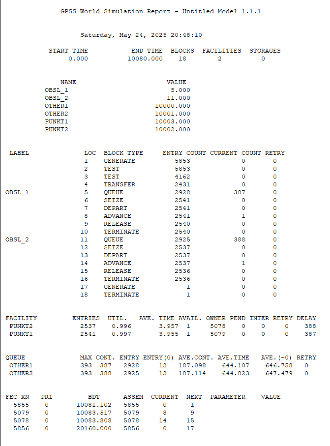
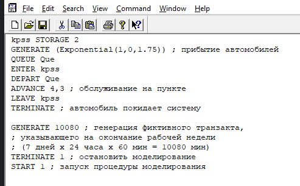
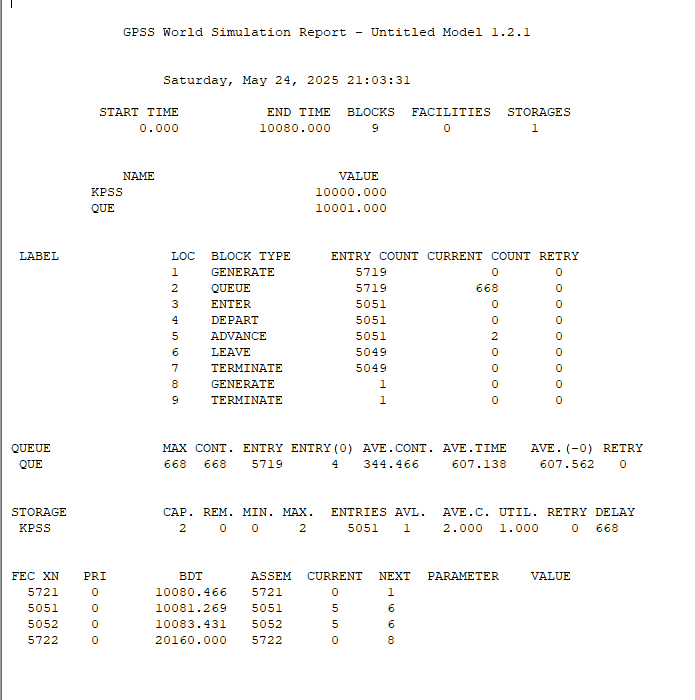
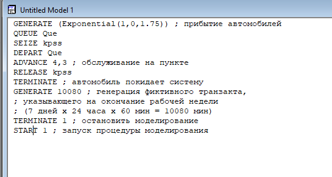
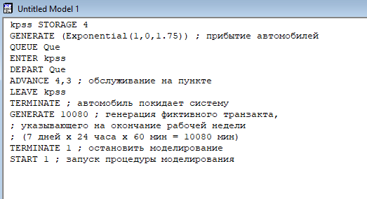
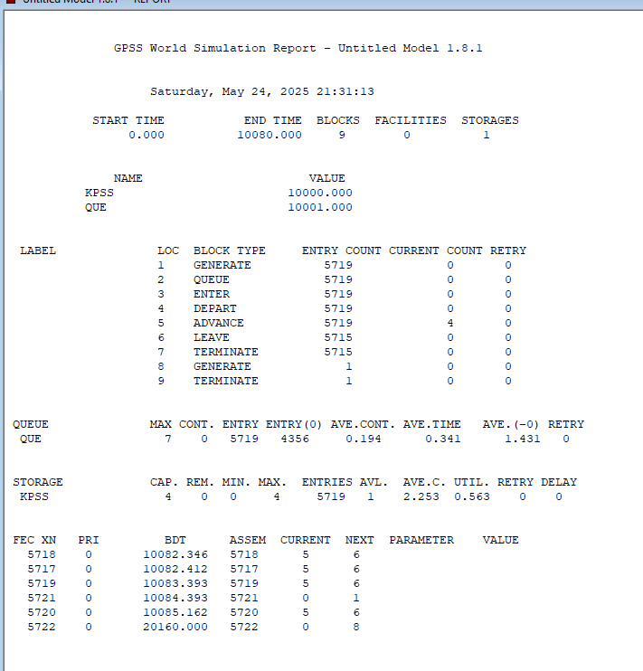
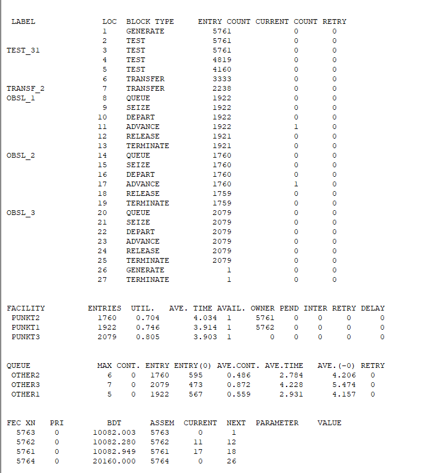
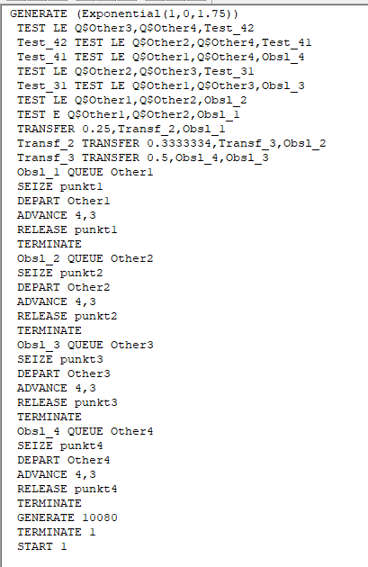

---
## Front matter
lang: ru-RU
title: Лабораторная работа 16. Задачи оптимизации. Модель двух стратегий обслуживания
author:
  - Абакумова О. М.
institute:
  - Российский университет дружбы народов, Москва, Россия

## i18n babel
babel-lang: russian
babel-otherlangs: english

## Formatting pdf
toc: false
toc-title: Содержание
slide_level: 2
aspectratio: 169
section-titles: true
theme: metropolis
header-includes:
 - \metroset{progressbar=frametitle,sectionpage=progressbar,numbering=fraction}
 - '\makeatletter'
 - '\makeatother'
mainfont: Open Sans Light

---

# Информация

## Докладчик

:::::::::::::: {.columns align=center}
::: {.column width="70%"}

  * Абакумова Олеся Максимовна
  * Студентка
  * Российский университет дружбы народов
  * 1132220832@pfur.ru
  * <https://github.com/omabakumova>

:::
::: {.column width="30%"}

:::
::::::::::::::

# Цель работы

Изучить принципы работы GPSS для реализации моделей двух стратегий обслуживания.

# Постановка задачи

На пограничном контрольно-пропускном пункте транспорта имеются 2 пункта
пропуска. Интервалы времени между поступлением автомобилей имеют экспоненциальное распределение со средним значением μ. Время прохождения автомобилями
пограничного контроля имеет равномерное распределение на интервале $[a, b]$.
Предлагается две стратегии обслуживания прибывающих автомобилей:

1. Автомобили образуют две очереди и обслуживаются соответствующими пунктами
пропуска;

2. автомобили образуют одну общую очередь и обслуживаются освободившимся
пунктом пропуска.

Исходные данные: $μ$ = 1, 75 мин, $a$ = 1 мин, $b$ = 7 мин.

# Построение модели

Целью моделирования является определение:

- характеристик качества обслуживания автомобилей, в частности, средних длин
очередей; среднего времени обслуживания автомобиля; среднего времени пребывания автомобиля на пункте пропуска;

- наилучшей стратегии обслуживания автомобилей на пункте пограничного контроля;

- оптимального количества пропускных пунктов.

## Построение модели

В качестве критериев, используемых для сравнения стратегий обслуживания
автомобилей, выберем:

  - коэффициенты загрузки системы;
  
  - максимальные и средние длины очередей;
  
  - средние значения времени ожидания обслуживания.
  
## Построение модели
  
{#fig:001 width=50%}

## Построение модели

{#fig:002 width=25%}

# Задание

1. Составить модель для второй стратегии обслуживания, когда прибывающие автомобили образуют одну очередь и обслуживаются освободившимся пропускным
пунктом;

2. Свести полученные статистики моделирования в таблицу

3. По результатам моделирования сделать вывод о наилучшей стратегии обслуживания автомобилей;

## Задание

4. Изменив модели, определить оптимальное число пропускных пунктов (от 1 до 4)
для каждой стратегии при условии, что:

  - коэффициент загрузки пропускных пунктов принадлежит интервалу [0, 5; 0, 95];
  
  - среднее число автомобилей, одновременно находящихся на контрольно-пропускном пункте, не должно превышать 3;
  
  - среднее время ожидания обслуживания не должно превышать 4 мин.

# Выполнение лабораторной работы

{#fig:003 width=50%}

## Выполнение лабораторной работы

{#fig:004 width=50%}

## Выполнение лабораторной работы

: Сравнение стратегий 

| Показатель                 | стратегия 1 |         |          |  стратегия 2 |
|----------------------------|-------------|---------|----------|--------------|
|                            | пункт 1     | пункт 2 | в целом  |              |
| Поступило автомобилей      | 2928        | 2925    | 5853     | 5719         |
| Обслужено автомобилей      | 2540        | 2536    | 5076     | 5049         |
| Коэффициент загрузки       | 0,997       | 0,996   | 0,9965   | 1            |
| Максимальная длина очереди | 393         | 393     | 786      | 668          |
| Средняя длина очереди      | 187,098     | 187,114 | 374,212  | 344,466      |
| Среднее время ожидания     | 644,107     | 644,823 | 644,465  | 607,138      |

## Выполнение лабораторной работы

{#fig:005 width=50%}

## Выполнение лабораторной работы

{#fig:006 width=50%}

## Выполнение лабораторной работы

{#fig:007 width=50%}

## Выполнение лабораторной работы

{#fig:008 width=30%}

## Выполнение лабораторной работы

{#fig:009 width=50%}

## Выполнение лабораторной работы

{#fig:010 width=35%}

## Выполнение лабораторной работы

{#fig:011 width=35%}

## Выполнение лабораторной работы

{#fig:012 width=35%}

## Выполнение лабораторной работы

{#fig:013 width=25%}

## Выполнение лабораторной работы

{#fig:014 width=35%}

## Выполнение лабораторной работы

: Сравнение стратегий с пунктами 

| Показатель       | 1 п. | С1, 2п. | С2, 2п. | С1, 3п. | С2, 3п. | С1, 4п. | С2, 4п. |
|------------------|------|---------|---------|---------|---------|---------|---------|
| Загрузка         | 1.000| 0.9965  | 1.000   | 0.752   | 0.748   | 0.5675  | 0.563   |
| Авто в очереди   | 1618 | 376.2   | 346.4   | 4.172   | 3.306   | 3.36    | 2.447   |
| Время ожидания   | 2838 | 644.5   | 607.1   | 3.354   | 1.885   | 1.923   | 0.341   |

## Выполнение лабораторной работы

1. **Эффективность стратегий**:  

- Стратегия 2 демонстрирует лучшие показатели по сравнению со Стратегией 1, особенно в сокращении среднего времени ожидания. Например, при использовании 4 пунктов пропуска время ожидания уменьшается до 0.341 минуты, что в 5 раз меньше, чем у Стратегии 1 (1.923 минуты).

2. **Оптимальное количество пунктов пропуска**:  

- **4 пункта**: Обе стратегии с 4 пунктами соответствуют критериям задания, обеспечивая низкий коэффициент загрузки и минимальное время ожидания. 
 
- **3 пункта**: Только Стратегия 2 с 3 пунктами показывает приемлемые результаты, близкие к варианту с 4 пунктами.  

# Выводы

В процессе выполнения данной лабораторной работы я изучила приципы работы GPSS для реализации моделей двух стратегий обслуживания.
