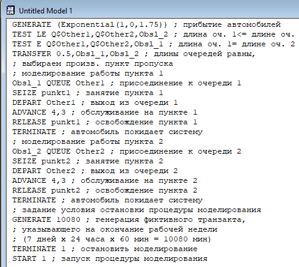
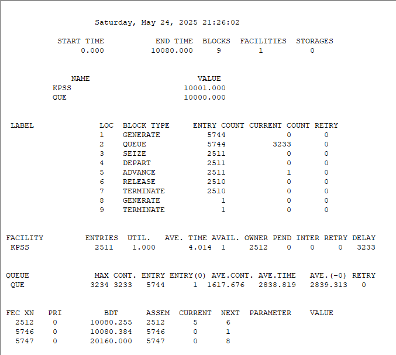
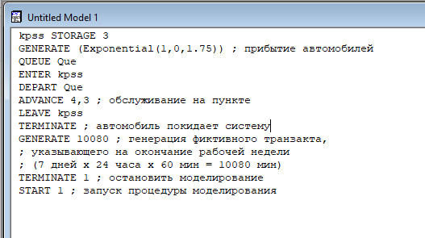
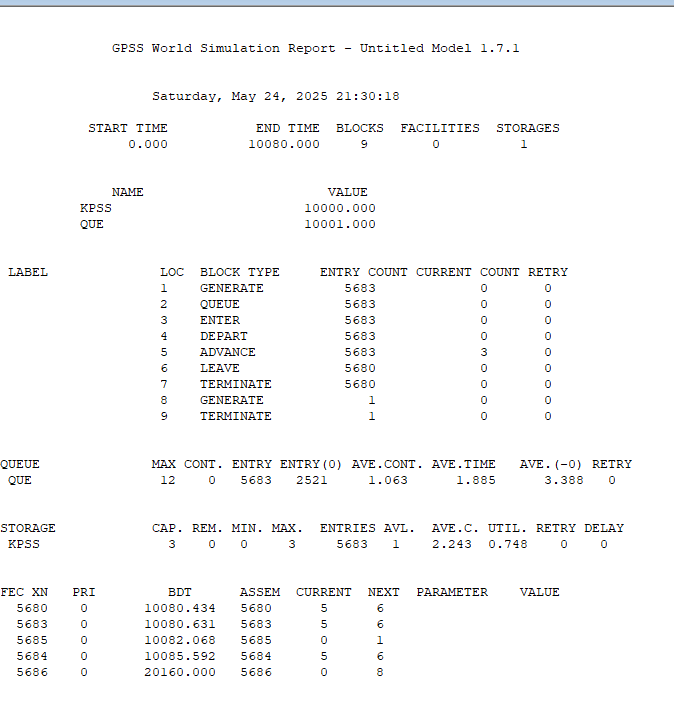
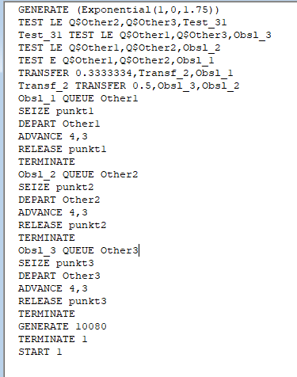
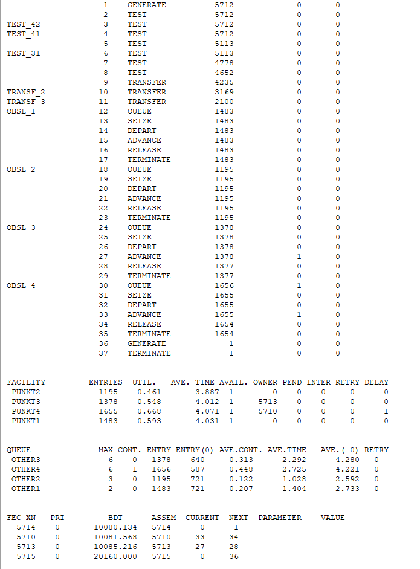

---
## Front matter
title: "Лабораторная работа 16. Задачи оптимизации. Модель двух стратегий обслуживания"
author: "Абакумова Олеся Максимовна, НФИбд-02-22"

## Generic otions
lang: ru-RU
toc-title: "Содержание"

## Bibliography
bibliography: bib/cite.bib
csl: pandoc/csl/gost-r-7-0-5-2008-numeric.csl

## Pdf output format
toc: true # Table of contents
toc-depth: 2
lof: true # List of figures
lot: true # List of tables
fontsize: 12pt
linestretch: 1.5
papersize: a4
documentclass: scrreprt
## I18n polyglossia
polyglossia-lang:
  name: russian
  options:
	- spelling=modern
	- babelshorthands=true
polyglossia-otherlangs:
  name: english
## I18n babel
babel-lang: russian
babel-otherlangs: english
## Fonts
mainfont: IBM Plex Serif
romanfont: IBM Plex Serif
sansfont: IBM Plex Sans
monofont: IBM Plex Mono
mathfont: STIX Two Math
mainfontoptions: Ligatures=Common,Ligatures=TeX,Scale=0.94
romanfontoptions: Ligatures=Common,Ligatures=TeX,Scale=0.94
sansfontoptions: Ligatures=Common,Ligatures=TeX,Scale=MatchLowercase,Scale=0.94
monofontoptions: Scale=MatchLowercase,Scale=0.94,FakeStretch=0.9
mathfontoptions:
## Biblatex
biblatex: true
biblio-style: "gost-numeric"
biblatexoptions:
  - parentracker=true
  - backend=biber
  - hyperref=auto
  - language=auto
  - autolang=other*
  - citestyle=gost-numeric
## Pandoc-crossref LaTeX customization
figureTitle: "Рис."
tableTitle: "Таблица"
listingTitle: "Листинг"
lofTitle: "Список иллюстраций"
lotTitle: "Список таблиц"
lolTitle: "Листинги"
## Misc options
indent: true
header-includes:
  - \usepackage{indentfirst}
  - \usepackage{float} # keep figures where there are in the text
  - \floatplacement{figure}{H} # keep figures where there are in the text
---

# Цель работы

Изучить принципы работы GPSS для реализации моделей двух стратегий обслуживания.

# Постановка задачи

На пограничном контрольно-пропускном пункте транспорта имеются 2 пункта
пропуска. Интервалы времени между поступлением автомобилей имеют экспоненциальное распределение со средним значением μ. Время прохождения автомобилями
пограничного контроля имеет равномерное распределение на интервале $[a, b]$.
Предлагается две стратегии обслуживания прибывающих автомобилей:

1. Автомобили образуют две очереди и обслуживаются соответствующими пунктами
пропуска;

2. автомобили образуют одну общую очередь и обслуживаются освободившимся
пунктом пропуска.

Исходные данные: $μ$ = 1, 75 мин, $a$ = 1 мин, $b$ = 7 мин.

# Построение модели

Целью моделирования является определение:

- характеристик качества обслуживания автомобилей, в частности, средних длин
очередей; среднего времени обслуживания автомобиля; среднего времени пребывания автомобиля на пункте пропуска;

- наилучшей стратегии обслуживания автомобилей на пункте пограничного контроля;

- оптимального количества пропускных пунктов.
В качестве критериев, используемых для сравнения стратегий обслуживания
автомобилей, выберем:

  - коэффициенты загрузки системы;
  
  - максимальные и средние длины очередей;
  
  - средние значения времени ожидания обслуживания.
  
Для первой стратегии обслуживания, когда прибывающие автомобили образуют
две очереди и обслуживаются соответствующими пропускными пунктами, имеем
следующую модель (рис. [-@fig:001]):

{#fig:001 width=70%}

После запуска симуляции получаем следующий отчет (рис. [-@fig:002]):

{#fig:002 width=70%}

# Задание

1. Составить модель для второй стратегии обслуживания, когда прибывающие автомобили образуют одну очередь и обслуживаются освободившимся пропускным
пунктом;

2. Свести полученные статистики моделирования в таблицу

3. По результатам моделирования сделать вывод о наилучшей стратегии обслуживания автомобилей;

4. Изменив модели, определить оптимальное число пропускных пунктов (от 1 до 4)
для каждой стратегии при условии, что:

  - коэффициент загрузки пропускных пунктов принадлежит интервалу [0, 5; 0, 95];
  
  - среднее число автомобилей, одновременно находящихся на контрольно-пропускном пункте, не должно превышать 3;
  
  - среднее время ожидания обслуживания не должно превышать 4 мин.

# Выполнение лабораторной работы

1. Для начала составим модель для второй стратегии обслуживания,она будет выглядеть следующим образом (рис. [-@fig:003]):

{#fig:003 width=80%}

При запуске такой модели получаем следующий отчет (рис. [-@fig:004]):

{#fig:004 width=70%}

2. Сведем полученные данные в таблицу [-@tbl:strategy]. 

: Сравнение стратегий {#tbl:strategy}

| Показатель                 | стратегия 1 |         |          |  стратегия 2 |
|----------------------------|-------------|---------|----------|--------------|
|                            | пункт 1     | пункт 2 | в целом  |              |
| Поступило автомобилей      | 2928        | 2925    | 5853     | 5719         |
| Обслужено автомобилей      | 2540        | 2536    | 5076     | 5049         |
| Коэффициент загрузки       | 0,997       | 0,996   | 0,9965   | 1            |
| Максимальная длина очереди | 393         | 393     | 786      | 668          |
| Средняя длина очереди      | 187,098     | 187,114 | 374,212  | 344,466      |
| Среднее время ожидания     | 644,107     | 644,823 | 644,465  | 607,138      |

3. Анализ данных таблицы [-@tbl:strategy] показывает, что при наличии двух контрольно-пропускных пунктов вторая стратегия демонстрирует более высокую эффективность по сравнению с первой. Это подтверждается ключевыми показателями работы системы.

4. Изменим модели так, чтобы можно было определить оптимальное число пропускных пунктов.

Рассмотрим 2 стратегию с 1 пропуском.Для такого типа модели код будет следующим (рис. [-@fig:005]):

{#fig:005 width=70%}

{#fig:006 width=70%}

Теперь также рассмотрим и дальше 2 стратегию, но уже для модели с 3 пропусками (рис. [-@fig:007]):

{#fig:007 width=70%}

Отчет для такой модели будет выглядеть следующим образом (рис. [-@fig:008]):

{#fig:008 width=70%}

Осталось рассмотреть 4 пропуска (рис. [-@fig:009]):

{#fig:009 width=70%}

{#fig:010 width=70%}

Аналогично нужно рассмотреть и для модели 1 стратегии:

- Для 3 пропусков (рис. [-@fig:011]):

{#fig:011 width=70%}

{#fig:012 width=70%}

- Для 4 пропусков (рис. [-@fig:013]):

{#fig:013 width=70%}

{#fig:014 width=70%}

: Сравнение стратегий с пунктами {#tbl:strategy_punkts}

| Показатель       | 1 п. | С1, 2п. | С2, 2п. | С1, 3п. | С2, 3п. | С1, 4п. | С2, 4п. |
|------------------|------|---------|---------|---------|---------|---------|---------|
| Загрузка         | 1.000| 0.9965  | 1.000   | 0.752   | 0.748   | 0.5675  | 0.563   |
| Авто в очереди   | 1618 | 376.2   | 346.4   | 4.172   | 3.306   | 3.36    | 2.447   |
| Время ожидания   | 2838 | 644.5   | 607.1   | 3.354   | 1.885   | 1.923   | 0.341   |

На основании проведённого [-@tbl:strategy_punkts] моделирования можно сделать следующие выводы:

1. **Эффективность стратегий**:  

- Стратегия 2 демонстрирует лучшие показатели по сравнению со Стратегией 1, особенно в сокращении среднего времени ожидания. Например, при использовании 4 пунктов пропуска время ожидания уменьшается до 0.341 минуты, что в 5 раз меньше, чем у Стратегии 1 (1.923 минуты).

2. **Оптимальное количество пунктов пропуска**:  

- **4 пункта**: Обе стратегии с 4 пунктами соответствуют критериям задания, обеспечивая низкий коэффициент загрузки и минимальное время ожидания. 
 
- **3 пункта**: Только Стратегия 2 с 3 пунктами показывает приемлемые результаты, близкие к варианту с 4 пунктами.  

3. **Выбор стратегии**:  

- Окончательное решение зависит от конкретных условий работы системы. Если приоритетом является максимальное сокращение времени ожидания, рекомендуется выбрать Стратегию 2 с 4 пунктами. Для баланса между ресурсами и эффективностью можно рассмотреть Стратегию 2 с 3 пунктами.  

# Выводы

В процессе выполнения данной лабораторной работы я изучила приципы работы GPSS для реализации моделей двух стратегий обслуживания.
