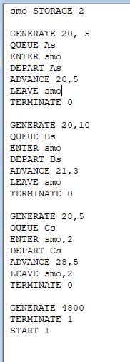
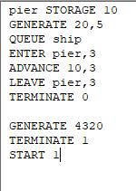
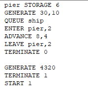

---
## Front matter
lang: ru-RU
title: Лабораторная работа 17. Задания для самостоятельной работы
author:
  - Абакумова О. М.
institute:
  - Российский университет дружбы народов, Москва, Россия

## i18n babel
babel-lang: russian
babel-otherlangs: english

## Formatting pdf
toc: false
toc-title: Содержание
slide_level: 2
aspectratio: 169
section-titles: true
theme: metropolis
header-includes:
 - \metroset{progressbar=frametitle,sectionpage=progressbar,numbering=fraction}
 - '\makeatletter'
 - '\makeatother'
mainfont: Open Sans Light

---

# Информация

## Докладчик

:::::::::::::: {.columns align=center}
::: {.column width="70%"}

  * Абакумова Олеся Максимовна
  * Студентка
  * Российский университет дружбы народов
  * 1132220832@pfur.ru
  * <https://github.com/omabakumova>

:::
::: {.column width="30%"}

:::
::::::::::::::

# Цель работы

Использовать, изученные принципы GPSS для выполнения ряда заданий для самостоятельной работы.

# Выполнение лабораторной работы
## Моделирование работы вычислительного центра

1. Задача

На вычислительном центре в обработку принимаются три класса заданий А, В и С.
Исходя из наличия оперативной памяти ЭВМ задания классов А и В могут решаться
одновременно, а задания класса С монополизируют ЭВМ. Задания класса А поступают через 20 ± 5 мин, класса В — через 20 ± 10 мин, класса С — через 28 ± 5 мин и требуют для выполнения: класс А — 20 ± 5 мин, класс В — 21 ± 3 мин, класс
С — 28 ± 5 мин. Задачи класса С загружаются в ЭВМ, если она полностью свободна.
Задачи классов А и В могут дозагружаться к решающей задаче.
Смоделировать работу ЭВМ за 80 ч. Определить её загрузку.

## Моделирование работы вычислительного центра

{#fig:001 width=15%}

## Моделирование работы вычислительного центра

{#fig:002 width=30%}

## Моделирование работы вычислительного центра

1. **Очереди на конец моделирования**:

   - **Тип A (AS)**: 51 заявка в очереди, 1 в обработке.
   
   - **Тип B (BS)**: 51 заявка в очереди, 1 в обработке.
   
   - **Тип C (CS)**: 134 заявки в очереди, ни одной в обработке.
   
## Моделирование работы вычислительного центра

2. **Обслуженные заявки**:

   - **Тип A**: 188 завершено (из 240 сгенерированных).
   
   - **Тип B**: 180 завершено (из 232 сгенерированных).
   
   - **Тип C**: 37 завершено (из 171 сгенерированных).

3. **Проблемы**:

   - **Тип C**: Низкая пропускная способность (только 37 из 171 заявок обслужено).
   
   - **Очереди**: Значительное скопление заявок (особенно типа C — 134 в очереди).
   
## Модель работы аэропорта

2. Задача

Самолёты прибывают для посадки в район аэропорта каждые 10 ± 5 мин. Если
взлетно-посадочная полоса свободна, прибывший самолёт получает разрешение на
посадку. Если полоса занята, самолет выполняет полет по кругу и возвращается
в аэропорт каждые 5 мин. Если после пятого круга самолет не получает разрешения
на посадку, он отправляется на запасной аэродром.
В аэропорту через каждые 10 ± 2 мин к взлетно-посадочной полосе выруливают
готовые к взлёту самолёты и получают разрешение на взлёт, если полоса свободна.
Для взлета и посадки самолёты занимают полосу ровно на 2 мин. Если при свободной
полосе одновременно один самолёт прибывает для посадки, а другой --- для взлёта,
то полоса предоставляется взлетающей машине.

## Модель работы аэропорта

Требуется:

- выполнить моделирование работы аэропорта в течение суток;

- подсчитать количество самолётов, которые взлетели, сели и были направлены на
запасной аэродром;

- определить коэффициент загрузки взлетно-посадочной полосы.

## Модель работы аэропорта

{#fig:003 width=20%}

## Модель работы аэропорта

{#fig:004 width=30%}

## Модель работы аэропорта

1. **Генерация заявок**:

   - **Основной поток**: 146 заявок сгенерировано (`GENERATE` блок 1), все обработаны.
   
   - 142 заявки сгенерировано (блок 20), все завершены (`TERMINATE` блок 25).
   
## Модель работы аэропорта
     
2. **Обработка по кругам (CIRCLE1–5)**:

   - **CIRCLE1**: 32 заявки прошли (блок 3).
   
   - **CIRCLE2**: 5 заявок (блок 5).
   
   - **CIRCLE3**: 1 заявка (блок 7).
   
   - **CIRCLE4–5**: Ни одной заявки не обработано (блоки 9, 11). 
    
**Вывод**: Большинство заявок завершили работу на ранних этапах (CIRCLE1).

## Моделирование работы морского порта

3. Задача

Морские суда прибывают в порт каждые $[a ± δ]$ часов. В порту имеется N причалов.
Каждый корабль по длине занимает M причалов и находится в порту $[b ± ε]$ часов.
Требуется построить GPSS-модель для анализа работы морского порта в течение
полугода, определить оптимальное количество причалов для эффективной работы
порта.
Исходные данные:

1. $a$ = 20 ч, $δ$ = 5 ч, $b$ = 10 ч, $ε$ = 3 ч, $N$ = 10, $M$ = 3;

2. $a$ = 30 ч, $δ$ = 10 ч, $b$ = 8 ч, $ε$ = 4 ч, $N$ = 6, $M$ = 2.

## Моделирование работы морского порта(1-ый случай)

{#fig:005 width=30%}

## Моделирование работы морского порта(1-ый случай)

{#fig:006 width=30%}

## Моделирование работы морского порта(1-ый случай)

- **Генерация кораблей (`SHIP`)**:  

  - Сгенерировано **215** заявок (`GENERATE` блок 1).  
  
  - Все **215** вошли в систему.  
  
  - **214** успешно обработаны (`TERMINATE` блок 6).  
  
  - **1** заявка осталась в обработке (`ADVANCE` блок 4, `CURRENT COUNT=1`).  
  
## Моделирование работы морского порта(2-ой случай)

{#fig:007 width=30%}

## Моделирование работы морского порта(2-ой случай)

{#fig:008 width=30%}

## Моделирование работы морского порта(2-ой случай)

1. **Генерация и обработка заявок**  

- **Генерация кораблей (`SHIP`)**:  

  - Сгенерировано **143** заявки (`GENERATE` блок 1). 
   
  - Все **143** прошли через очередь.  
  
  - **142** успешно обработаны (`TERMINATE` блок 6).  
  
  - **1** заявка осталась в обработке (`ADVANCE` блок 4, `CURRENT COUNT=1`).  

# Выводы

В процессе выполнения данной лабораторной работы я применила, полученные навыки в ходе изучения GPSS и применила их на практике, выполнив задания для самостоятельной работы.
