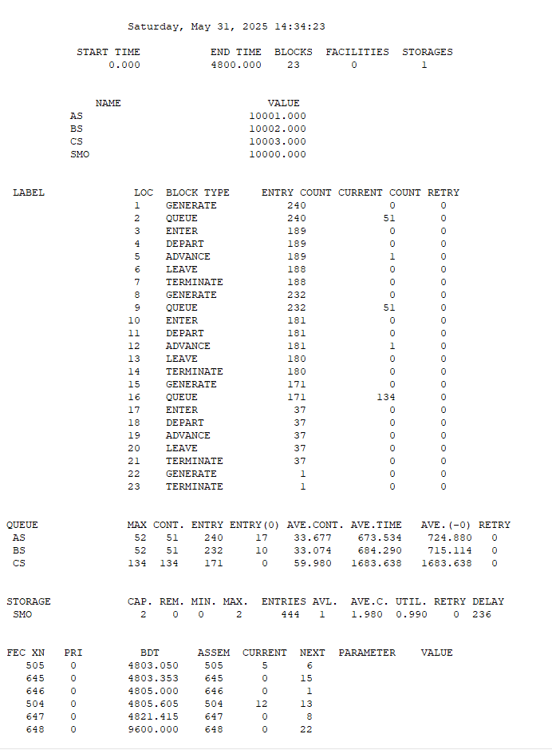
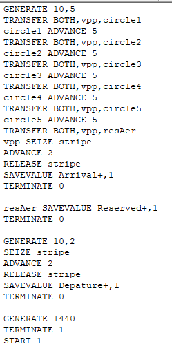
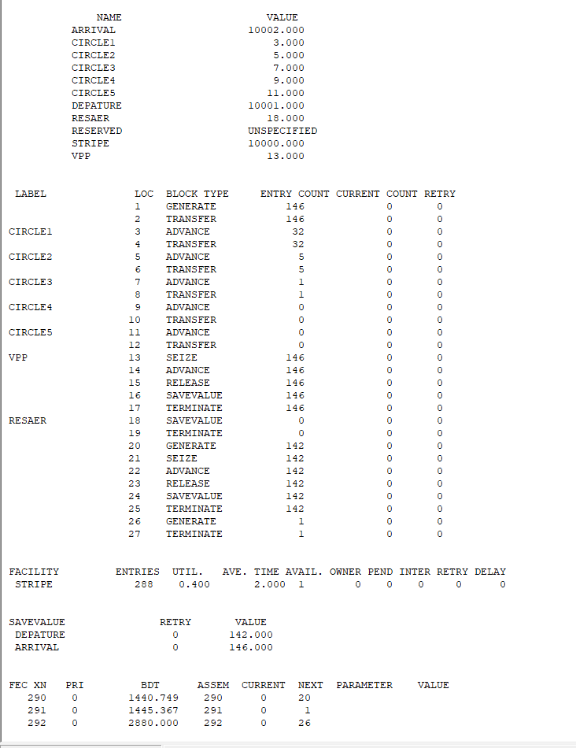
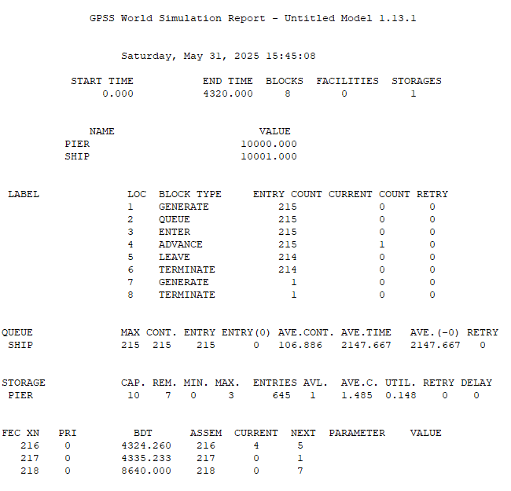
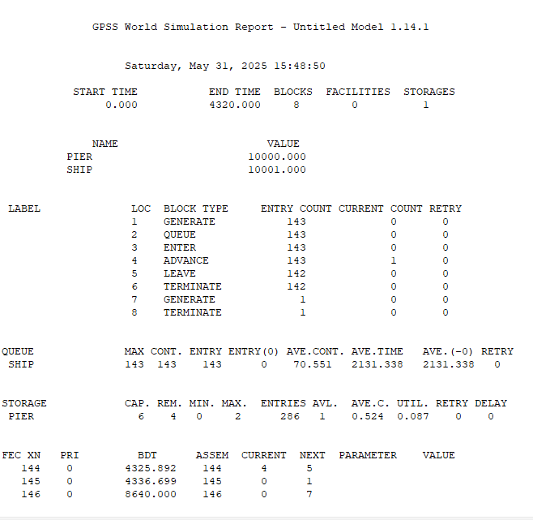

---
## Front matter
title: "Лабораторная работа 17. Задания для самостоятельной работы"
author: "Абакумова Олеся Максимовна, НФИбд-02-22"

## Generic otions
lang: ru-RU
toc-title: "Содержание"

## Bibliography
bibliography: bib/cite.bib
csl: pandoc/csl/gost-r-7-0-5-2008-numeric.csl

## Pdf output format
toc: true # Table of contents
toc-depth: 2
lof: true # List of figures
lot: true # List of tables
fontsize: 12pt
linestretch: 1.5
papersize: a4
documentclass: scrreprt
## I18n polyglossia
polyglossia-lang:
  name: russian
  options:
	- spelling=modern
	- babelshorthands=true
polyglossia-otherlangs:
  name: english
## I18n babel
babel-lang: russian
babel-otherlangs: english
## Fonts
mainfont: IBM Plex Serif
romanfont: IBM Plex Serif
sansfont: IBM Plex Sans
monofont: IBM Plex Mono
mathfont: STIX Two Math
mainfontoptions: Ligatures=Common,Ligatures=TeX,Scale=0.94
romanfontoptions: Ligatures=Common,Ligatures=TeX,Scale=0.94
sansfontoptions: Ligatures=Common,Ligatures=TeX,Scale=MatchLowercase,Scale=0.94
monofontoptions: Scale=MatchLowercase,Scale=0.94,FakeStretch=0.9
mathfontoptions:
## Biblatex
biblatex: true
biblio-style: "gost-numeric"
biblatexoptions:
  - parentracker=true
  - backend=biber
  - hyperref=auto
  - language=auto
  - autolang=other*
  - citestyle=gost-numeric
## Pandoc-crossref LaTeX customization
figureTitle: "Рис."
tableTitle: "Таблица"
listingTitle: "Листинг"
lofTitle: "Список иллюстраций"
lotTitle: "Список таблиц"
lolTitle: "Листинги"
## Misc options
indent: true
header-includes:
  - \usepackage{indentfirst}
  - \usepackage{float} # keep figures where there are in the text
  - \floatplacement{figure}{H} # keep figures where there are in the text
---

# Цель работы

Использовать, изученные принципы GPSS для выполнения ряда заданий для самостоятельной работы.

# Выполнение лабораторной работы
## Моделирование работы вычислительного центра
### Задача

На вычислительном центре в обработку принимаются три класса заданий А, В и С.
Исходя из наличия оперативной памяти ЭВМ задания классов А и В могут решаться
одновременно, а задания класса С монополизируют ЭВМ. Задания класса А поступают через 20 ± 5 мин, класса В — через 20 ± 10 мин, класса С — через 28 ± 5 мин и требуют для выполнения: класс А — 20 ± 5 мин, класс В — 21 ± 3 мин, класс
С — 28 ± 5 мин. Задачи класса С загружаются в ЭВМ, если она полностью свободна.
Задачи классов А и В могут дозагружаться к решающей задаче.
Смоделировать работу ЭВМ за 80 ч. Определить её загрузку.

### Решение задачи

Для решения данного типа задачи составим листинг, используя GPSS (рис. [-@fig:001]):

{#fig:001 width=70%}

При запуске симуляции получаем следующий отчет (рис. [-@fig:002]):

{#fig:002 width=70%}

### Краткие выводы из отчета по модели работы вычислительного центра:

1. **Очереди на конец моделирования**:

   - **Тип A (AS)**: 51 заявка в очереди, 1 в обработке.
   
   - **Тип B (BS)**: 51 заявка в очереди, 1 в обработке.
   
   - **Тип C (CS)**: 134 заявки в очереди, ни одной в обработке.

2. **Обслуженные заявки**:

   - **Тип A**: 188 завершено (из 240 сгенерированных).
   
   - **Тип B**: 180 завершено (из 232 сгенерированных).
   
   - **Тип C**: 37 завершено (из 171 сгенерированных).

3. **Проблемы**:

   - **Тип C**: Низкая пропускная способность (только 37 из 171 заявок обслужено).
   
   - **Очереди**: Значительное скопление заявок (особенно типа C — 134 в очереди).

## Модель работы аэропорта
### Задача

Самолёты прибывают для посадки в район аэропорта каждые 10 ± 5 мин. Если
взлетно-посадочная полоса свободна, прибывший самолёт получает разрешение на
посадку. Если полоса занята, самолет выполняет полет по кругу и возвращается
в аэропорт каждые 5 мин. Если после пятого круга самолет не получает разрешения
на посадку, он отправляется на запасной аэродром.
В аэропорту через каждые 10 ± 2 мин к взлетно-посадочной полосе выруливают
готовые к взлёту самолёты и получают разрешение на взлёт, если полоса свободна.
Для взлета и посадки самолёты занимают полосу ровно на 2 мин. Если при свободной
полосе одновременно один самолёт прибывает для посадки, а другой --- для взлёта,
то полоса предоставляется взлетающей машине.
Требуется:

- выполнить моделирование работы аэропорта в течение суток;

- подсчитать количество самолётов, которые взлетели, сели и были направлены на
запасной аэродром;

- определить коэффициент загрузки взлетно-посадочной полосы.

### Решение задачи 

Для решения такого типа задачи составим листинг следующего вида (рис. [-@fig:003]):

{#fig:003 width=80%}

При запуске симуляции получаем следующий отчет (рис. [-@fig:004]):

{#fig:004 width=70%}

### Краткие выводы из отчета по модели работы аэропорта:

1. **Генерация заявок**:

   - **Основной поток**: 146 заявок сгенерировано (`GENERATE` блок 1), все обработаны.
   
   - 142 заявки сгенерировано (блок 20), все завершены (`TERMINATE` блок 25).
     

2. **Обработка по кругам (CIRCLE1–5)**:

   - **CIRCLE1**: 32 заявки прошли (блок 3).
   
   - **CIRCLE2**: 5 заявок (блок 5).
   
   - **CIRCLE3**: 1 заявка (блок 7).
   
   - **CIRCLE4–5**: Ни одной заявки не обработано (блоки 9, 11). 
    
   **Вывод**: Большинство заявок завершили работу на ранних этапах (CIRCLE1).

3. **Использование ресурсов**:

   - **FACILITY "STRIPE"**: 
   
     - Утилизация 40% (288 входов, среднее время 2.0).
     
     - Ресурс доступен, нет задержек (`RETRY=0`).
     
   - **SAVEVALUE**:
   
     - `DEPATURE=142` (завершенные заявки доп. потока).
     
     - `ARRIVAL=146` (основной поток).

4. **Критические точки**:

   - **VPP (блок 13–16)**: Все 146 заявок успешно прошли этап (`SEIZE` $\rightarrow$ `RELEASE`).
   
   - **RESAER (блок 17)**: Все 146 заявок завершены.

## Моделирование работы морского порта
### Задача

Морские суда прибывают в порт каждые $[a ± δ]$ часов. В порту имеется N причалов.
Каждый корабль по длине занимает M причалов и находится в порту $[b ± ε]$ часов.
Требуется построить GPSS-модель для анализа работы морского порта в течение
полугода, определить оптимальное количество причалов для эффективной работы
порта.
Исходные данные:

1. $a$ = 20 ч, $δ$ = 5 ч, $b$ = 10 ч, $ε$ = 3 ч, $N$ = 10, $M$ = 3;

2. $a$ = 30 ч, $δ$ = 10 ч, $b$ = 8 ч, $ε$ = 4 ч, $N$ = 6, $M$ = 2.

### Решение задачи первого случая

Задача которую мы рассмотрим в первую очередь имеет следующие исходные данные:

1. $a$ = 20 ч, $δ$ = 5 ч, $b$ = 10 ч, $ε$ = 3 ч, $N$ = 10, $M$ = 3;

Составим следующий листинг для такого типа задачи (рис. [-@fig:005]):

{#fig:005 width=70%}

При запуске симуляции получаем следующий отчет (рис. [-@fig:006]):

{#fig:006 width=70%}

### Краткие выводы из отчета по модели работы морского порта(1-ый случай):

1. **Генерация и обработка заявок**  

- **Генерация кораблей (`SHIP`)**:  

  - Сгенерировано **215** заявок (`GENERATE` блок 1).  
  
  - Все **215** вошли в систему (`QUEUE` блок 2 $\rightarrow$ `ENTER` блок 3).  
  
  - **214** успешно обработаны (`TERMINATE` блок 6).  
  
  - **1** заявка осталась в обработке (`ADVANCE` блок 4, `CURRENT COUNT=1`).  

2. **Очередь (`QUEUE SHIP`)**  

- **Максимальная длина очереди**: 215 (все заявки прошли через очередь).  

- **Среднее время в очереди**: **2147.667** усл. ед. времени. 
 
- **Накопительный эффект**:  

  - Все заявки ждали (`ENTRY(0)=0`), среднее число заявок в очереди — **106.886**.  
  
### Решение задачи второго случая

Задача которую мы рассмотрим имеет следующие исходные данные:

2. $a$ = 30 ч, $δ$ = 10 ч, $b$ = 8 ч, $ε$ = 4 ч, $N$ = 6, $M$ = 2.

Составим следующий листинг для такого типа задачи (рис. [-@fig:007]):

{#fig:007 width=70%}

При запуске симуляции получаем следующий отчет (рис. [-@fig:008]):

{#fig:008 width=70%}

### Краткие выводы из отчета по модели работы морского порта(2-ой случай):

1. **Генерация и обработка заявок**  

- **Генерация кораблей (`SHIP`)**:  

  - Сгенерировано **143** заявки (`GENERATE` блок 1). 
   
  - Все **143** прошли через очередь (`QUEUE` блок 2 $\rightarrow$ `ENTER` блок 3).  
  
  - **142** успешно обработаны (`TERMINATE` блок 6).  
  - **1** заявка осталась в обработке (`ADVANCE` блок 4, `CURRENT COUNT=1`).  

**2. Очередь (`QUEUE SHIP`)**  

- **Максимальная длина очереди**: 143 (все заявки прошли через очередь).  

- **Среднее время в очереди**: **2131.338** усл. ед. времени.  

- **Накопительный эффект**:  

  - Все заявки ждали (`ENTRY(0)=0`), среднее число заявок в очереди — **70.551**.  

# Выводы

В процессе выполнения данной лабораторной работы я применила, полученные навыки в ходе изучения GPSS и применила их на практике, выполнив задания для самостоятельной работы.
